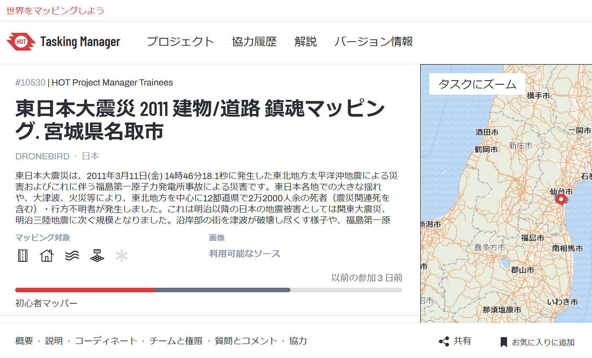
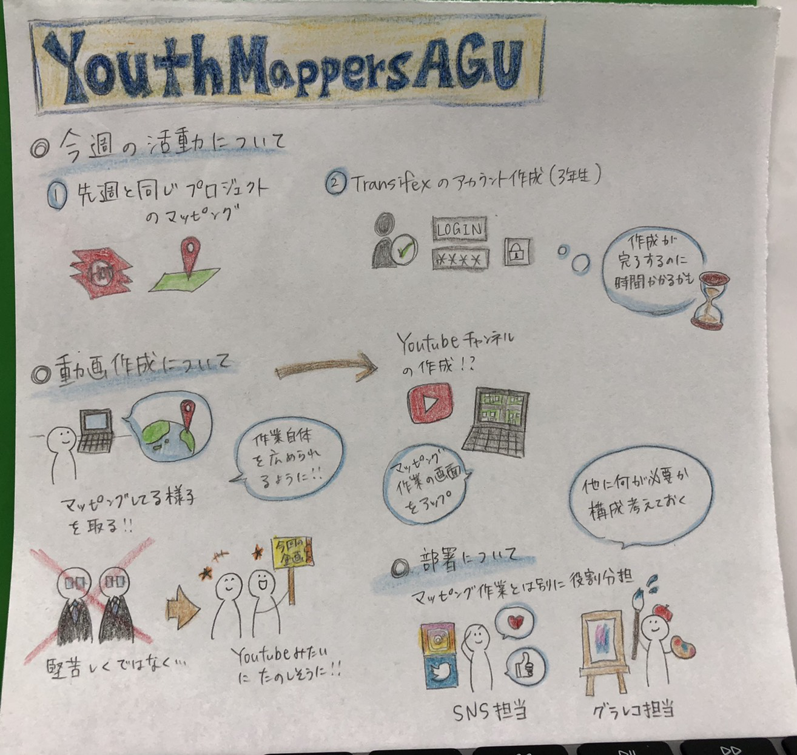

### マッピングが進まない…

5月17日、定例会議を行いました

### 先週の活動

１、先週に引き続き、鎮魂マップのマッピングを進める

２、Blenderハッカソン

まず一つ目の鎮魂マッピングでは、先週に引き続き、HOT Tasking Managerの「東日本大震災2011建物/道路鎮魂マッピング.宮城県名取市」というプロジェクトのマッピングを進めました。

[HOT Tasking Manager
Tasking Manager is a the tool for coordination of volunteers and organization of groups to map on OpenStreetMap.tasks.hotosm.org](https://tasks.hotosm.org/projects/10530)

三年生はマッピングを進めてくれたのですが、四年生は就活やハッカソン（四年生を中心に進めた）の方に体力・時間を奪われ、疲労困憊だったため殆どマッピングには手をつけられませんでした。今週こそは頑張ります！！！

二つ目のBlenderハッカソンでは、Blenderに地図データ（Blender GIS/Blender OSM）を組み込むと、Macでは思うように動かずWindowsパソコンでしか弄ることが出来ないというトラブルが発生し、筆者（木多）がほぼ1人でBlenderを使った作業をこなしました。

今回のハッカソンの詳しい内容は、5限の発表会でさせて頂きます。

### 今年度の活動

マッピングを広めるための活動案では

１、実際にドローンを用いたマッピング

２、マッピングをしている様子を動画にしてYouTube上に公開する

３、ユース2チーム化

などの話し合いを行いました。

グラレコ

