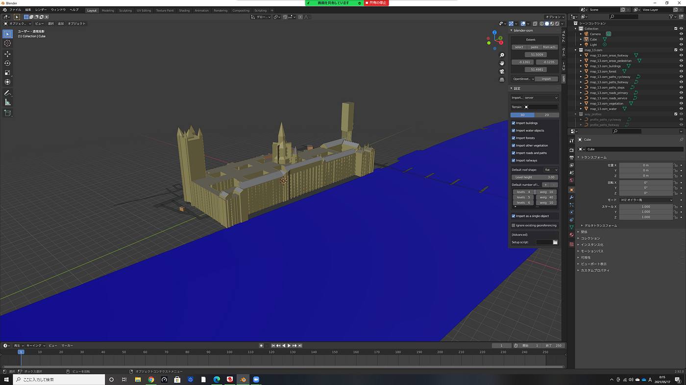
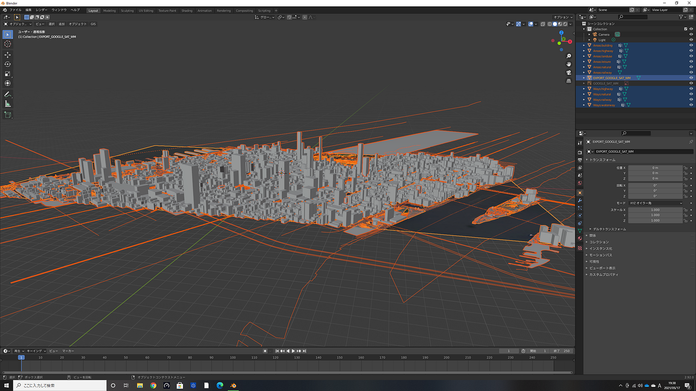
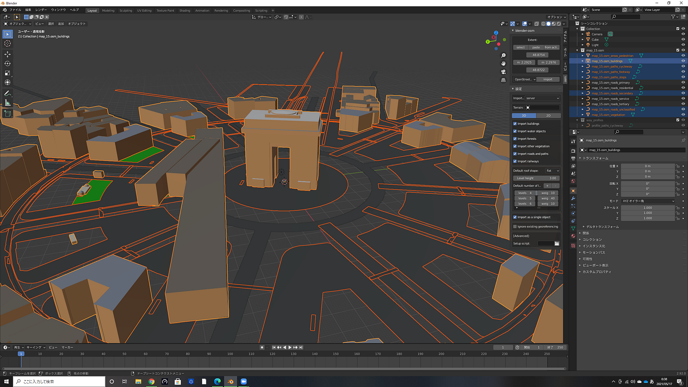
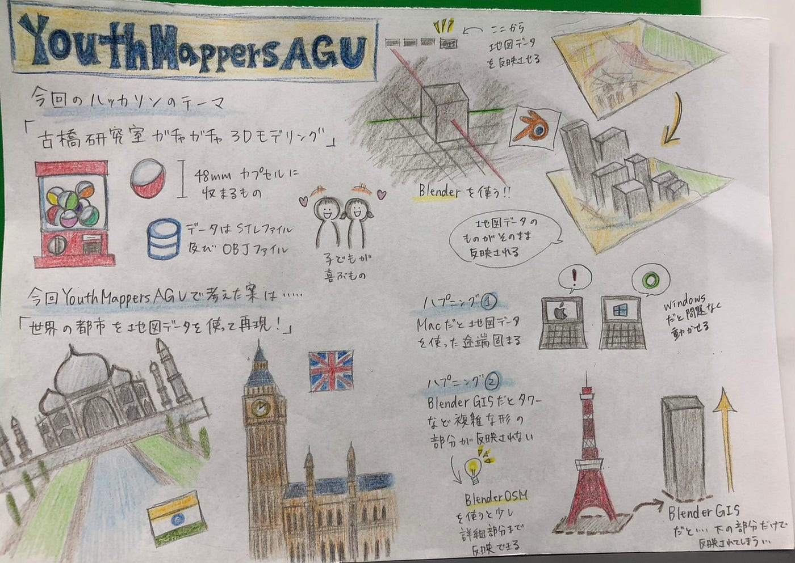

### ジオラマ的なの作りました

４年の日向野邦春です。

今年度もハッカソンがスタートしました。我々ユースは相変わらず動くのが遅くて木曜日から作業をはじめました。

今回私たちが作ったのは

**OSMを用いた世界の建築物と街並みの3Dデータ作成**です。

#### 1.BlenderOSM or BlenderGIS

OSMを使って3Dデータを作ることを考えると上記の２つのどちらかを使う事が望ましいです。BlenderOSMはOSMとBlenderとOSMを独立して起動させます。池や森にはしっかりと色がついているのが特徴です。

対してBlenderGISはBlender内部でOSMを起動させて作業を行います。使いやすさでいうとBlenderOSMの方が使いやすかったです。

#### 2.バグが発生

パリの凱旋門を3Dデータ化させていく過程でバグが発生しました。地下にあるはずの地下鉄の駅が地上にまで出てしまっていました。OSMのレイヤーは-5になっていたのですが地上にまで出て来てしまいました。これはBlenderOSMのレベル設定によるバグだと思います。

[https://github.com/furuhashilab/youthmappers4agu](https://github.com/furuhashilab/youthmappers4agu)
