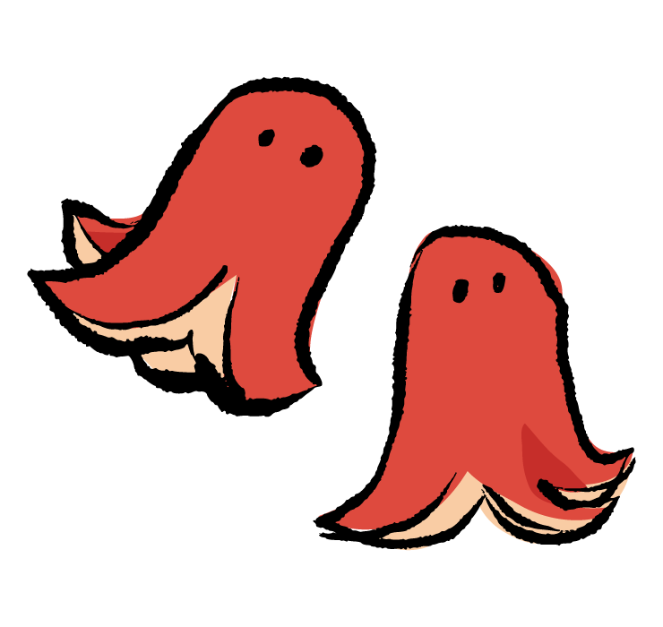
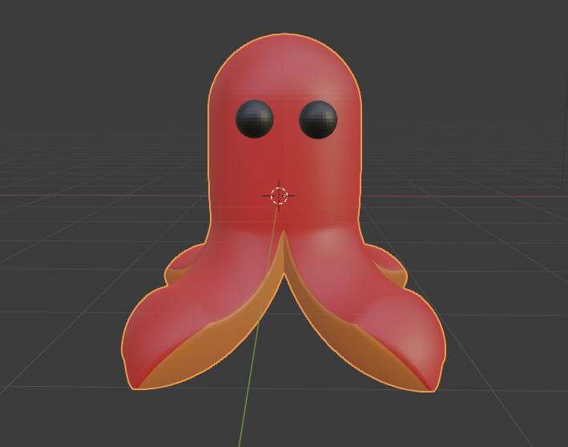
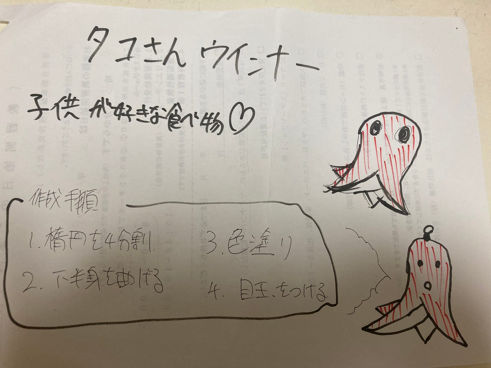

### タコさんウインナー

子供が好きそうなもの？？タコさんウインナーじゃね？ということでタコさんウインナー作りました。位置ゲーは2人だけなので、お手柔らかにお願いします。言い訳です。

参考画像(illust8より）

最終的に作成手順は

１.楕円を4分割

2.下半身を曲げる

3.色塗り

４.目玉をつける

５.微調整

完成形

### 反省点

目玉がリアルすぎて怖い。かなり飛び出しているのでもう少し控えめにすればよかったかもしれません。口をつけるのもアリかと思いましたが、あくまで弁当に入っているタコさんということでなしにしました。また、もっとリアルに再現するならば、頭頂部にしぼみを加えることによってウインナー特有の感じが再現できるかもしれません。ついでにキーホルダーのような輪っかも作れば良いかも知れませんね。後、objにエクスポートする際に白塗りされてしまいます、、、

グラレコ

