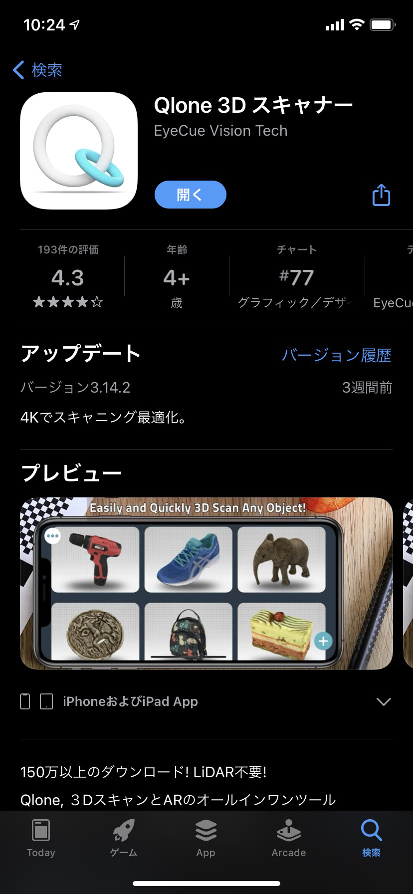
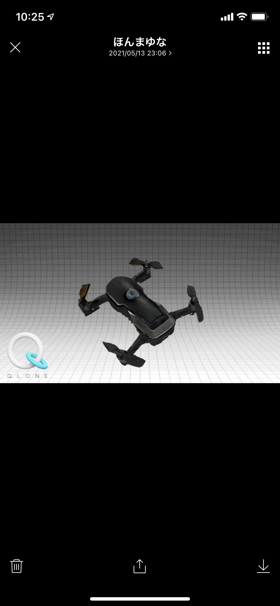
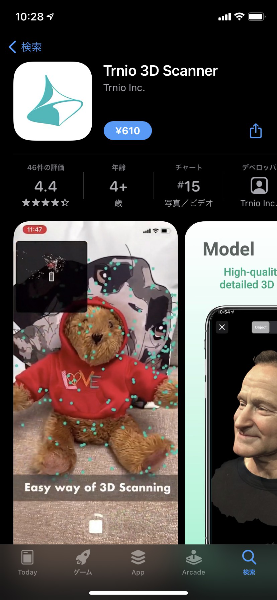
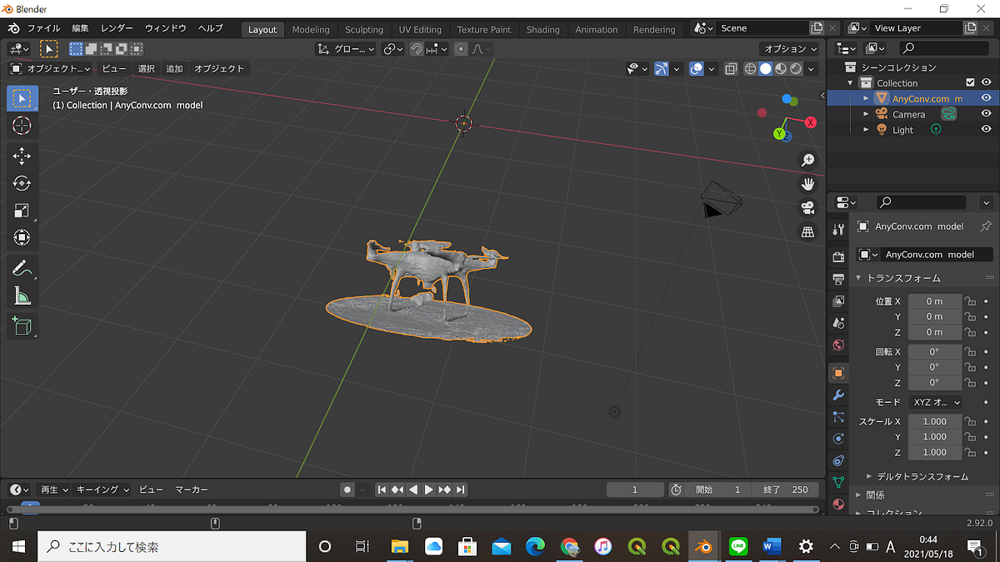
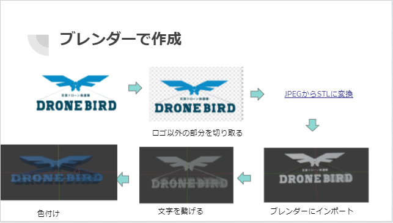
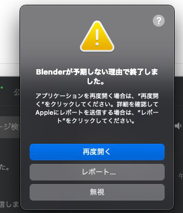
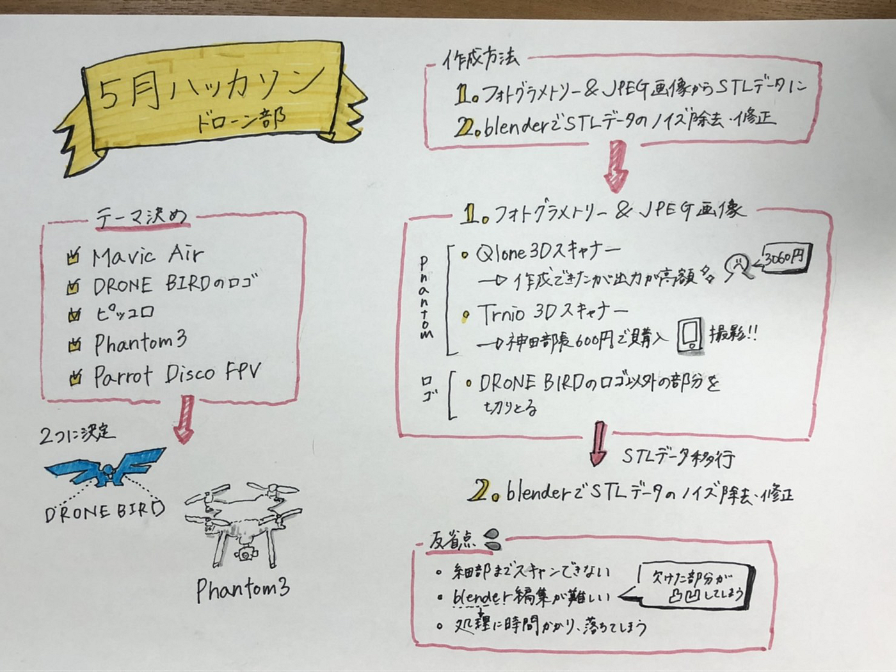

ドローンを作成？！

2021年5月の古橋ゼミの課題は古橋研究室のガチャガチャのアイデアを３Dモデリングです。

＃＃ドローン部で何を作るか

ドローン部で何を作成するかミーティングを行った際にドローン部に関わるものを作成すると話し合い、以下の案が出ました。

・Mavic Air

・DRONE BIRDのロゴ

・ピッコロ

・Phantom2

・Parrot Disco FPV

この中でドローン部では、最低1データセットとしてはDRONE BIRDのロゴとPhantomを優先して行いました。

残りの物もこれからSTL、OBそれぞれ行っていきます。

＃＃担当

レポジトリ作成：松山

メディウム：伊藤

グラレコ：本間

発表資料：松山

３Dモデリング作成：松山、神田

発表：神田

＃＃使用ソフト/アプリ

blender バージョン 2.92.0 
→STL・OBJデータのノイズ除去、修正
Capture: 3D Scan Anything 
→TureDepthにより点群でOBJ作成
Qlone 3D Scanner
→QRマットを使用して撮影、STL・OBJ出力には課金必要

＃＃作成方法

最初にQlone 3D スキャナーを用いてフォトグラメトリーを行いました。

実際に作成してみるとこのようになりました。

しかしSTLやOBJデータでの出力に3060円かかるので断念しました。

ドローン部の部長である神田くんが有料ではありますがこちらのアプリを購入し、進めました。

610円と手ごろではあります。

こちらで作成したものを「Blender」で修正を行いました。

DRONE BIRDのロゴの作成はロゴ以外の部分を切り取り、JPEGからSTLに変換をし、Blenderにインポートを行いました。

そして文字を繋げ色を付けることで作成しました。

＃＃反省点

・細部までスキャンが出来なかった。

・フォトグラメトリーしたものをBlenderで編集するのが難しい

→欠けた部分の修正・凸凹感

メンバーのPCのスペックが原因でブレンダーの処理に時間がかかり、落ちてしまうことも何回かありました。

[プレゼンはこちら](https://docs.google.com/presentation/d/1xu8ytJ5RIqr6SdlayizgjhZDpDzuqoLL1j7ngujKrGk/edit#slide=id.gda4e0ac51c_0_285)

[Git hubはこちら](https://github.com/furuhashilab/hachathon_3dmodel)

[プロジェクトはこちら](https://github.com/furuhashilab/hachathon_3dmodel/projects/1)

グラレコはこちら

