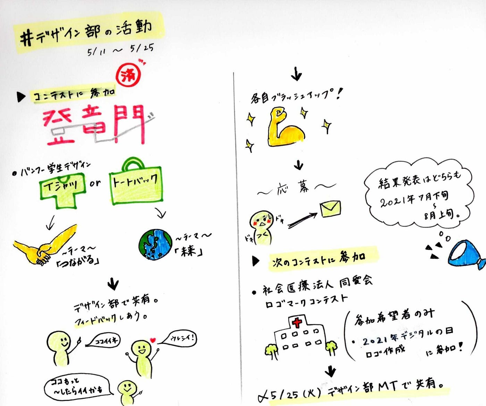

### デザインコンペは、続く…！

三年生にとって初めての第一回オンラインハッカソンも終了し、デザイン部の定期ミーティングではお疲れ様会が行われました。
メンバー同士お互いに感謝の気持ちを述べる場面もあり、終始ほっこりとした雰囲気でしたね！
皆さん、お疲れさまでした…！
さて、オンラインハッカソン前の5月11日のミーティングでは、参加するバンフ―デザインコンテストについて話し合いました。

**➀第3回 バンフー 学生トートバッグデザインコンテスト《学生限定》**
締切：2021年05月27日 (木)、紙原稿は2021年05月13日 (木)必着
募集内容：「FUTURE」をテーマにしたトートバッグデザイン
結果発表：2021年7月下旬～8月上旬、受賞者に通知するほか、公式ホームページ・SNSにて発表[第3回 バンフー 学生トートバッグデザインコンテスト — 募集要項 -｜株式会社 帆風(Vanfu)](https://www.vanfu.co.jp/design/tote/)

**②第12回 バンフー 学生Tシャツデザインコンテスト《学生限定》**
締切：2021年05月27日 (木)、紙原稿は2021年05月13日 (木)必着
募集内容：「つながる」をテーマにしたTシャツデザイン
結果発表：2021年7月下旬～8月上旬、受賞者に通知するほか、公式ホームページ・SNSにて発表 
[第12回 バンフー 学生Tシャツデザインコンテスト — 募集要項 -｜株式会社 帆風(Vanfu)](https://www.vanfu.co.jp/design/t-shirt/)
各々書き上げてきたロゴやイラストを共有しフィードバックまで行いました。
その後、それぞれもらった意見やアドバイスを参考にしつつブラッシュアップし、提出。
メンバーの個性あふれるデザインに学ばせていただくことが多く、勉強になりました。結果はどちらも2021年7月下旬～8月上旬です。楽しみに待ちましょう。そして我々デザイン部は次のコンテストに参加します。

**③社会医療法人同愛会のロゴマークコンテスト**
締切：2021年05月31日 (月)
作品提出・応募締切、必着
応募内容：社会医療法人 同愛会のロゴマークデザイン
結果発表：2021年6月中旬ごろ、受賞者に通知するとともに、公式ホームページにて発表

[同愛会ロゴマークデザイン募集 | 社会医療法人同愛会 博愛病院 (hakuai-hp.jp)](https://www.hakuai-hp.jp/doaikai-rogo/)

今回の課題は次回ミーティングまでにロゴマークを作成してくることです。ミーティングは5月25日（火）、ロゴマークを共有し、フィードバックを行います。

