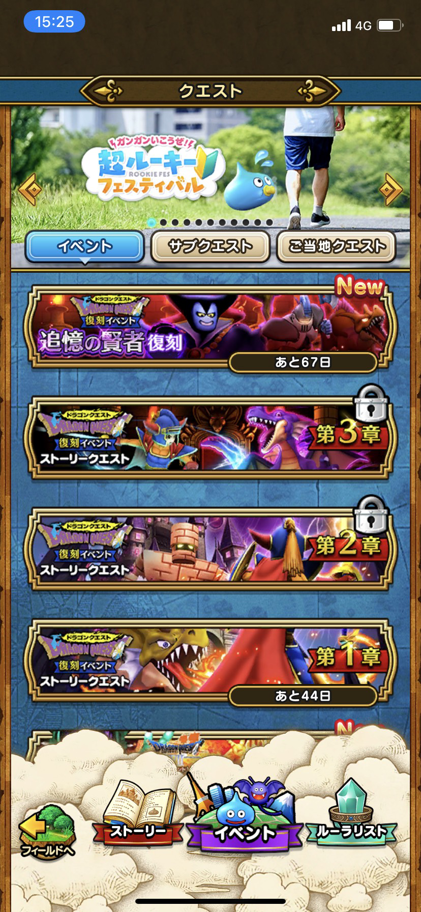
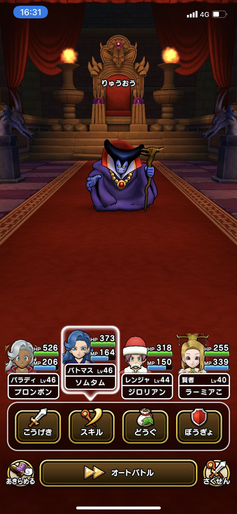
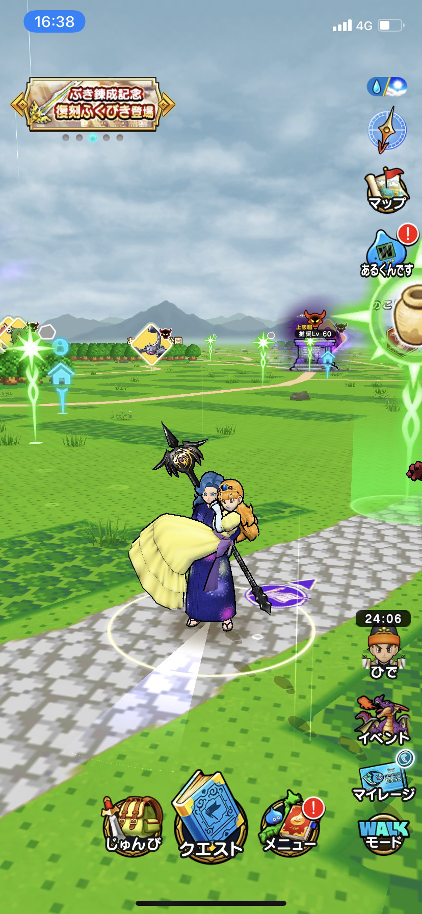
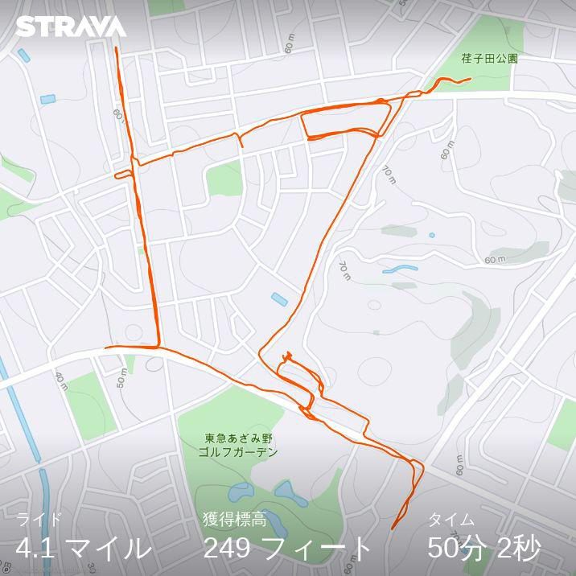
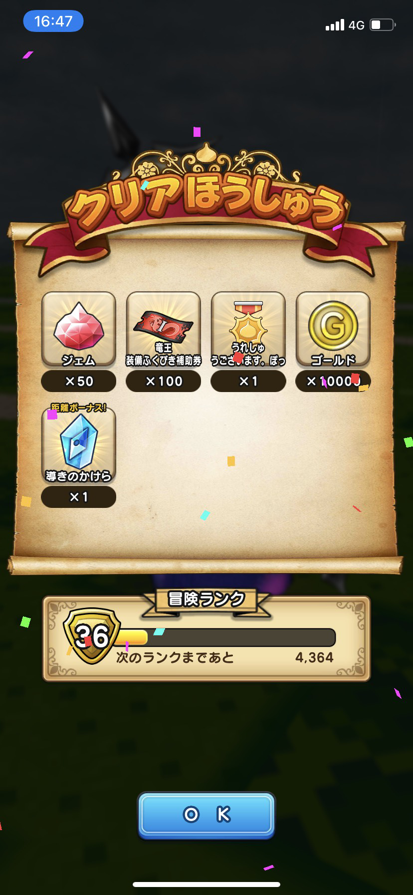
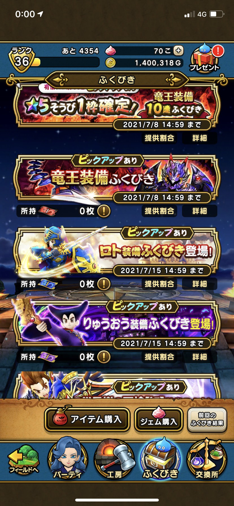
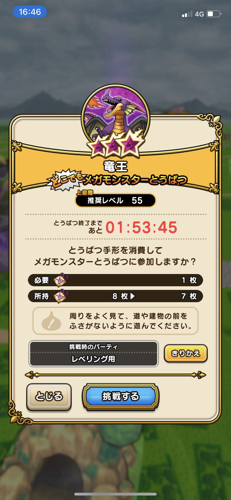
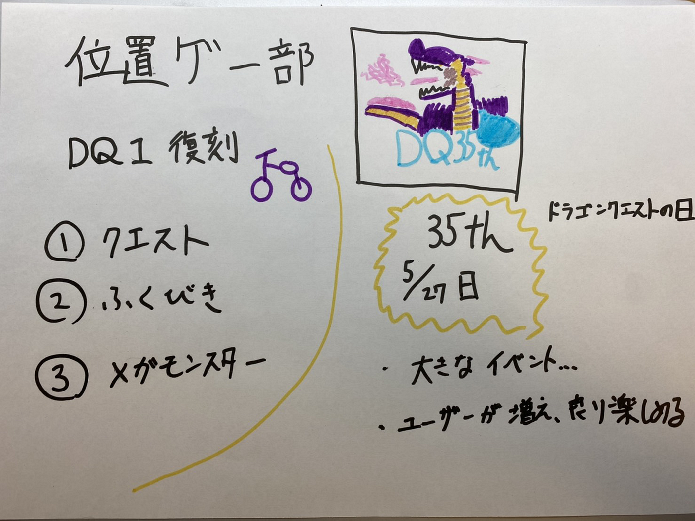

### 位置ゲー部：5/27日は何の日か、、、

##5月27日について

初代ドラゴンクエストの発売日の5月27日がドラゴンクエストの日に認定されました。

[ファミ通によるとスマホ版のシリーズが最大35%OFFになるそうです。](https://www.google.co.jp/amp/s/www.famitsu.com/news/amp/201805/27157954.php)

ドラゴンクエストウォークでも5月27日からイベントが開始されるそうです。DQ1が発売されてから35周年になるのでアイコンも変わり、新たなイベントが開始されます。

そのため今後の見込みとして、ドラゴンクエストウォーク史上一番大きいイベントが開催されることが予想されます。そしてユーザーが増加すれば、メガモンスター討伐もより簡単になり、今よりも楽しめることが出来そうです。

##DQ1復刻

前回は「ダイの大冒険」の時に紹介しましたが、現在ではドラゴンクエスト１イベントが開催（復刻）されています。

##クエスト

今まで忙しく時間がなかったので、効率重視でイベントを消化したらどれくらいの時間がかかるのか検証してみました。

・使用したもの

電気自転車

Strava

・行う事

復刻したクエスト1章から4章すべてクリア

結果は50分でクリアをすることが出来ました。効率良く電動自転車を使った移動をすることで効率化出来て良かったです。

また4章をクリアすると姫をお姫様抱っこをして冒険が出来ます。特にメリットはないですが、ストーリーがしっかりしているので楽しめます。

[https://strava.app.link/9xJw6Zmrwgb](https://strava.app.link/9xJw6Zmrwgb)

##ふくびき

復刻のロトの装備やりゅうおうの装備、新しく出た竜王の装備があります。

クエストをクリアするだけでも30回以上は引くことが出来るので初心者の人向けに運営が最近変更したのかなと思います。

##メガモンスター討伐

メガモンスターでは竜王が登場しています。推奨レベルが上級職のLv.55なのでまだ満たしていないので、挑戦は今回断念しました。渋谷など都会に行った際に挑戦してみます。メガモンスター討伐は上級者向けに切り替えた印象があります。最近のイベントでは上級職であることは前提のイベントが多いです。

初心者向けにも用意してほしいです。

グラレコはこちら

