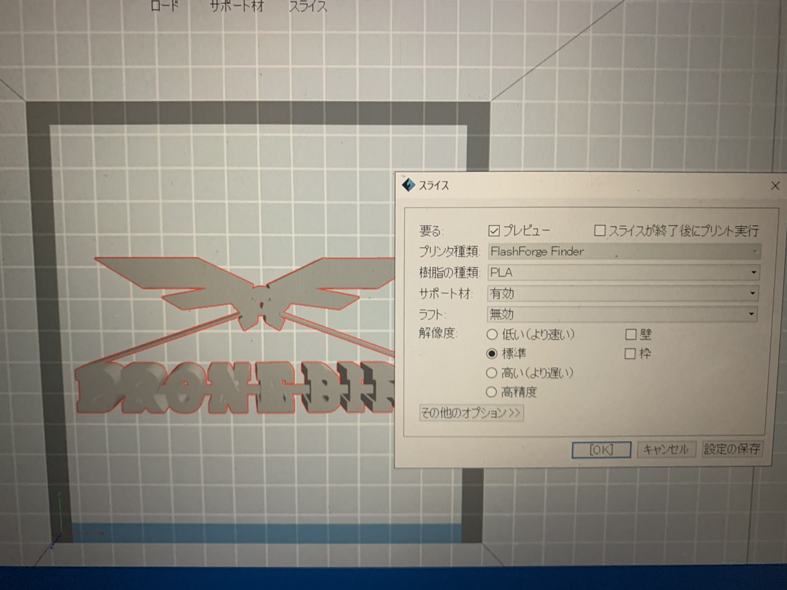
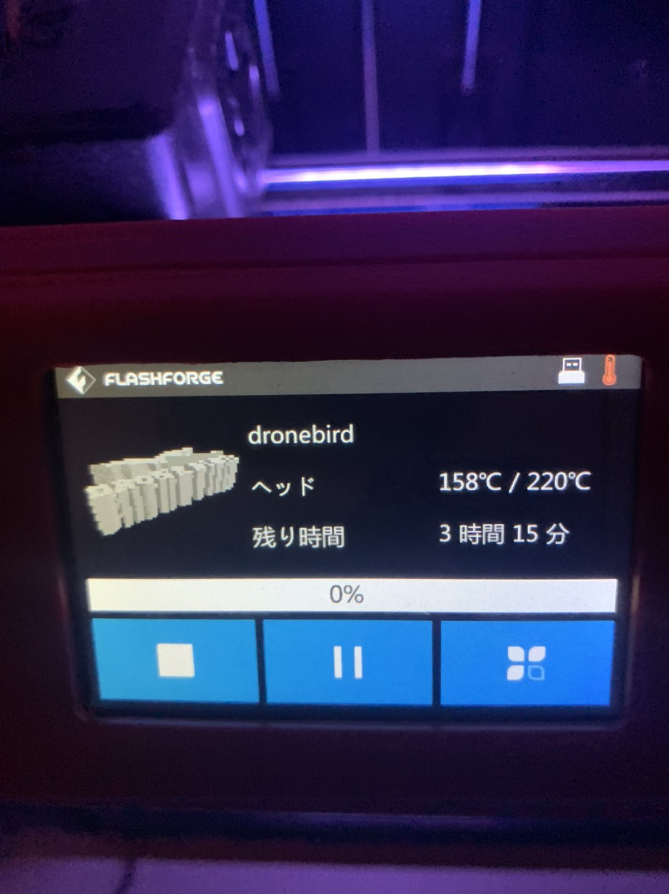
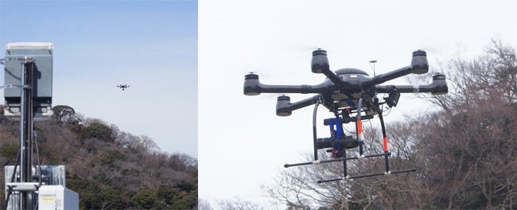
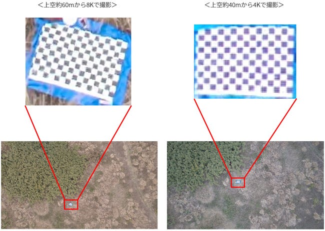
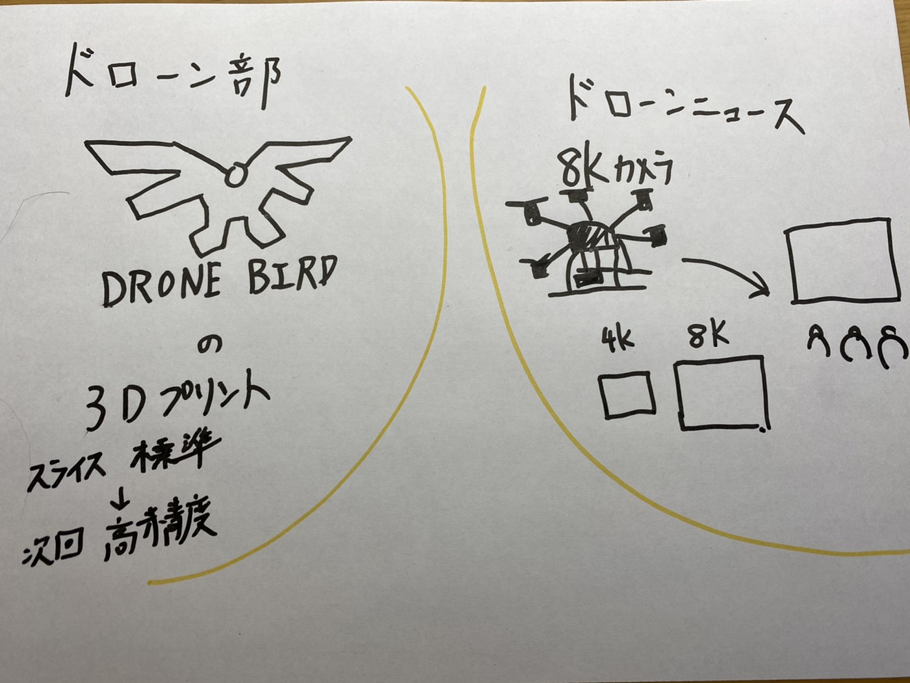

### ドローン部：ハッカソンを終えて

ドローン部の伊藤です。

##前回のハッカソンについて

前回のハッカソンであった「DRONE BIRD」のロゴの３Dプリントを部長の神田君が行ってくれました。

今回はスライスの解像度は標準で行ったので次は高精度で行ってみたいと思います。

完成したら写真を追加します。

＃＃ドローンニュース

今回紹介するドローンニュースはドローンに８Kカメラで撮影したものを上空60mからリアルタイムで伝送の実証実験に成功したニュースです。

これはシャープとNTTドコモが災害時の広域監視利用を想定し、５Gによる８K高精度映像をリアルタイムで伝送しました。

3月8日に横須賀ドローンフィールドで実施され、８K対応のテレビにリアルタイム配信しました。映像配信には次世代技術のSRT（Secure Reliable Transport）が運用されました。そのため途切れることのない安定した映像表示が可能になりました。

４Kよりも高精度なことはもちろん、40mと60mで撮影したところ、８Kは60mでも４Kと同じくらいの精細度でより広範囲期のデータを取得することが出来ました。

今後は被害状況なタイムリーかつ広範囲期の確認など、災害・防災様々な利用が想定されます。

その他にも５Gによってモバイル通信でドローンを操縦することにより、機体の制御や映像伝送が拡大されることが予想されるので楽しみです。

[総務省 携帯電話の上空利用に向けた主な検討内容](https://www.soumu.go.jp/main_content/000653940.pdf)

[KDDI モバイル通信によるドローン目視外飛行](https://news.kddi.com/kddi/business-topic/2020/09/4660.html)

グラレコはこちら

