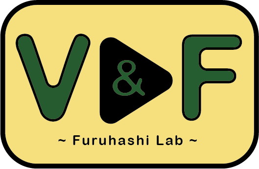
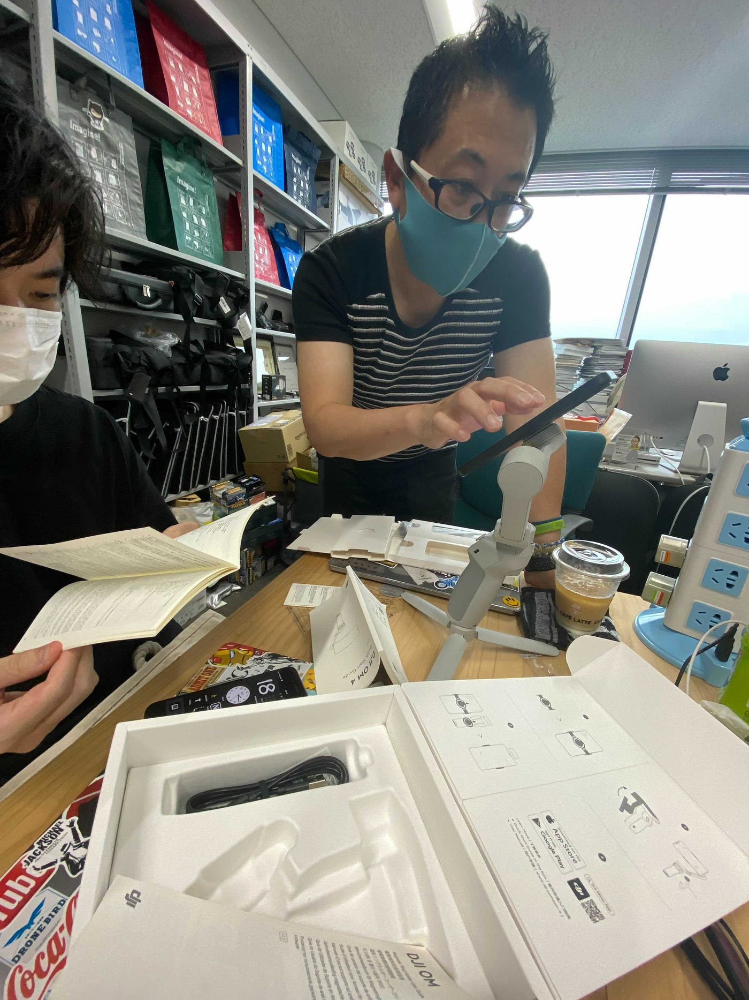
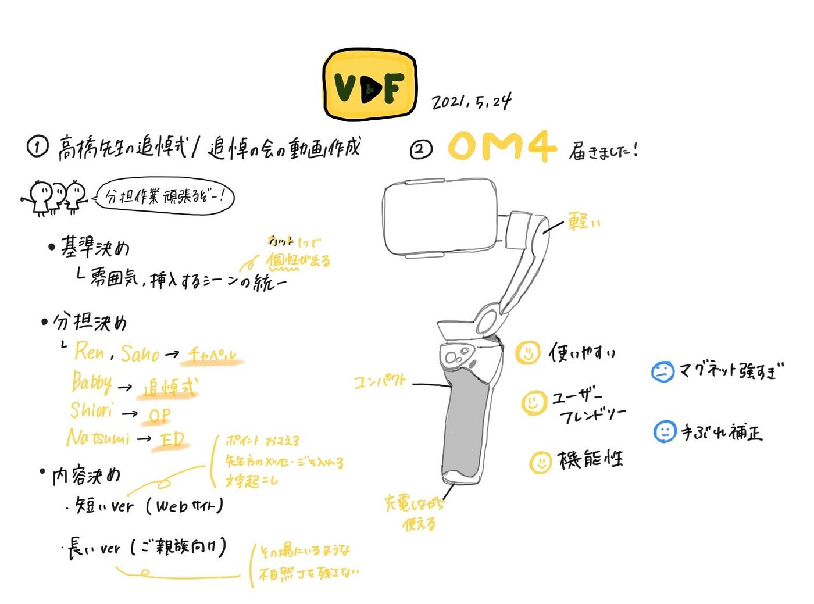

### 今週のV&Fニュース(2021年5月)

オンラインハッカソンが終わってから少し休憩して、今週はいくつか進展があったことをお話します。

### 今週は２つ

> **◎高橋先生の追悼式/追悼の会の動画制作**

> **◎OM4触りました**

### **◎高橋先生の追悼式/追悼の会の動画制作**

V&Fが始まってから、5人でやっと動画編集をするときがきました。本業に取りかかれるわけです。

せっかくですから、メンバー５人全員で分担して作業したいということでどのように分けるかを考えました。TEDxの時もFamieeの時も必ず壁にぶち当たる分担作業。動画編集を複数人でやる難しさは変わりません。

しかも、これまでと違って決まったデザインを作って繋げればいいものではなくて、短くまとめなければならない動画なのでこれはこれでむずかしい。。。

効率を上げたいから複数人でやるはずが気づいたら１人でやったほうが早いなんてことがあるので、慎重に行きましょう。

### □ミーティング

### ・基準決め

なんども言いますが、いつもとまた違った難しさがある今回のようなログ動画。なぜ、難しいのかと言うといつものように絵で表現し辛いのに加えて、言語化するのも難しいからです。今回の場合、最低限決めなければいけない所はどのような点でしょうか。

> ・雰囲気の統一

> ・挿入するシーンの規則を統一

雰囲気は色々な要素で決まってきますが、動画の流れを決める「カット」のやり方でほぼ決まってくると思っています。ただ動画を切るだけと思いきや、意外と人によって癖があります。

例えば、青木怜はYouTubeの見すぎで、無意識にYouTuberみたいなカットをしているそうです。

**無意識で感覚的に編集してしまうことが多いので、〇〇のタイミングで△△の方法でカットするとしっかり言語化することが大切になってきます。**

**同時に使うシーンにある一定の規則を作ってしまえば動画制作を分担しても、繋げたときの違和感を減らすことができるのではないかと考えています。**

### ・分担決め

基準の決め方はなんとなくわかった気がしましたが、それを言語化するのはそう簡単にはいかないので、今回は皆で作業しながら手探りで調整していくことにしました。参考にする動画を共有しておきましょう。

動画編集の分担としては、

> Ren：チャペル動画

> Saho：チェペル動画

> Babby：追悼の会

> Shiori：OPシーン

> Haga：EDシーン

こんな感じです。３年生の２人は編集ソフトを触ったことはありますが、ガッツリ制作するのは初めてなので短めのOPとED部分を任せることになりました。

ちなみに、２分の動画で追悼式と追悼の会の両方をまとめるので、

> 追悼式：追悼の会 ＝ 6：4 ＝ ７２秒：４８秒 ＝２分

の比率で作成します。

### ・内容決め

そもそも、「どんな動画を作るべきか」が最も重要な考えるべきことです。

今回制作する動画は

> **・Webサイトに載せるための短いver**

> **・親族の方々向けの長いver**

の２つです。

まず短いverでは、今回来れなかった方や外部の人向けで、「何があったか」がわかりやすいようにするのと、記憶に残りやすいしたいですね。そのために含める内容は

> ・式のポイントを押さえて流れが分かりやすいようにする。
・藤原先生や升本先生のメッセージを含める。
・文字起こしをする

等が必要になってくると思います。

長いverは親族の方々向けですので、数年後に見返したときに「思い出しやすいように」すべきですね。

> ・その場にいるような雰囲気を作る
・不自然なカットをしない

を気をつけたいところです。

### ５月中に完成予定

以上のことを踏まえて制作をしていきます。

短いverは５月中に完成予定です。

V&Fとしても目標は「１プロジェクト１週間」で制作できるようにすることですが、最初は手探りな部分が多いので余裕をもって５月中にさせてもらいました。

### **◎OM4触りました**

### □いいところ

### ・使いやすさ

> **#軽い
#大きさもコンパクト
#最初から三脚つきなのもいいところ**

> **#充電しながら使用できる
#OM４の順電部分とスマホの充電部分がある**

### ・ユーザーフレンドリー

> **#スマホで簡単に設定できる**
 bluetooth接続で一瞬で接続できる。

### ・機能性

> **#アクティブトラッキング**
 画面上で選択した部分をカメラが追ってくれる。
 ピースやパー等の特定のジェスチャーでトラッキングを発動できる。
 ピースで撮影する機能もあり。

> **#撮影方法がテンプレになっている**
撮影用途に合わせてカメラワークを自動でやってくれる機能がついている。

### □気になる所

### ・マグネット強すぎ

使用中の安心感はあるが外すときに壊れそうな感覚がある。スマホに貼るシールタイプだと、マグネットが強すぎてシールのほうが剥がれそうになります。しかし、これだけ強いので、激しい動きをしても落ちる心配はなさそう。

### ・手ぶれ補正

OM４の使い方はわかりましたが、少し激しい動きをしたときにどれくらい補正してくれるのかまだわからない。これまでのOSMOと手ぶれ補正を比較してみたいですね。

### グラレコ

