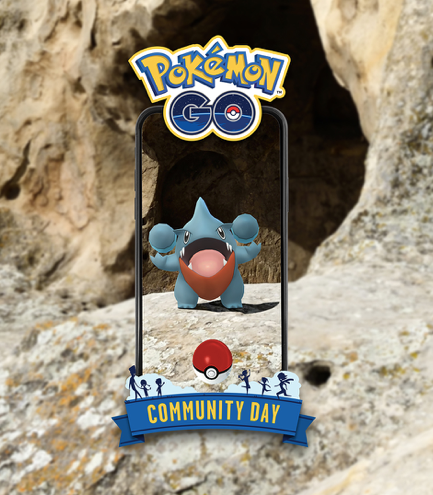
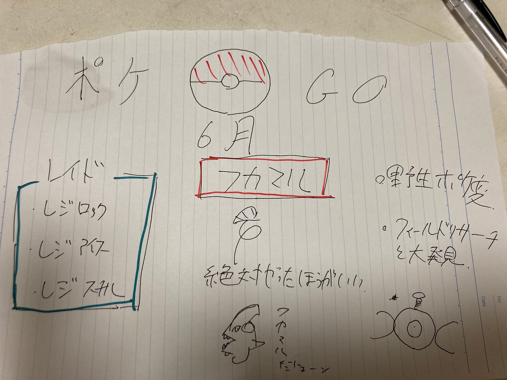

### ポケgo のイベント把握してますか？

最近、イングレスとドラクエの週報が続いて、ポケgoを触れてなかったので、紹介させていただきます。正直、ドラクエに対抗しようとポケgo凄い沢山イベントやってるんですよ！先週は吉野家とのコラボで経験値6倍とかイベルタルとか、、、そこで、月は変わって今週今月のhotなイベントを紹介させていただきます。

> 1. 伝説レイドバトル

6月1日(火)10:00~6月17日(木)10:00

レジロック、レジアイス、レジスチル

> 2. 野生に生息するポケモンの変更

毎シーズン変わりますが、今回は街に「ポリゴン」「コイル」「コラッタ（アローラのすがた）」などのポケモンがいつもより多く出現し、森では「マダツボミ」「スコルピ」「ドードー」などが出現します。山のポケモンも変化して「サイホーン」「ノズパス」「イシズマイ」がいつもより多く出現し、水辺では「ホエルコ」「コイキング」「マリル」などがいつもより多く出現します。いつか、海辺、森、山、街でゲットできるポケモンのチプ別データグラフなんか作るの面白そうですね、、、

> 3. フィールドリサーチの大発見でリモートレイドパス！！！

これは熱いです。しかも、６月中全部。毎日行えば3個ゲットできるので時間が合わなくてレイド参加できない方はゲットしておきたいものです。また、大発見で2倍のxpを獲得できるので。今月のフィールドリサーチはやるべきです！！！

> 4. 6月6日のフカマルに準備せよ！！

6月6日(日)11:00~17:00にコミュニティデイでフカマルが大量発生します！！

期間中にガブリアスに進化させますと、だいちのちからを覚えるので個体値にも期待しながら行いたいですね。

また、ボーナスとして貰えるxpが3倍、おこうが3時間持続します！正直、この日だけで初心者は20ぐらいレベル上げは楽勝かも

*公式ホームページの写真です

＊注意すること：フカマルはゲット率が低いです。通常のモンスターボールではなく、ハイパーボールやスーパーボールをこの日に向けて備蓄した方がよき。また、しあわせたまご余らせている方は使った方がいいです。

> 最後に、豆知識

・本日のスポットライトアワーでは、イシズマイが獲得xp2倍

・おそらく、サカキと戦うまで、リサーチをクリアしていない人が大半だと思いますので触れませんでしたが、6月1日(火)~6月16日(水)にサカキがシャドウサンダーを使ってくるので、サンダーをゲットできます。欲しい人はリサーチを進めてまずスーパーロケットレーダーを手に入れましょう。

公式 [六月イベント詳細](https://pokemongolive.com/post/jun-2021-events/?hl=ja) [コミュニティ・デイ詳細](https://pokemongolive.com/post/communityday-jun21/?hl=ja)

