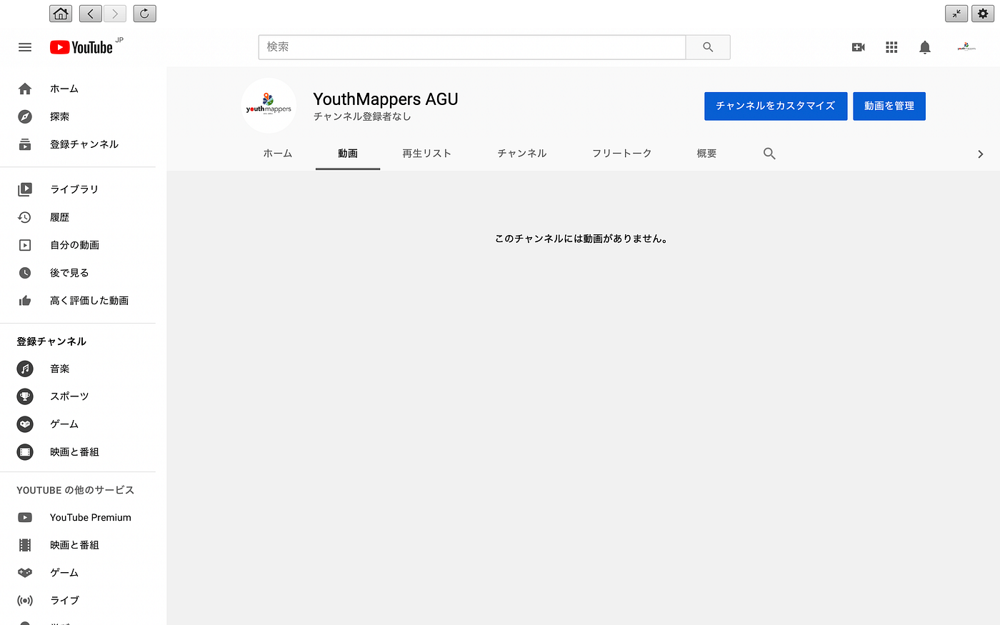
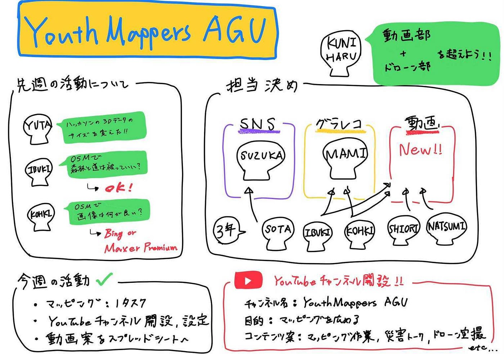

### ついに動画に手を出すことにしました💦

とてつもなく久しぶりにmediumを作成する吉田です。5/24に行ったMTGの内容について書かせていただきます。

１、担当決め

２、Youtubeのチャンネル登録

１、担当決め

以前まで人数が少なかったため、一人の負担がとても大きくなってしまいました。

そこでSNSとグラレコの人数を増やし、さらに新たに動画チームも左右性しました。

・SNS：吉田、颯太
・グラレコ：八尋、菊池、息吹
・動画：菊池、息吹、詩織、葉賀
・ドローン：木多

新たに動画チームを作った理由としては、

・マッピングを広める

・減災について

などさまざまな分野に視野をむけ、動画を一辺倒にしないようにします。

また、Youtubeを多く見る世代として子どもたちが増えてきているため、子ども向けのわかりやすい、ポップな動画を増やして行けたらと思っています。

動画チームはVFチームに所属しているメンバーが多いので、質の高いものを盗んできてくれたらと思います！

我らがリーダー、日向野の野望は

「ドローン部や動画部を超えるものを作る」

だそうです

みなさん温かく見守って下さいね〜

２、Youtubeチャンネルの登録

先週の金曜日にYoutubeチャンネルの登録が完了しました。

これから頑張るのでチャンネル登録よろしくお願いしますう！！！

↑これが言ってみたかっただけです。。。

今回は以上となります。引き続きマッピング、ハッカソン、就活がんばります、、💦

