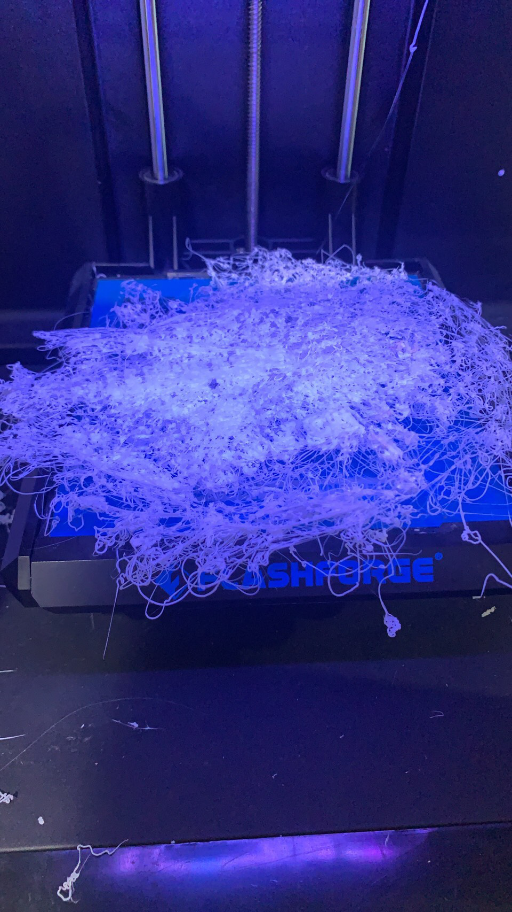
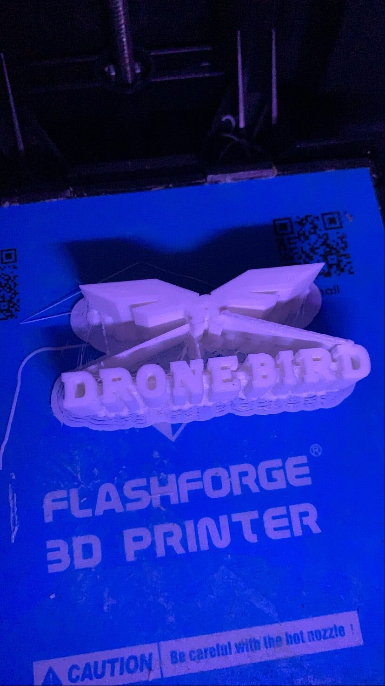
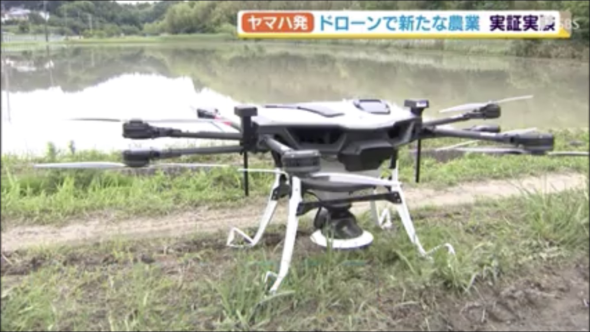

### ドローン週報⑤

### ＃DRONE BIRDのロゴが完成

5月のハッカソンでブレンダーで作成した「DRONE BIRD」のロゴの３Dプリントが完成しました。

一度目は糸状のものになって失敗でした。

二度目はフィラメントがずれないようにするために、サポート材を付けた結果、ロゴが綺麗に出来上がりました。

### ＃ドローンニュース

今回はヤマハ発電機がドローンで種もみを行う実証実験を行ったことを紹介させて頂きます。

現在日本の農業人口は年々減少にある一方で、１戸あたりの耕地面積は拡大傾向にあり、効率化や省人化に対するニーズが高まっています。

そんな中、ヤマハ発電機は田植えをせずに自動で種もみをまく農業用ドローンを開発しました。種もみをするルートを事前に登録しておくとその通りに飛んでくれる仕組みです。実証実験で散布したものは米の種もみなのですが、鉄でコーティングされており、真っ黒です。その理由は、重さを付けることで種もみが水中に沈みしっかりと根を張ることだそうです。同じように除草剤なども自動で撒くことが出来ます。

ヤマハ発動機は実証実験を2年間繰り返しており、今後も開発と検証を続けていくそうです。

[ヤマハ発 ドローンで新たな農業 実証実験（静岡県）](https://news.yahoo.co.jp/articles/bba866ec23ff9d90bd5d859b65777824b44500f0)
