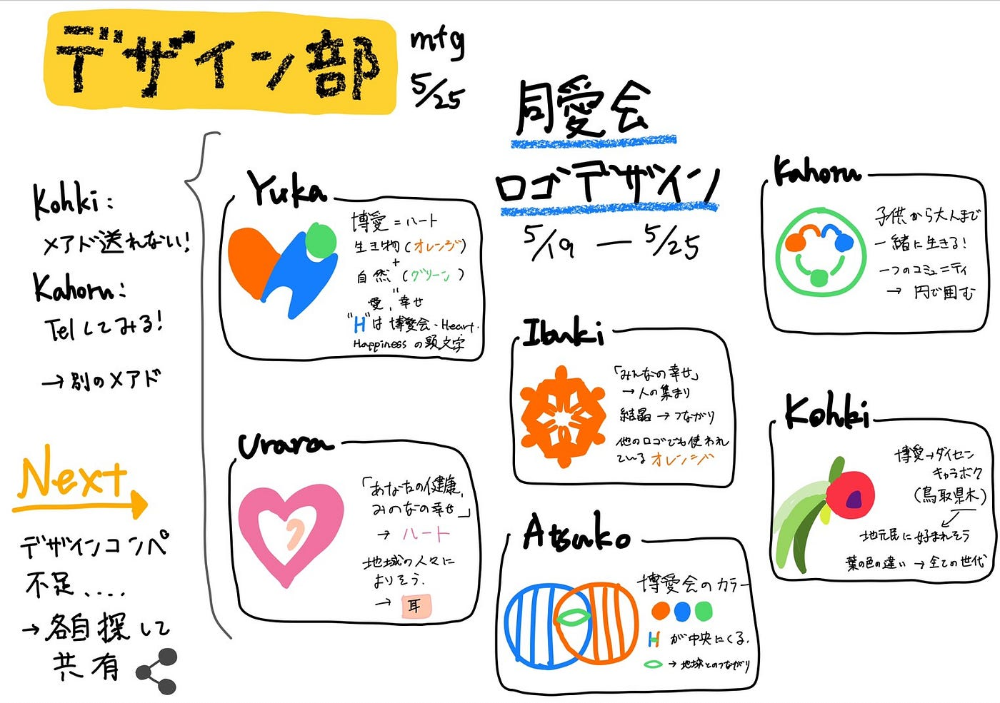

### 力作揃いなロゴコンペ

今週は「社会医療法人 博愛会」のロゴコンペに向けた作品を制作し、共有しました。それぞれ違った切り口で、オリジナリティーある力作揃いだったので、発表も非常に楽しめました！

**社会医療法人同愛会のロゴマークコンテスト**
締切：2021年05月31日 (月)
作品提出・応募締切、必着
応募内容：社会医療法人 同愛会のロゴマークデザイン
結果発表：2021年6月中旬ごろ、受賞者に通知するとともに、公式ホームページにて発表

[同愛会ロゴマークデザイン募集 | 社会医療法人同愛会 博愛病院 (hakuai-hp.jp)](https://www.hakuai-hp.jp/doaikai-rogo/)

来週の課題を決めるためみんなで登竜門を覗きましたが、ちょうどいいコンペを見つけることができませんでした。次回、各自なんかしらのコンペに向けた作品を制作する！

