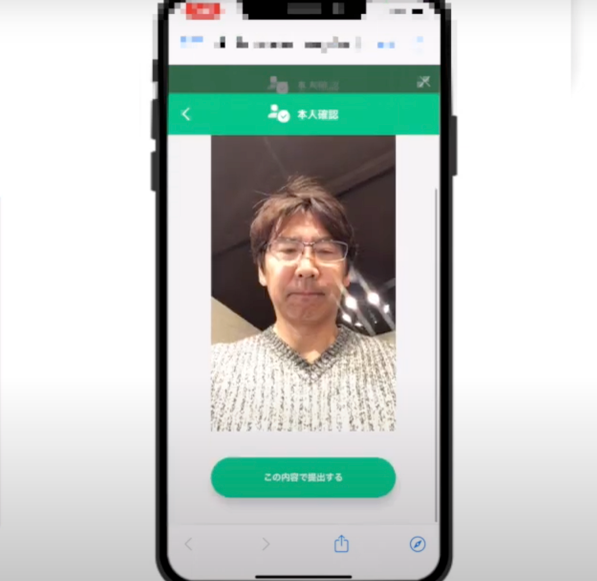
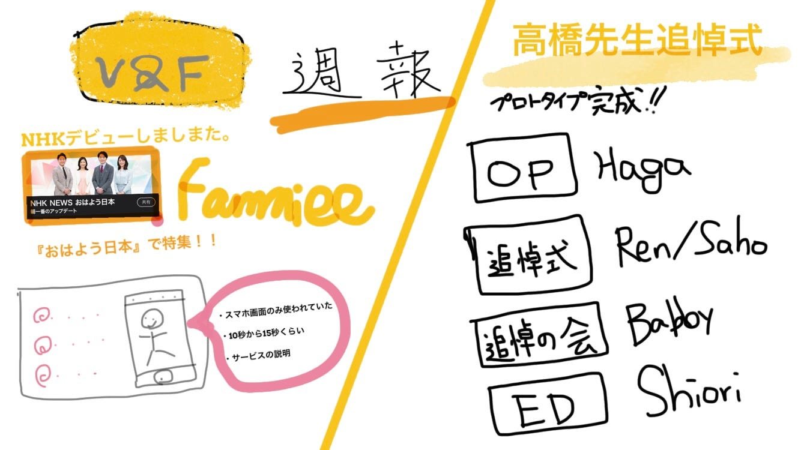

### 動画制作「まずは王道」

先週に引き続きV&Fは高橋先生の追悼式の動画制作に力を入れていました。一通り完成に近づいたので制作過程のお話をします。

### その前に、、

今週も大きなニュースがあるので報告します。

### NHKデビューしました。

実は、Famiee（家族関係証明書を発行できるサービス）が先日5月30日のNHK「おはよう日本」で特集されていました。

番組内でV&Fが制作したアプリの紹介動画の一部を使っていただきました。サービスについての解説としてスマホ画面を部分的に使用していました。

解説シーンは少し長めだったので10秒から15秒ほど使われていたと思います。

というニュースでした。

### 高橋先生の追悼式動画

今週作った動画は、追悼式の内容を2分ほどにまとめたものです。そして、これを無理やり5人で分けて編集しました。

少しおさらいすると

> Haga : OP 5秒
Shiori : ED 5秒
Babby : 追悼の会 43秒
Ren : チャペル 67秒
Saho : チャペル 67秒

こんな感じで分担してました。

まずは、動画を見てほしいです。
※プロトタイプは限定グループで公開します。
完成次第、この記事に掲載します。

### わるくない出来

ところどころ、シーンの見直しが必要な部分や改善点がありますが、全体を通しての雰囲気やまとまりは悪くない印象です。

実際のところ、全体での話し合いや動画の構成があったわけではなく、個々で好きなように制作してみましたが、意外にも成り立ってしまうんだなという感じです。

デザインや色決め等が必要な動画ではなく、全体としての雰囲気やストーリーが重要になるようなジャンルなので、今回の場合は5人全員が式に参加して雰囲気を体感で知っていたことが大きかったのかと思います。

### 【グラレコ】

