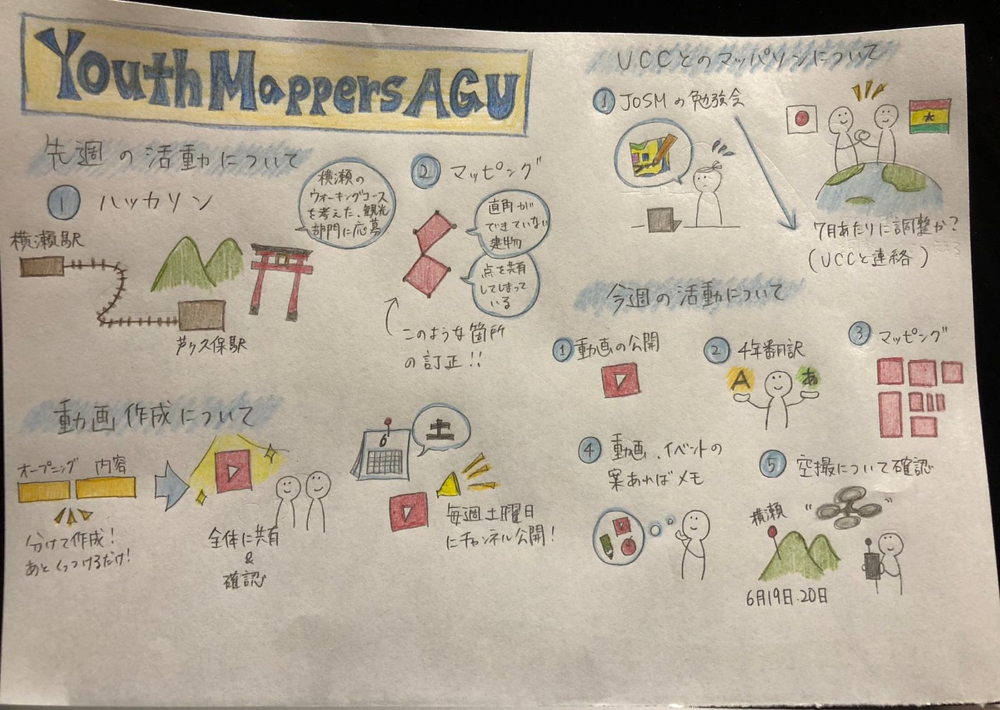

### これから本格的に活動していきます

こんにちは、今回担当する3年の村松です。

5月31日に定例会議行いましたので、報告させていただきます。

先週から役割が振り分けられ、動画チームのミーティングが行われました。方針としては短めの動画を複数作成し、連続して投稿する予定です。動画部からのメンバーもいますので、完成が楽しみです！

今週からハッカソンがあるようなので、ハッカソンに集中し、時間があればマッピングも進める予定です。

**・JOSMの勉強会**

6月29日の4限からJOSMの勉強会を行うことになりました。今後、UCCとのコラボも行う予定ですのでここで一度足並みを揃えようという事になりました。

**・Transifex**

[Transifex上でのMapSwipe日本語翻訳](https://www.transifex.com/mapswipe/dashboard/all_projects/ja/)を4年が行っています。レビュー待ちが126件あるので足踏み状態ですが常に最新の状態にしたいと思います。

