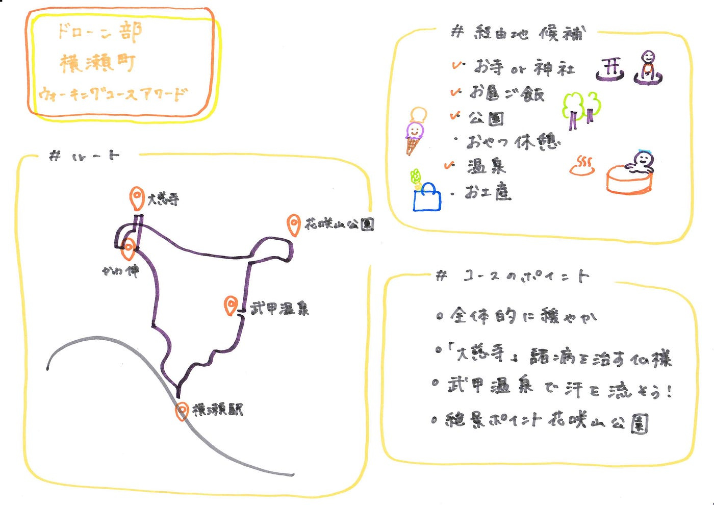

### ドローン部６月ハッカソン

今回は、横瀬町ウォーキングコースアワードにドローン部として応募しました。

＃コースのテーマ

健康促進のためのウォーキングコース

＃経由したいポイント

・お寺 or 神社

・お昼ご飯

・公園

・おやつ休憩

・温泉

・ お土産

候補の経由地のうちスイーツのお店、お土産屋さんはその他のポイントから離れていたため候補から外しました。

＃コース

①横瀬駅

②大慈寺（だいじじ）

諸病を治すと言われる仏「おびんずる様」が安置されています。

健康をお祈りしましょう！

③かわ伸

おいしいお昼でエネルギーチャージ

④花咲山公園

見晴台からの景色でリフレッシュ

⑤武甲温泉

たくさん歩いていい汗をかいた後は温泉で身体を休めてあげましょう～

⑥横瀬駅

＃コース全体の説明

全体的に緩やかな道を選んでいるため、年配の方でも歩きやすいコースとなっています。

途中に諸病を治すと言われている仏様が祀られている大慈寺や、春には新緑とツツジも楽しめる絶景スポット、花咲山公園、そしてなんといってもたくさん歩いて汗をかいた後は、温泉につかって一休みできる最高のコースになっています。

グラレコ

