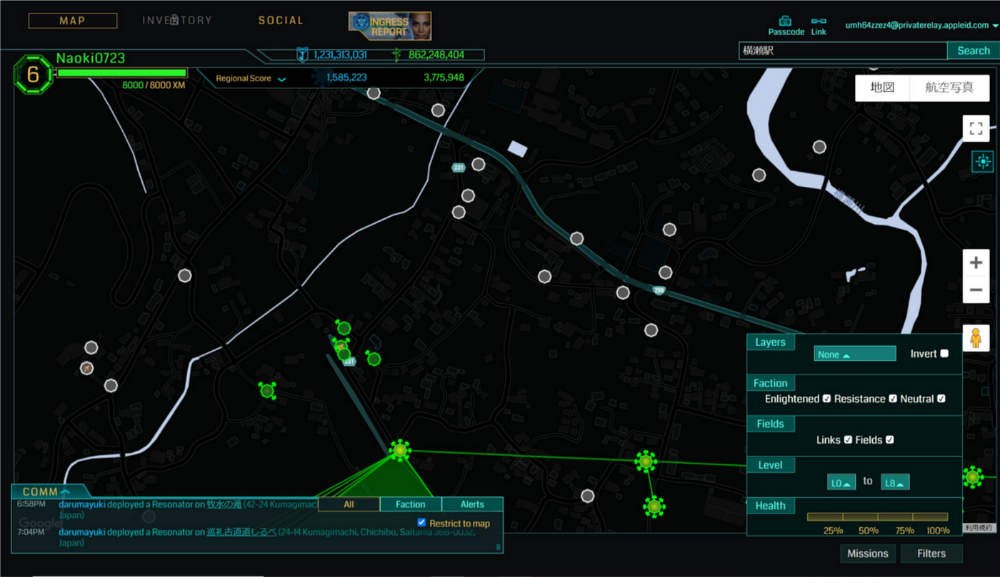
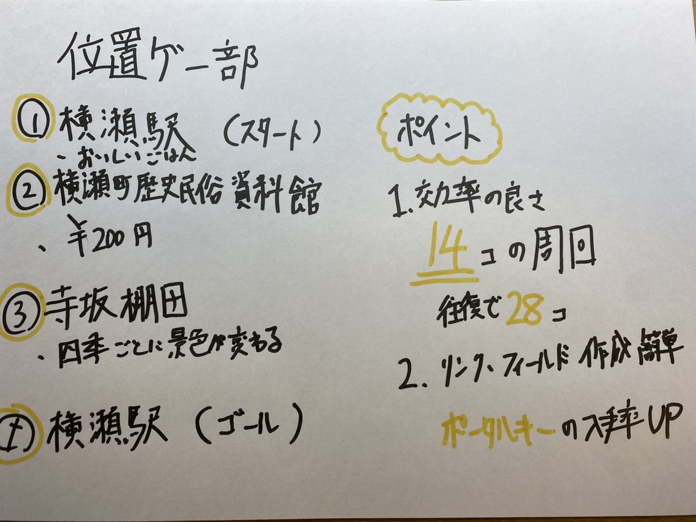

イングレスをしつつウォーキング

位置情報ゲーム部では位置情報ゲームをしつつウォーキングを楽しむことが出来ることを目標に取り組みました。

＃＃候補

話し合いの結果、候補が3つ上がりました。

・ドラクエウォーク

・Ingress

・PokémonGo

その中でも今回は中立のポータルが多く存在し、経験値も効率的に稼ぐことが出来るIngressにしました。

##時間設定

特に気軽に行う事を目標とし、1時間ほどで周ることが出来ることを目標としていました。

##コース紹介

1. 横瀬駅 （スタート）

道中に秩父のB級グルメで有名なみそポテトを食べたり、美味しいパン屋で有名な「ヤッホーパン」を堪能することが出来ます。

2. 横瀬町歴史民俗資料館

入館料が200円かかってしまいますが、秩父全域の考古・歴史・民族を学ぶことが出来ます。

3. 寺坂棚田

県内最大級の棚田で四季を通して、景色が変わりゆくので通年楽しむことが出来ます。

4. 横瀬駅 （ゴール）

##ポイント

・ポータルがたくさん存在

このコースを行くとポータルを14個周回することが出来ます。帰りも同じ道を歩くので往復で28個周回することが可能です。

・リンク・フィールド作成が簡単

往復をするので取れなかったポータルキーも入手する確率が上昇します。

グラレコはこちら

