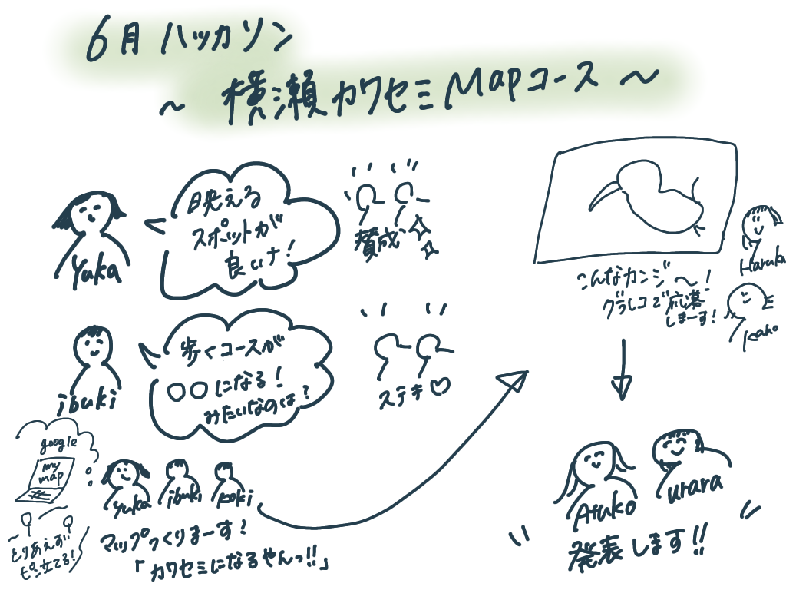

### 横瀬町を歩くと〇〇になる？！

今週は６月ハッカソンの「横瀬ウォーキングコースアワード 観光部門」にデザイン部として応募しました。

様々な案が出ましたが、やっぱり映えるところに行きたい！という意見と歩いた軌跡が何か形になるのが良いという意見により、それを合体したものを提出することにしました！

横瀬の名所を調べ、どんな形にできるかを考える班、グラレコ班に別れて作業を行いました。

[ウォーキングコース](https://www.google.com/maps/d/u/0/edit?mid=12ZGJEMXJqXBw9bCIE-kF4nTfh0Ws7FUU&ll=35.974855184809414%2C139.10848023125027&z=13)は下記のようになっています。

横瀬駅→牧水の滝→武甲山の資料館→大慈寺→武甲温泉→歴史民族資料館→カフェ茶min→古民家工房「かとう」→根古谷城址→味噌ポテト→横瀬

**＃ポイント１**

スポットはカフェや温泉、景色が綺麗なところなど「写真映え」を重視しました。

少し外れたところにある根古屋は城跡の跡地で緑豊かな場所にあるため自然を感じられるのではないでしょうか。

一つ一つのスポットとの距離が離れているので半日ぐらいかけてじっくり回ると良いと思います！

**＃ポイント２**

AからJのスポットをstravaなどのランニングアプリを活用し巡ると、横瀬町の鳥である「カワセミ」の形が浮かび上がります。
（考えるのめちゃめちゃ大変だった）

本物のカワセミを探しながら歩くのもアリです！！！

**＃反省点、課題**

今回のハッカソンの反省点としてはMTGに参加できなかったメンバーと
〆切日の確認を怠ってしまったことです。

GitHubでのマイルストーンを利用したスケジュールを徹底して行こうと思います！！！

**＃グラレコ**

【発表用資料】

[https://docs.google.com/presentation/d/1krfIYRIJ0NcgSocYok5KIB2iLpl7sEaixamwtBrTS24/edit#slide=id.gdefdb56a1a_1_0](https://docs.google.com/presentation/d/1krfIYRIJ0NcgSocYok5KIB2iLpl7sEaixamwtBrTS24/edit#slide=id.gdefdb56a1a_1_0)
