### フリーイラスト素材集作成｜デザイン部

古橋研デザイン部の安田遥です。今週のデザイン部の活動を紹介します。

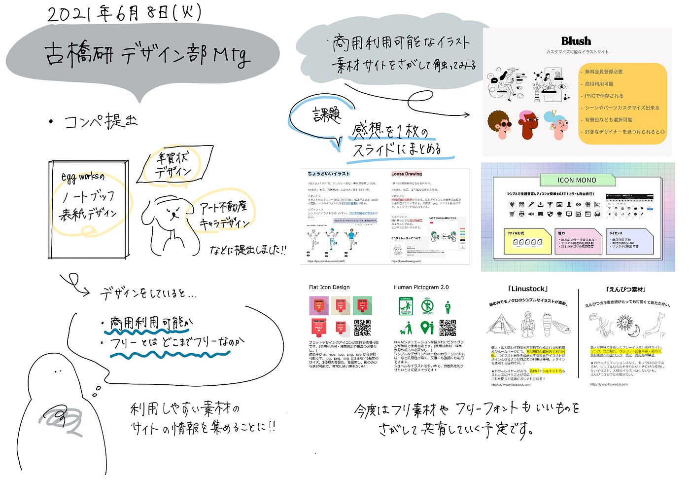

#### 今回提出したコンペ

・2022年れいわdeねんが寅年年賀状 商品化デザイン募集

[https://compe.japandesign.ne.jp/reiwadenenga-tora-2021/](https://compe.japandesign.ne.jp/reiwadenenga-tora-2021/)

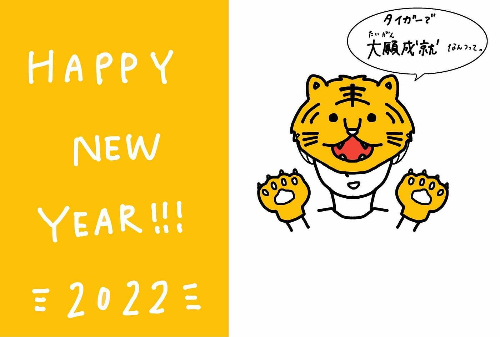

・アート不動産キャラクター大募集

[アート不動産キャラクター大募集キャンペーン
松山市・東温市エリアNo.1の不動産情報量をご提供するアート不動産のオフィシャルキャラクターを募集します！ あなたの応募作品が選ばれるかも！？最優秀賞10万円（1名様） 優秀賞5万円（2名様）www.7300.co.jp](https://www.7300.co.jp/charactercontest/)

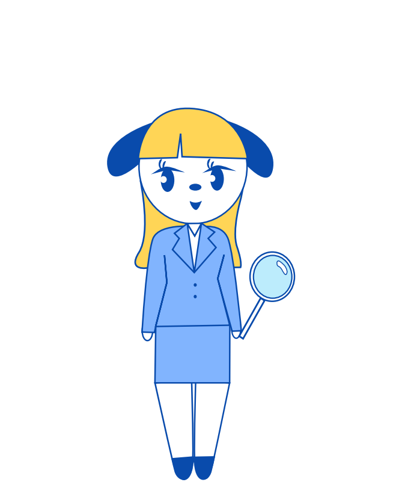

・EggnWorks 第3回 ノートブックの表紙デザイン

[EggnWorks 第3回 ノートブックの表紙デザイン | コンテスト 公募 コンペ の[登竜門]
EggnWorksは隠れた才能を見出し、商品化して世に出すアーティストのためのクラウドファンディング プラットフォームです。…compe.japandesign.ne.jp](https://compe.japandesign.ne.jp/eggs-design-2021/)

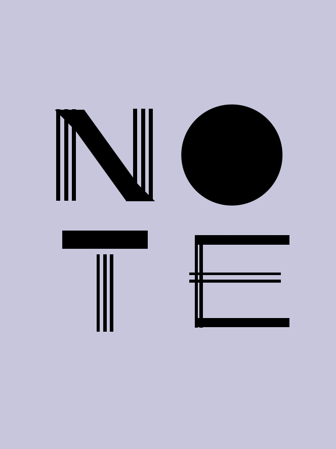

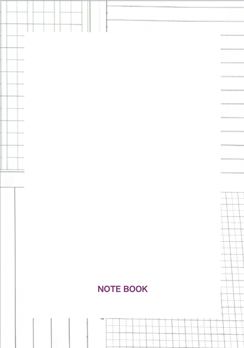

#### 今週の課題

コンペ提出をしていく中で、商用利用可能なフリー素材やフリーイラストの使い方が話題になりました。そこで、今週はフリーのイラスト素材を使ってみた感想をスライドにまとめてくることになりました。

フリー!‼︎!アイコンズ
[https://free-icons.net/category/money/](https://free-icons.net/category/money/)

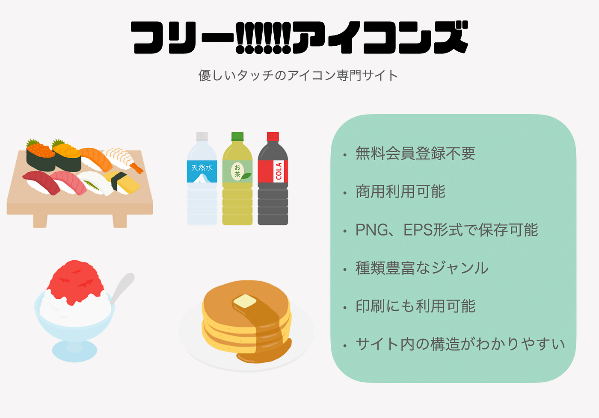

blush
[https://blush.design/ja/categories/work](https://blush.design/ja/categories/work)

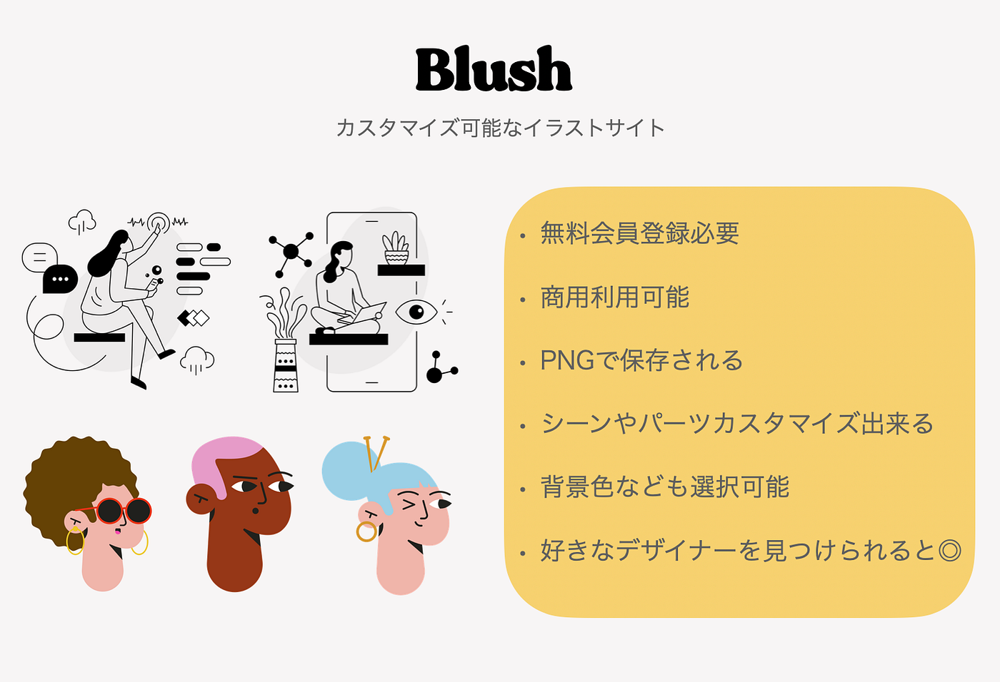

ちょうどいいイラスト

[https://tyoudoii-illust.com](https://tyoudoii-illust.com/)

loosedrawing

[https://loosedrawing.com/](https://loosedrawing.com/)

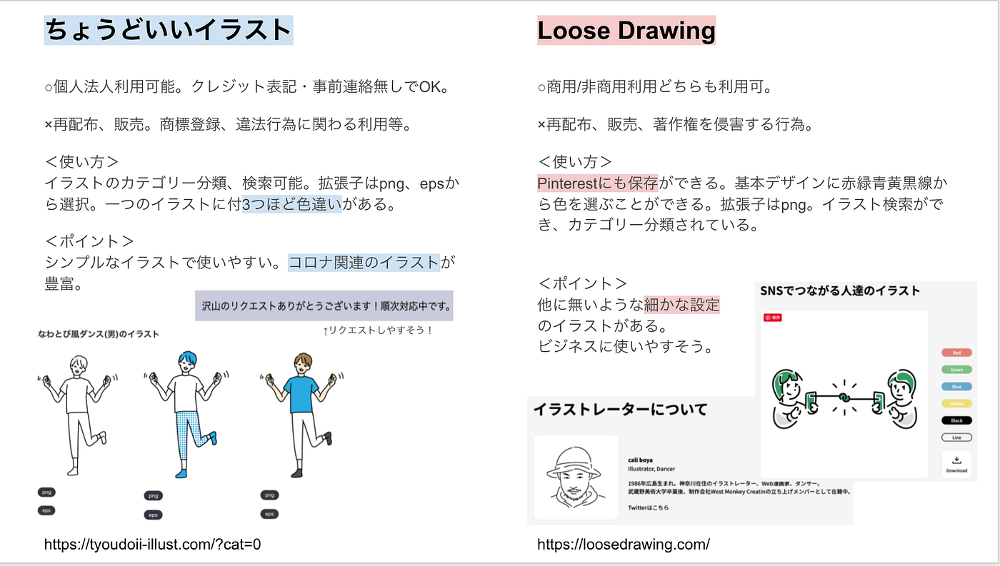

Flat Icon Design 
[http://flat-icon-design.com/](http://flat-icon-design.com/)

Human Pictogram 2.0
[https://pictogram2.com/](https://pictogram2.com/)

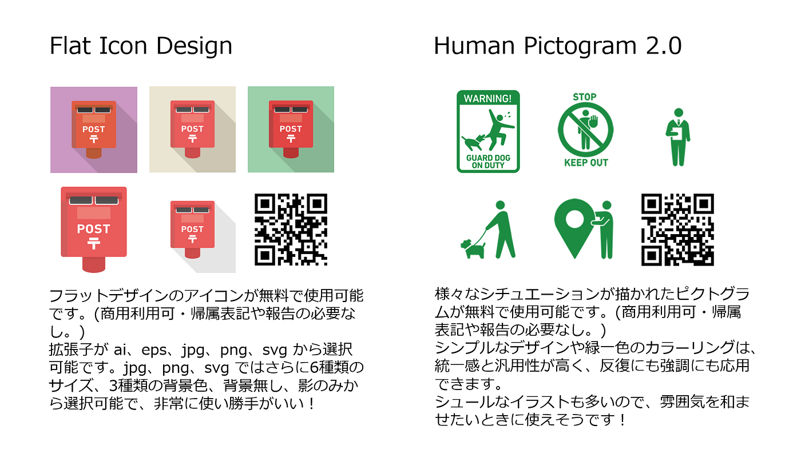

えんぴつ素材

[https://enpitsu-sozai.com/](https://enpitsu-sozai.com/)

Linustock
[https://www.linustock.com/](https://www.linustock.com/)

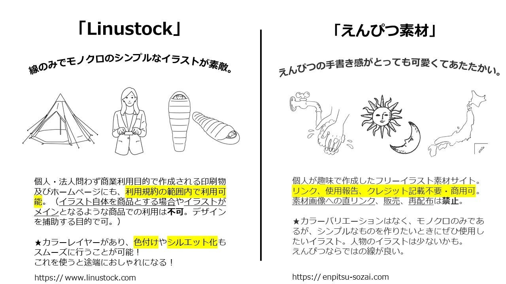

ICON MONO
[https://icooon-mono.com/](https://icooon-mono.com/)

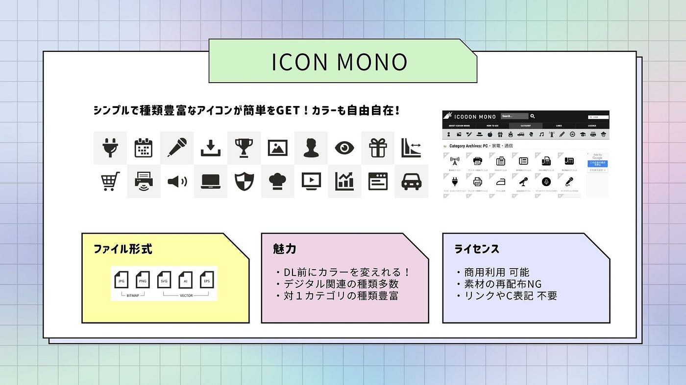

Town illust
[http://town-illust.com/](http://town-illust.com/)

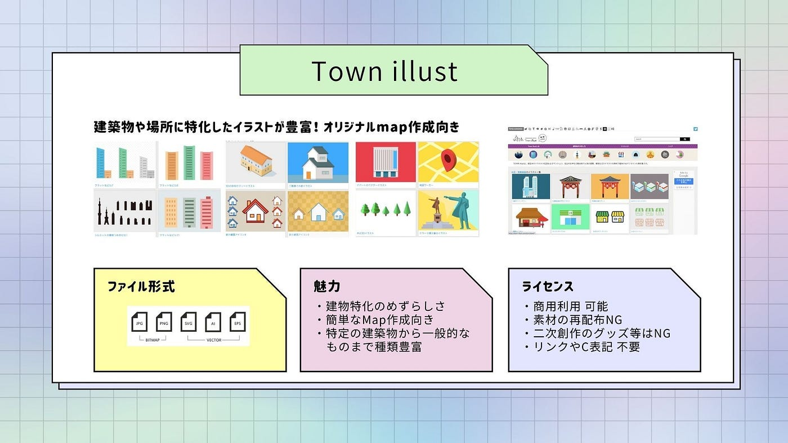

Sapiens Character Builder [@UI8](http://twitter.com/UI8)

[Sapiens Character Builder @UI8
Look what I just made with the Sapiens Character Builder @UI8sapiens.ui8.net](https://sapiens.ui8.net/6m3c3c2)

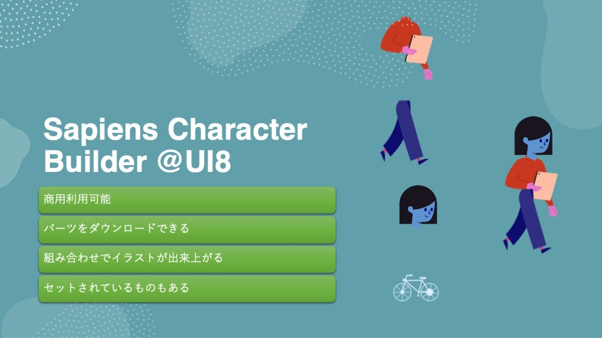

IRA Design Elements

[IRA Design by Creative Tim
Discover IRA illustrations to power up your project.iradesign.io](https://iradesign.io/illustrations)

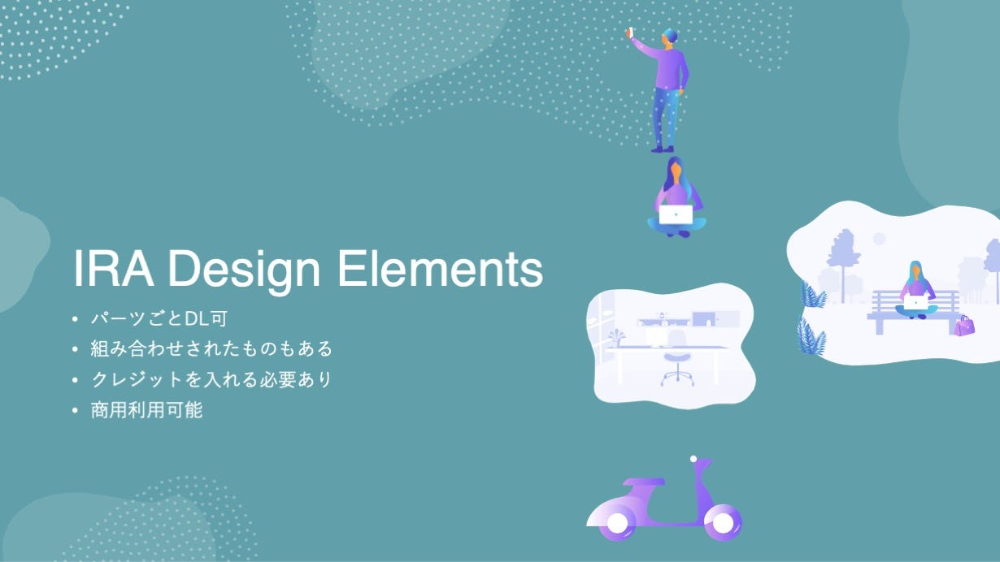

以上です。是非参考にしてみてください。
