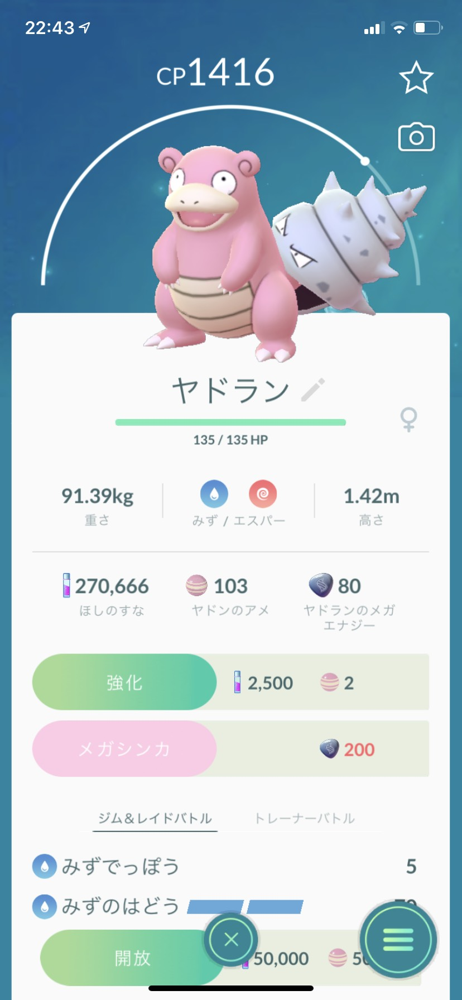
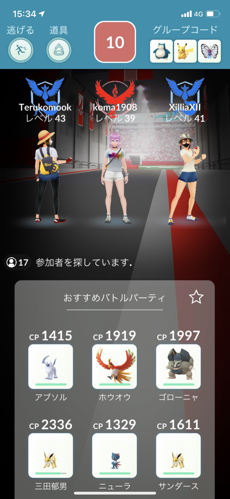
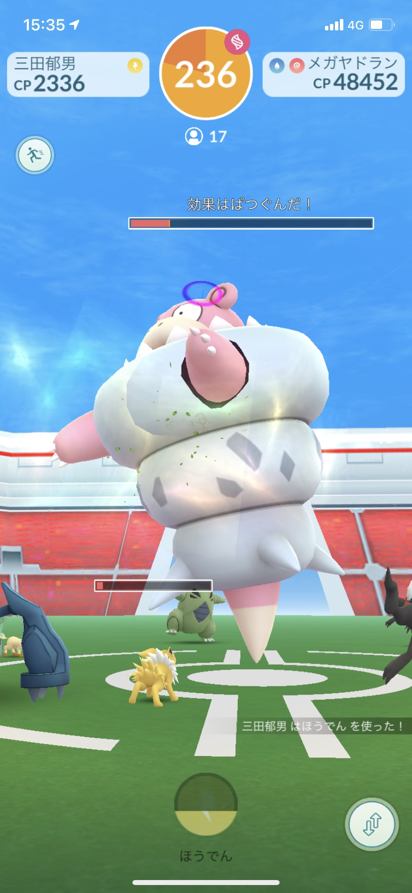
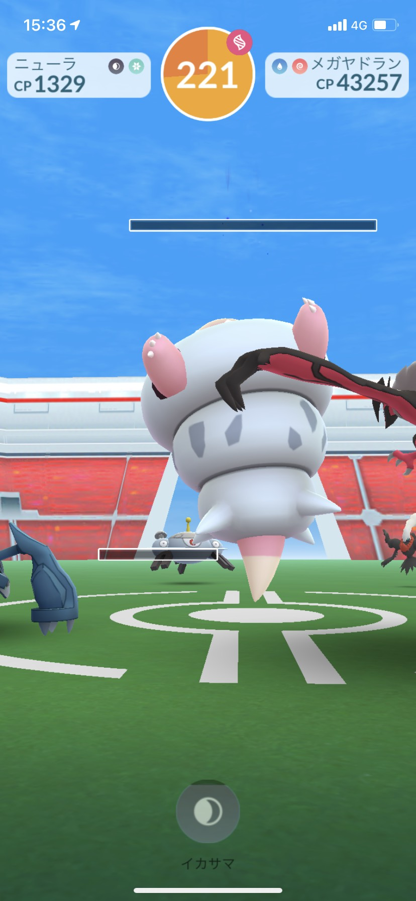
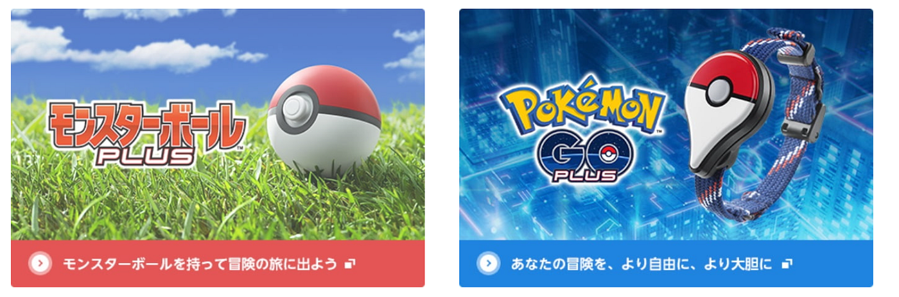
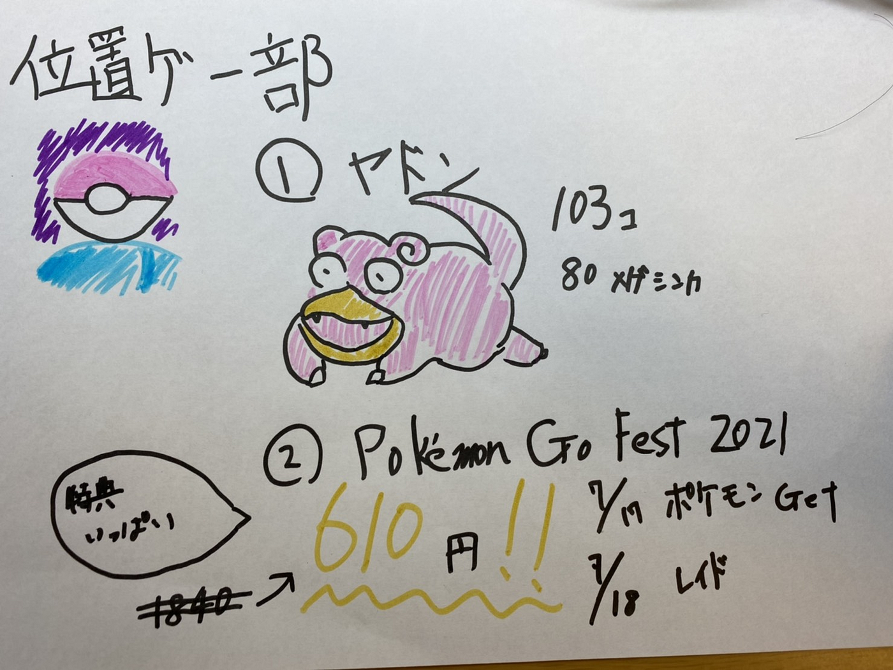

今年はPokémon GO Fest 2021に！！ 位置ゲー部

こんにちは。位置ゲー部の伊藤です。

#### ＃＃ドラクエウォークについて

ドラクエウォークは現在ドラクエ2とのコラボが始まっています。実際にプレイしてみたところ、割と今まで通りのイベントでした。

メガモンスター討伐も人数が集まらず、なかなか思うように楽しくできなかったので、先々週の週報で上がっていた、Pokémon Goをプレイしてみました。

#### ＃＃ヤドンの飴を求めてたまプラーザ駅周辺を散策

フカマルのイベントが終了して、ヤドンのイベントがまだ開催していたので、1時間30分でどれくらいの飴が集まるか散策しました。

結果として103個のヤドンの飴、そしてヤドンのメガシンカのエナジーを80集めることが出来ました。

レイドバトルもさすがPokémon Goです。平日ですが17人も集まりました。Pokémon Goはまだまだ初心者ですが上級者の人が倒してくれました。

改めて大人数で攻略することの楽しさを知りました。

大勢の人と楽しむならPokémon Goが一番ですね。

#### ##Pokémon GO Fest 2021

去年はハッカソンで参加しなかったPokémon GO Festに参加したいと思います。

日程は7月17日・18日に開催されます。

1日目がポケモンゲット2日目がレイド中心のイベントになっています。

チケットを購入しなくても遊べますが、より楽しむならチケット購入推奨です！

5周年を記念して1840円が610円になります。

少しチケットを購入して良いことを書きます。

1日目

・スペシャルリサーチで幻のポケモンゲット・着せ替えのチャンス

・色違いがより多く出現する

2日目

・レイドをクリアするたびに10000XPを追加で獲得できます。

・ジムのフォトディスクを回して最大10個のレイドパス

・タイムチャレンジ達成で最大8個のリモートレイドパス獲得

・無料のリモートレイドパス3つ獲得

2日目を最大限にプレイするだけで、210000XPチケットを所有していない人と差が出ます。

かなり大きいですね。

詳しい内容は[こちらから](https://pokemongolive.com/post/pokemongofest2021-announcement/?hl=ja)

##効率を重視するために

Pokémon Goを効率的に周回するために、どうしても欲しいものがあります。

それはこのどちらかです。

どうしても効率を重要視するとポケモンの自動獲得・ポケストップの道具を自動的に獲得が必要になるので今後試しに購入したいと思います。

今週は以上です。

グラレコはこちら

