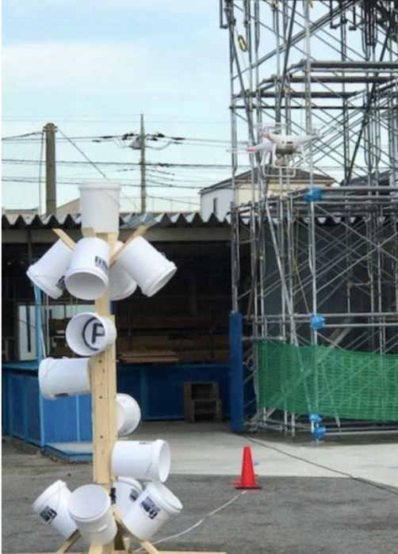
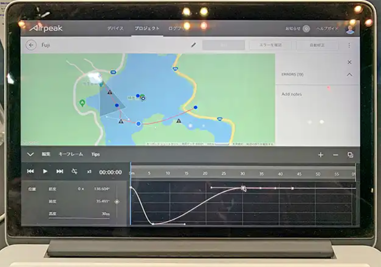
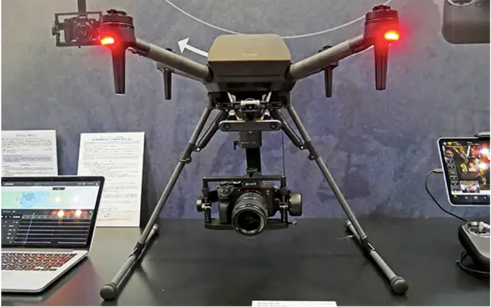

### STMをつくろう!

今週のドローン部ではSTMツールキットを作成することについて話し合いました。

標準性能試験法 ”STM for sUAS” とは”Standard Test Methods for SUAS”の略で、「**ドローン操縦者の技能評価法**」のことです。

STMの詳しい説明については昨年のドローン部部長森田の記事に書かれているため割愛します。

[ドローン部週報 ７週目
今週はドローン部リーダーに就任してから、ポップアップ広告がDJIだらけになってしまった3年の森田が担当いたします。今回は最近話題になりつつある、「ドローン技能評価方法 ”STM for…medium.com](https://medium.com/furuhashilab/%E3%83%89%E3%83%AD%E3%83%BC%E3%83%B3%E9%83%A8%E9%80%B1%E5%A0%B1-%EF%BC%97%E9%80%B1%E7%9B%AE-917d1b32d7be)

### 実際に作成してドローン部の操縦技能向上に

STMの材料として必要なのはバケツと木材だけなので、これらを買い揃えていく計画を立てました。まずは簡単に手に入るバケツから入手してその中にアルファベットや数字を記載していくところからスタートしていく予定です。

### 今週のドローンニュース

Japan Drone 2021が現在幕張メッセにて開催中です。

今回は目玉と言えるSONYの「Airpeak S1」に注目してみます。

この機体の主なスペックは

> 対角寸法60cm強（約644.6mm、モーター対角）

> フルサイズ一眼カメラ「α」シリーズを搭載できる世界最小クラスの機体

> 90m/hの飛行スピードや20m/sの耐風性能

となっています。

前後左右下面にステレオビジュアルセンサー、上下に赤外線センサーを搭載しています。そしてそれらの技術ベースであるフライトコントローラー、センサー類、モーター、バッテリー、プロペラなど、ジンバル以外はほぼSONYの内製とのことです。

なかでも注目なのが、自動航行のフライトミッションを作成したり、機体やバッテリーの状況を一覧表示したりできるWebアプリケーションです。独自の機能としてのフライトプラン作成機能では、「**ベジェ曲線**」を使ってなめらかなコース設定や高度設定ができる仕様になっています。

これまでのスタンダードは点と点を結んでいく「**ウェイポイント**」機能が一般的でしたが、直線的な動きになってしまうため、ベジェ曲線によって滑らかなコースをデザインできるようになることは非常に魅力的であると思います。

これに加えて、高度やカメラの角度も設定できるので自動航行による滑らかな空撮が可能になると考えられます。

