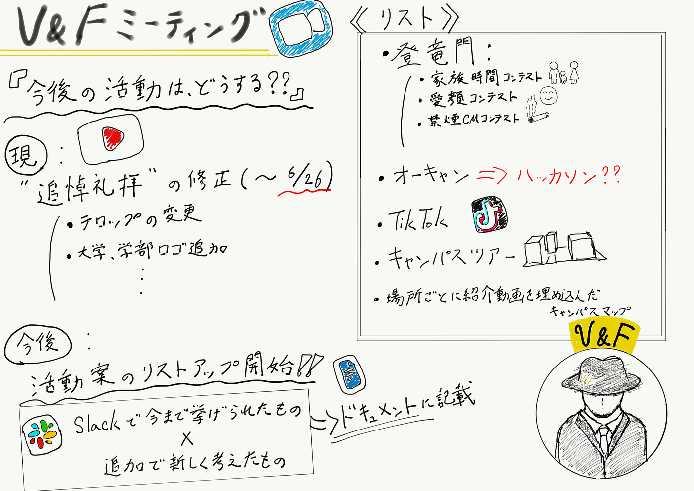

### V&F今後の展望

今週のV&F週報を担当する３年の葉賀です。実は今回が初メディウム担当ということで、少しドキドキしながら書いています。よろしくお願いします^^

今週の私たちの議題は**「これから何をする？」**です。

追悼礼拝動画の編集も残すところはロゴなどの細かい修正のみになりました。(修正版の完成は6月26日を予定)

V&Fとしては**今後は編集のクオリティを上げつつ、どんどんコンテストに応募したり、公開していきたい**ということで

→**どんな動画を作りたいかや参加してみたいコンテストなどを出し合いリストアップしました！**

＜アイデア＞

> _・映像コンテスト応募_

> _・編集技術の勉強会(アニメーションなど)_

> _・Tik Tok_

> _・学部向けのキャンパスツアー動画_

> _・紹介動画を埋め込んだキャンパスマップ作成 etc._

いろいろ出ましたが、まずは7月・9月末・10月締め切りの３つのコンテストを大きな目標として設定しました。

これらに照準を合わせて、間の期間にキャンパス動画などを作って技術向上を図っていこうと思います。

### 今後のV&Fの成長に乞うご期待！

【グラレコ】

