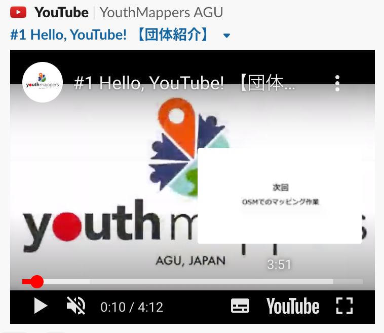
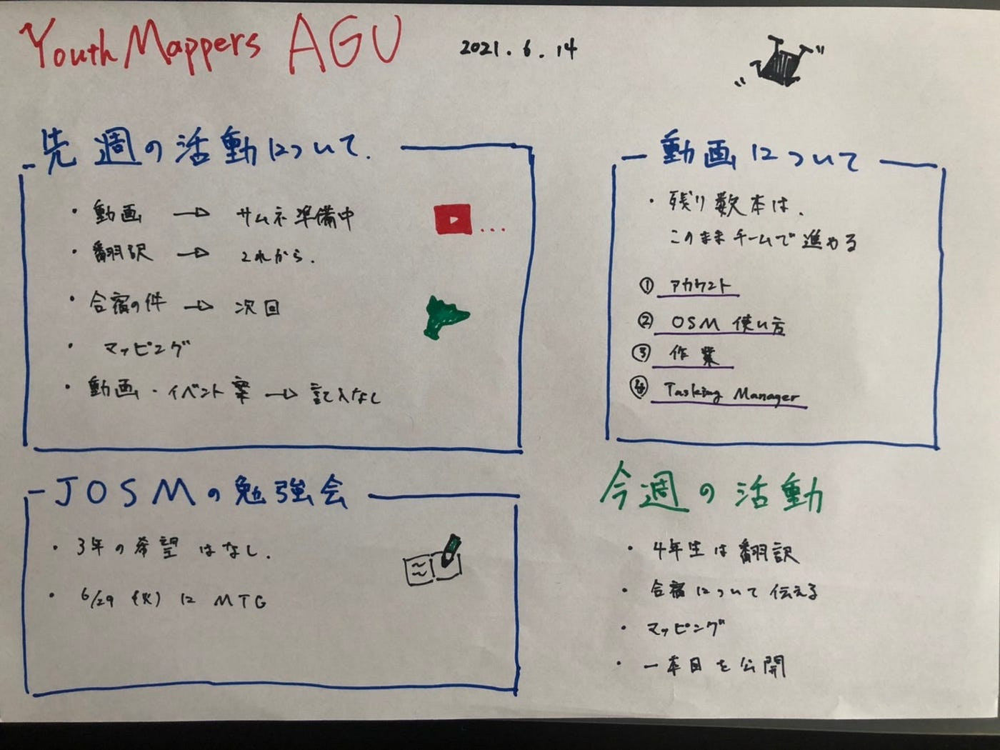

### マルチタスク・マッパーズ

こんにちは。今週の週報を担当する３年の葉賀です。メディウムは慣れないですが努力します。

6月14日に行った定例会議をレポートします。いくつかのタスクが同時に進行しているため、少し慌ただしいですが頑張っています。

**【動画チーム】**

ついに1本目の動画「＃1 Hello, YouTube!【団体紹介】」をYouTubeで公開しました！

この勢いに続いて２本目以降も順次投稿していきますので、お楽しみに。

**【横瀬の防災訓練】**

４年の日向野、木多が参加しました。天気が悪い中でしたが、ドローンも飛ばしました。

**【島でマッピング】**

夏休み中、伊豆大島でマッピングすることが決まりました！

(現在日程を調整中)

**【State of the Map】**

ポスターの制作の期限が近いので担当者を決め、制作に取り掛かりました。

昨年１年間の活動を振り返り、ポスターにしてまとめます。

#### 【グラレコ】

