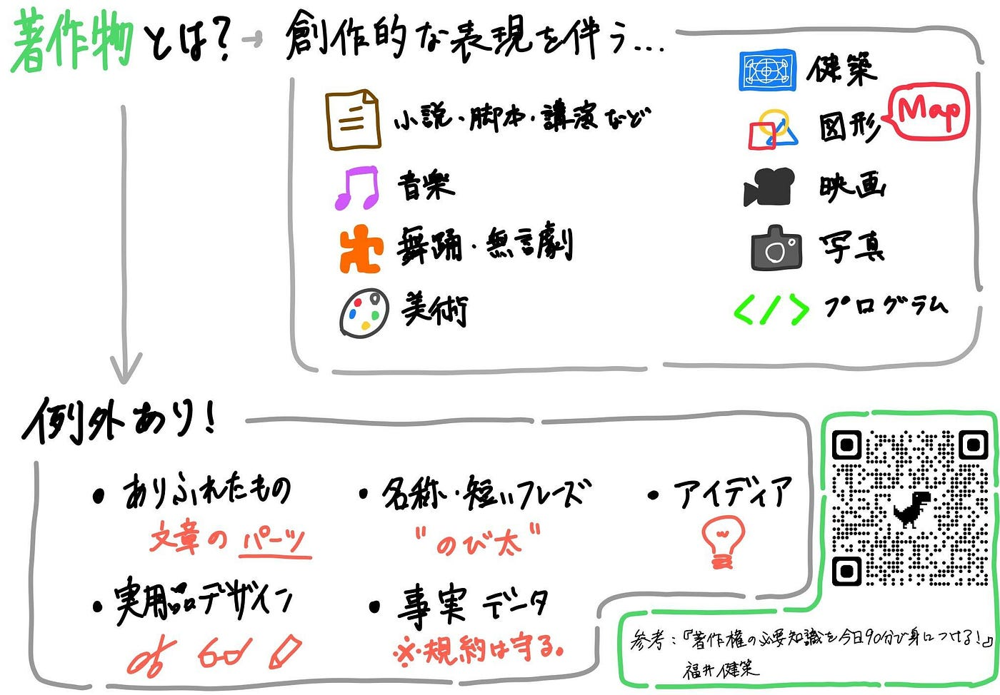
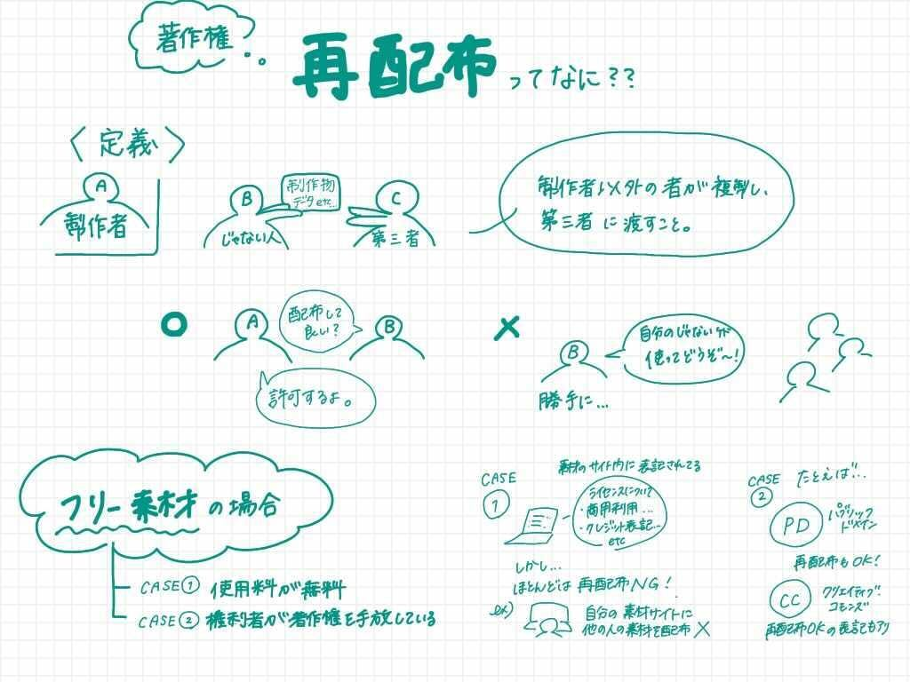
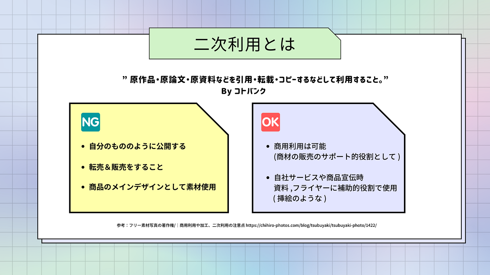
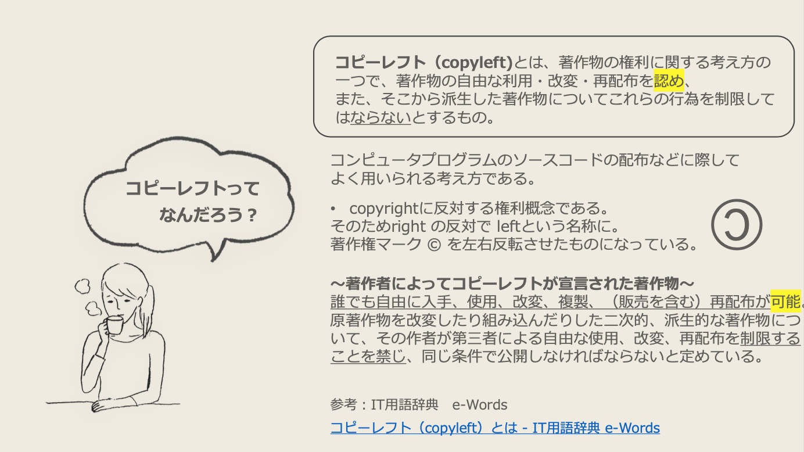

### 商用利用？再配布？今更人に聞けないライセンスの話

タイからこんにちは、デザイン部の斎藤です！

素材利用にまつわる著作権の話や細かいライセンスの区分についての理解を深めたい！ということで
**今週は「素材利用にまつわる専門用語集」を作成しました。**

というのも
隔週でコンペにむけて製作物を用意したり
資料作成をしたり
サークルやその他の団体で何らかの情報をまとめる大学生にとって
「フリー素材」「商用利用可能」等のラベリングがされている素材サイトは最高の相棒。

でも、
そもそもフリーって何？
商用利用可能ってどこまでOKなの？
そんな疑問が頭によぎったことのある学生はきっと多いはず。
私たちデザイン部も古橋研に所属しながらもアレ？となったその一人です。

**以下、メンバーが各々の気になった言葉を調べまとめたものを載せていきます。**
これらをもとに来週の授業内で古橋先生へわからないことを
質問させていただけたらさらなる理解につながるのではと思います！

【 著作物 】By Ibuki Shibayama

【 再配布 】By Kahoru Sato

【 二次利用 】By Yuka Saito

【 コピーレフト】By Urara Nagashima

以上です！

一概にフリー、や商用利用可能といってもはっきりとした区分付けをするのは難しいようですね。
私たちもライセンスには今一度気をつけて見ていく必要があります！
