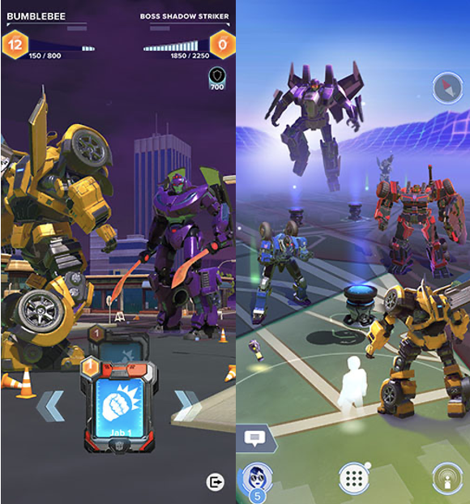

### nianticが近々出しそうで出さないゲーム

現在、イングレス、ポケモンgo、ハリポタを開発提供している。最後にサービスが始まったのはハリポタでもうすぐ二年がたつ。その後、nianticから様々なアプリの情報が提供されたが、まだサービス開始とはなっていない。では、どのようなゲームがあるのであろうか

> カタン・catan-world explorers

2019年10月24日に開催されたドイツのボードゲームイベント「[SPIEL’19](https://www.spiel-messe.com/)」でお披露目となりました。そこから、情報は発信されておらず7月に入ってニュージーランドでbテストが始まりました。本来のカタンと一緒で、資源を集めて建設すること。そして、派閥に分けて競い会うことが予想されます。今年中にリリースされると思われます。

> トランスフォーマー・TRANSFORMERS: Heavy Metal

Niantic，タカラトミー，Hasbroの共同で制作で６月に制作発表が行われ、今年中にリリースされる。公式ブログに載っている情報で『TRANSFORMERS: Heavy Metal』では、プレイヤーはオートボットと絆で繋がり、ディセプティコンと戦う「ガーディアンネットワーク」に参加します。ガーディアンの一員となったプレイヤーは地球各所の隠された地でリソースを見つけ、個人またはフレンドと力を合わせてターン制バトルでディセプティコンと戦います。

> ピクミン

情報なし！！！

皆さんはどのゲームが楽しみですか？私は、カタンです。
