ドローン部週報

今週のミーティングでは以下について話し合いました。

##新しく古橋研で購入したドローンについて

6月23日相模原キャンパスで開催される、座学に参加する方針で明日相模原キャンパスに向かいます。時間がまだ決まっていないのですが大体どのくらいの時間になりそうでしょうか。

##STM for sUAS作成について

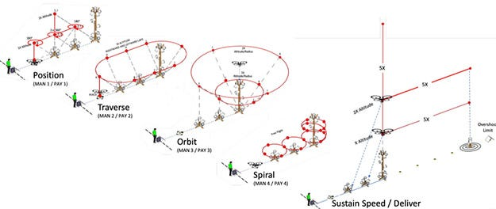

先週のゼミが終わった後にホームセンターにバケツと木材を下見しました。

バケツと木材があることを確認し、バケツの必要数が28個必要になるので、100均等のバケツも見てみて購入する事にしました。

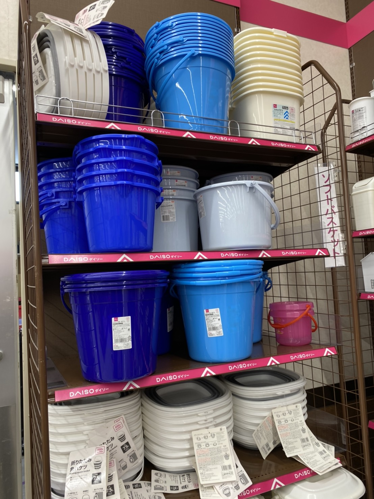

100均で売っていたので後で購入して、研究室に置いていきたいと思います。

ホームセンターのバケツだと10332円かかります。

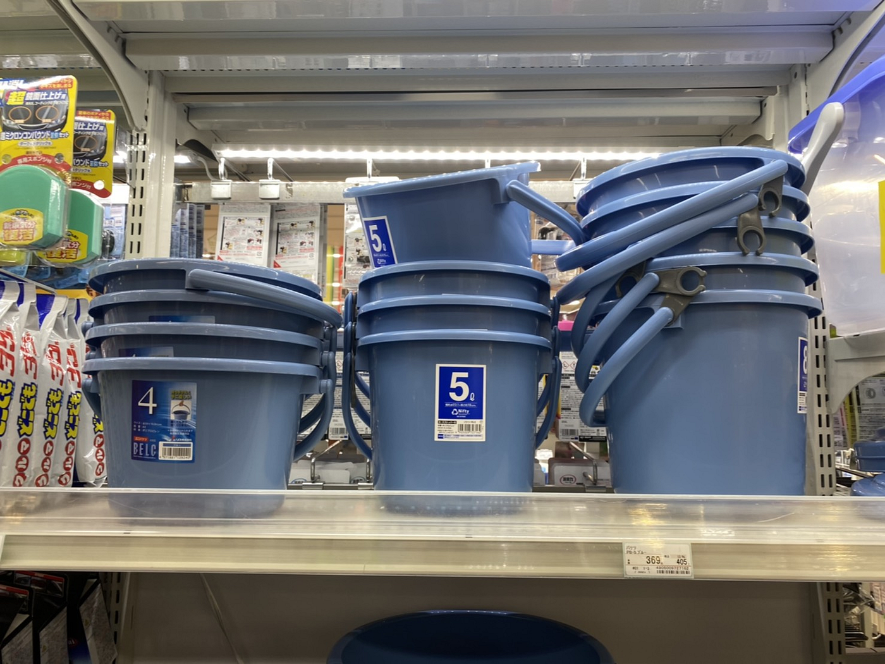

また別のサイトでは小さいキットを作成する際に、木材ではなく丸椅子を使用してバケツを設置していました。持ち運びの楽さを考えると丸椅子の方に軍配が上がると思うので、木材と椅子については要検討しています。

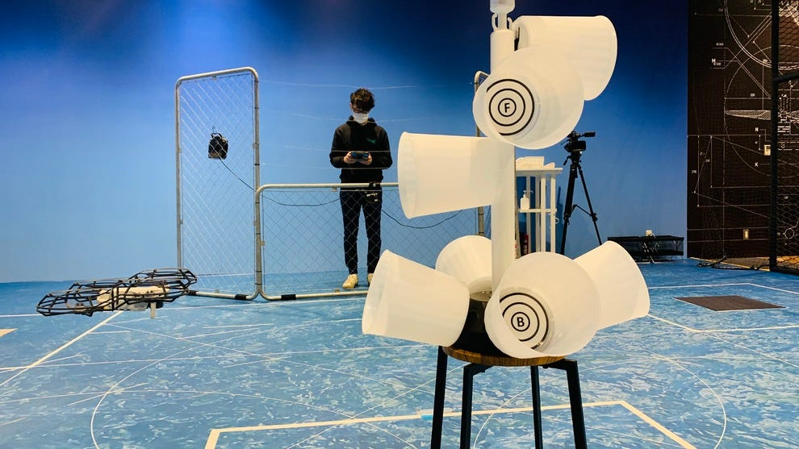

一番高さの出るものもこれで代用できそうです。

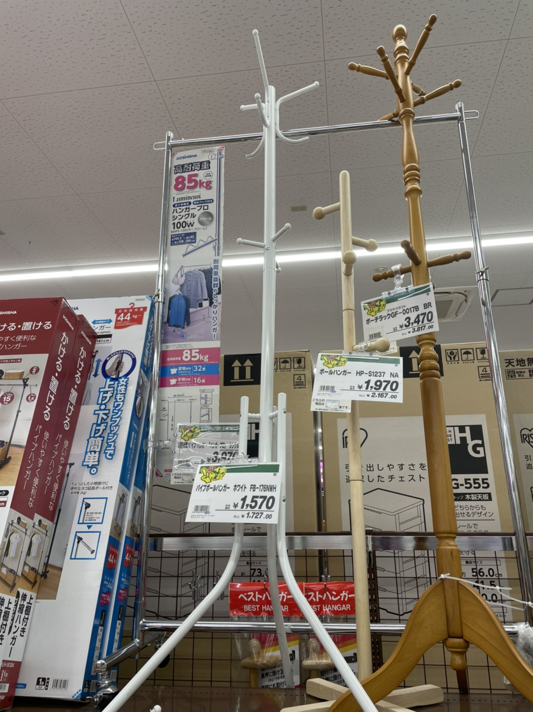

##Japan Drone 2021

前回のゼミが終了後、すぐに幕張メッセで開催されているJapan Drone 2021に向かいました。

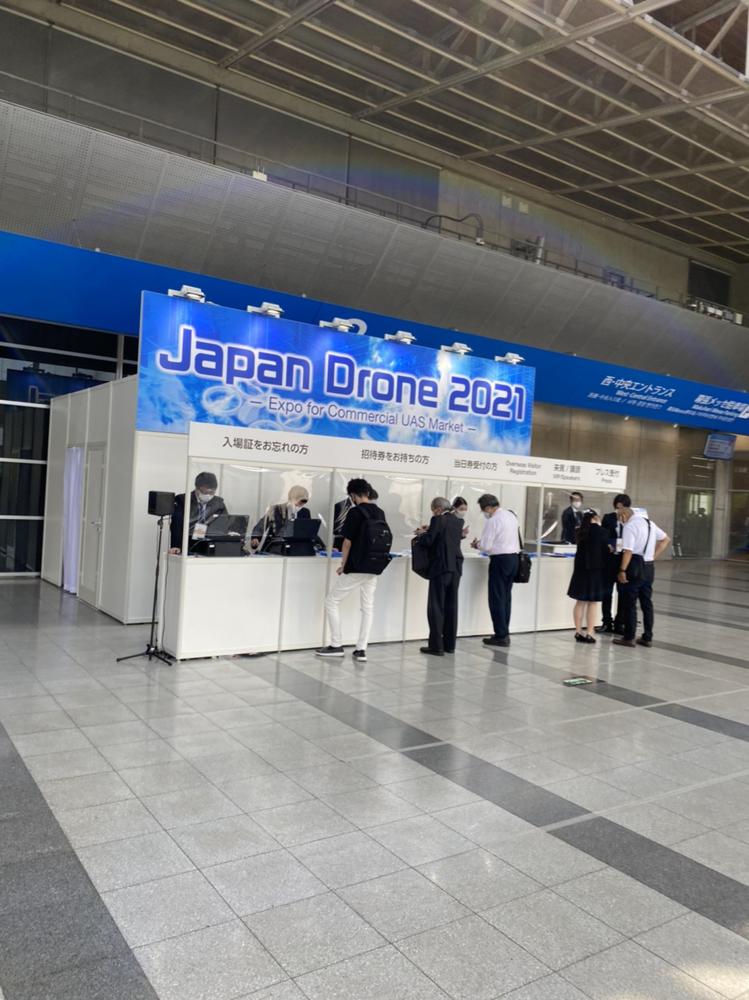

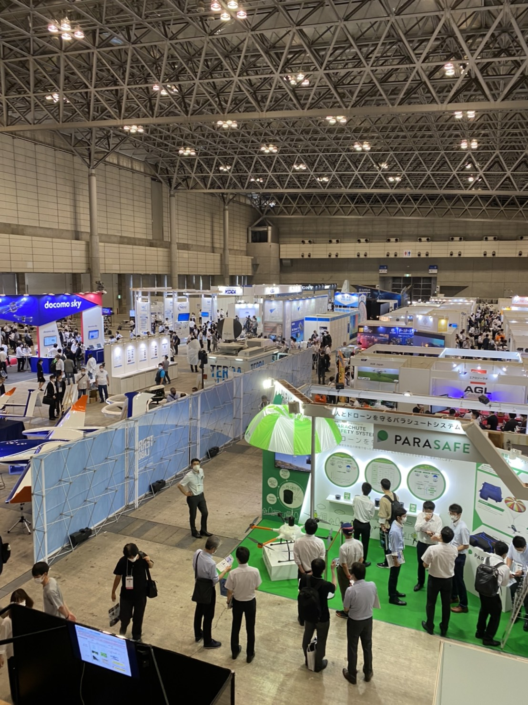

事前登録をすることで無料で見ることが出来るのは良かったです。

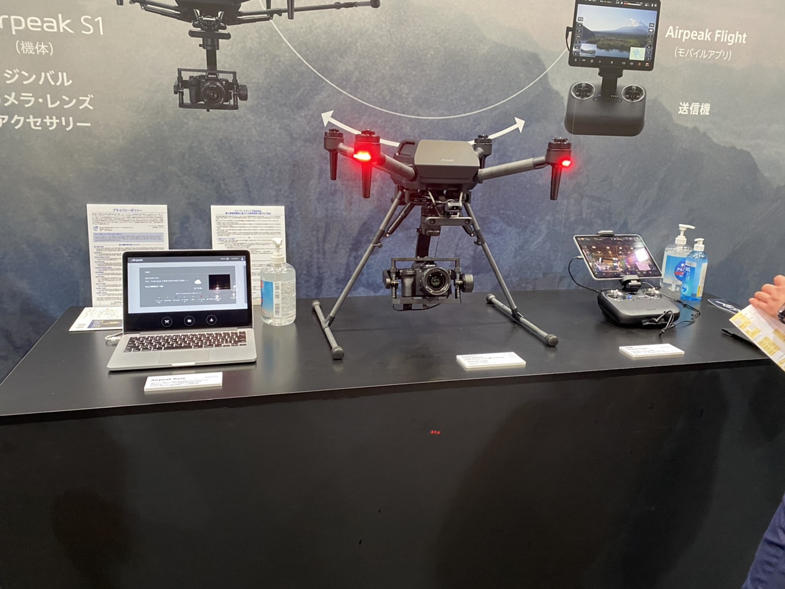

先週週報で発表されていたAirpeakを見ました。

やはりジンバルにＳＯＮＹ製品のカメラが搭載されているのには驚きました。

ビジネスの場というイメージが強く、商談スペースが用意されていました。そのため、名刺を持っていけば良かったと反省しています。

それでも規格外のドローンを見ることが出来たので良かったです。

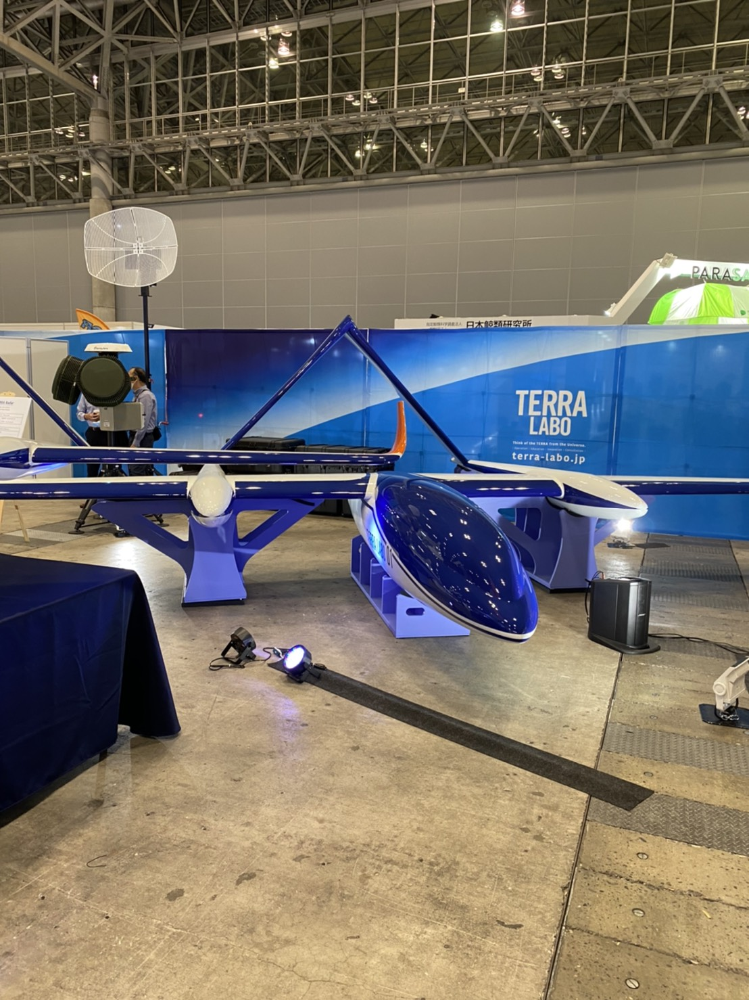

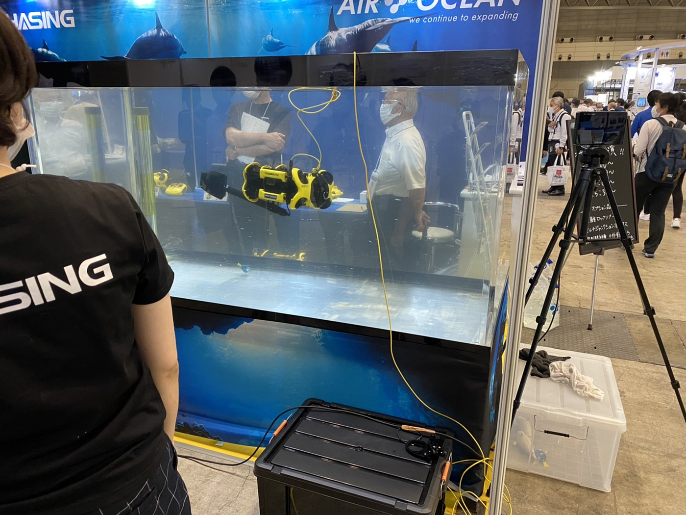

グラレコはこちらです。

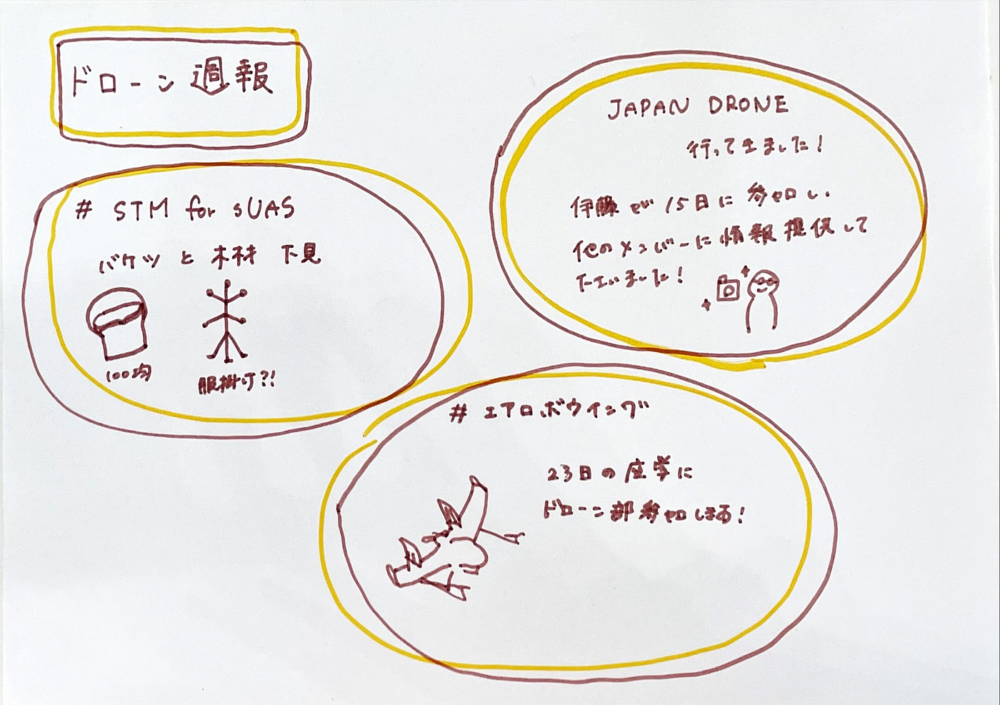
