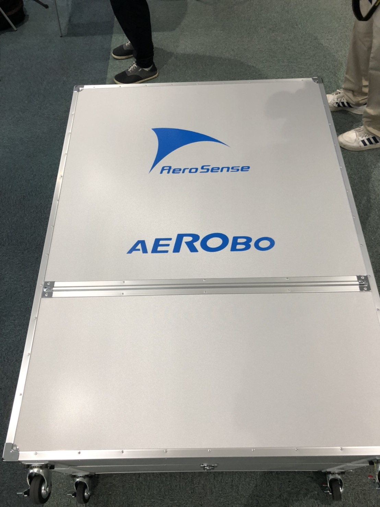
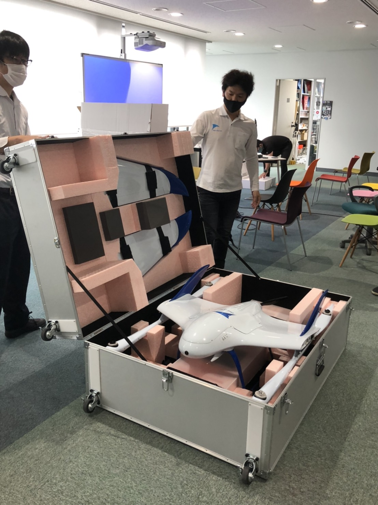
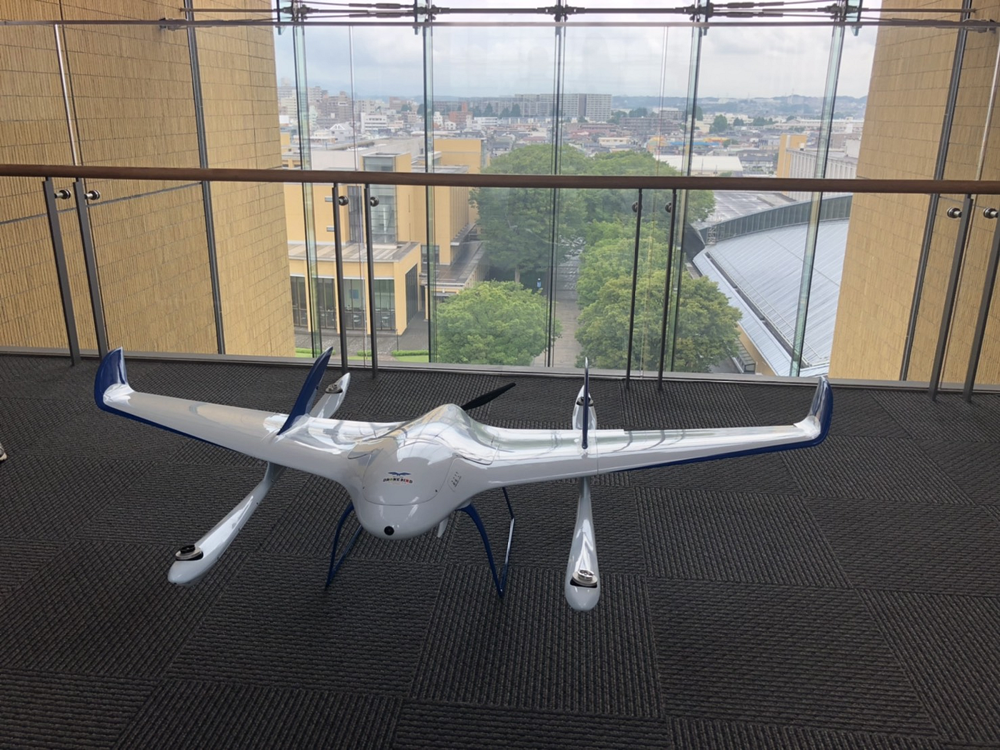
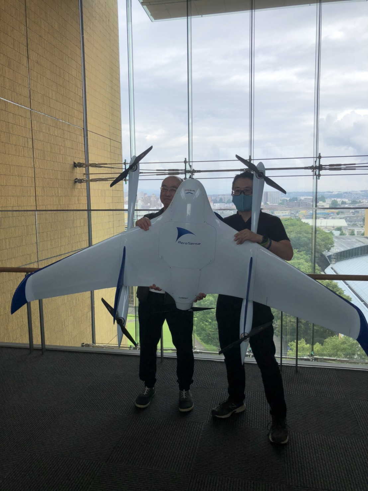
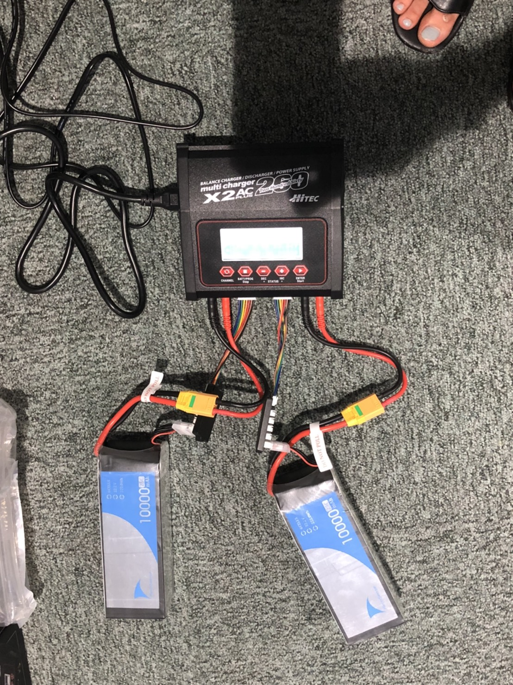
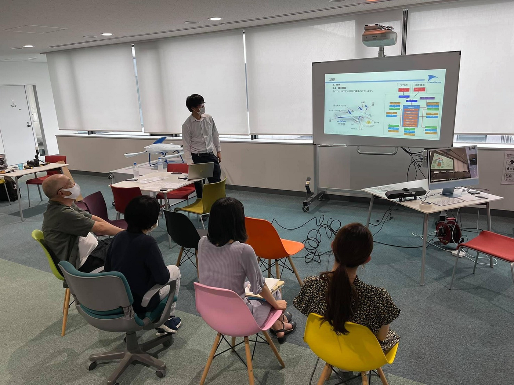
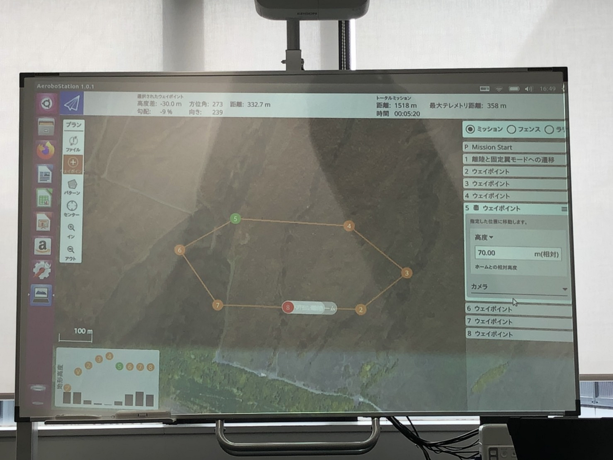
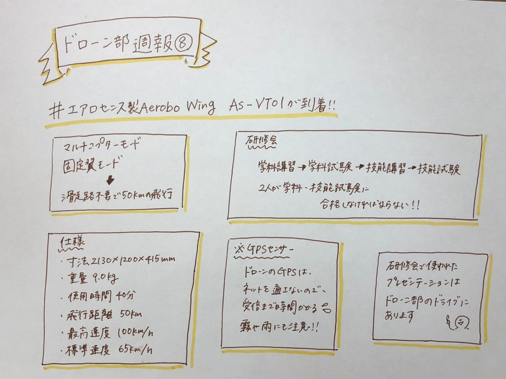

### ドローン部週報⑧

### ＃エアロセンス製 Aerobo Wing AS-VT01が到着！

6月23日にDRONE BIRDにAerobo Wing AS-VT01が納品され、勉強会が開かれました。

#### ＃＃Aerobo Wing AS-VT01

Aerobo Wing AS-VT01が青学に到着し、箱から機体を出す瞬間に立ち会うことができました。

Aerobo Wing AS-VT01はマルチコプターモードでの滑走路不要の離着陸、固定翼モードを用いて50kmの飛行をすることができます。

仕様は

・外形寸法 2130×1200×415mmプロペラなし

・本体重量 9.0kgバッテリー込み

・最大搭載可能重量 １kg

・最大使用可能時間 40分

・最大飛行距離 50km

・最高巡航速度 100km/h

・標準巡航速度 65㎞/h

・飛行制御 飛行計画による自動航行、またはマニュアル飛行

電池は6セルのリポバッテリー（セルとは蓄電池1個を数える単位）

#### ＃＃Aerobo Wing AS-VT01の研修会

次に、Aerobo Wing AS-VT01の操縦者認定研修プログラムが行われました。

研修は無人航空機の自律飛行を行うことが目的です。

学科講習→学科試験→技能講習→技能試験の順番に行われます。2人で飛行作業を行うため、2人が学科・技能の試験に合格し、認定証をもらう必要があります。

今回は学科のコースを行いました。

研修会で使われたプレゼンテーションの写真をドローン部のドライブにまとめています。

[Meet Google Drive - One place for all your files
Google Drive is a free way to keep your files backed up and easy to reach from any phone, tablet, or computer. Start…drive.google.com](https://drive.google.com/drive/folders/1FkPay_OBXbtDaUrPdbPoKXhIrYPu9oE_?usp=sharing)

補足

ドローンのGPSセンサーはスマホのGPSなどと違い、ネットを通さず、信号を受け取っているだけなので、信号受信まで時間がかかります。また、霧や雨に反応する場合があるので、注意が必要です。

以下の写真は自律飛行を行うためのアプリケーションです。ウェイポイントで高度と場所を追加していきルートを設定します。

Aerobo Wing AS-VT01は大規模な測量をすることや、災害時に遠い地域でも迅速に情報を集められることが期待されています。

実際にAerobo Wing AS-VT01が飛行するところを見るのが楽しみです。

