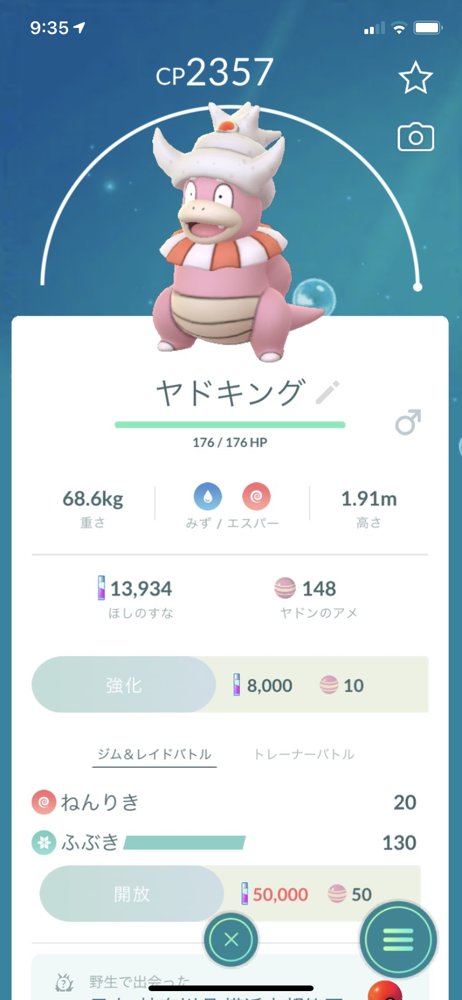
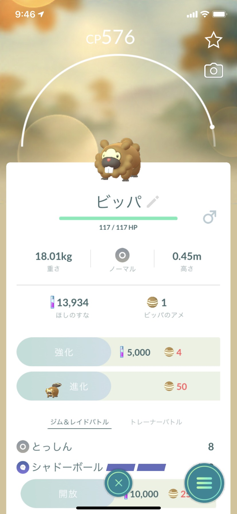
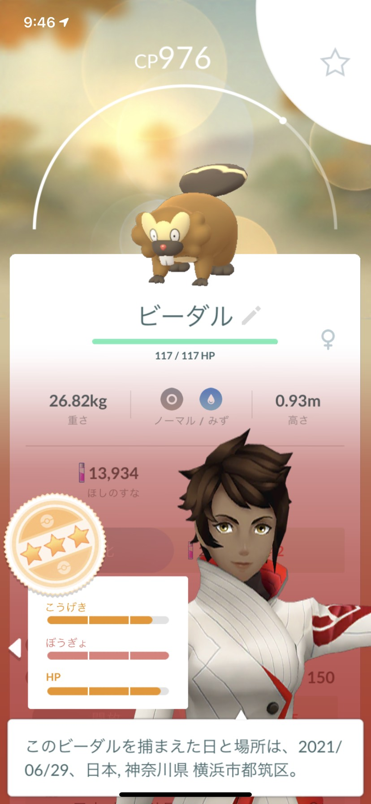
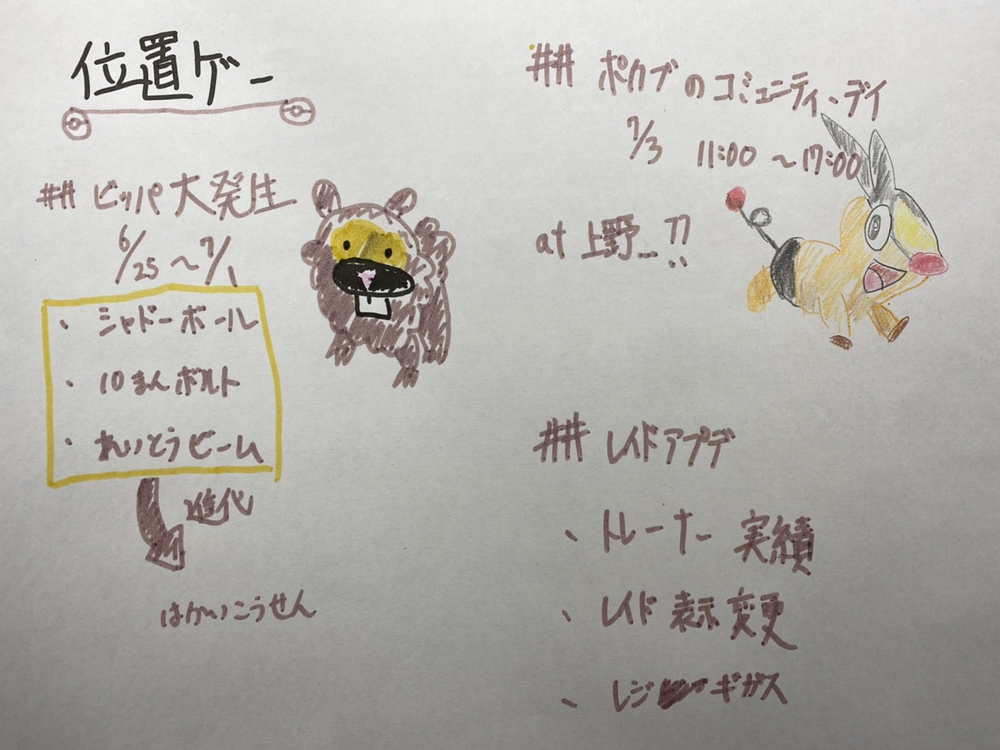

### 位置ゲー：御三家乱獲に備えて

##先週の週報の結果

ヤドンの飴を400近く集めることが出来、高い個体を進化させました。レベルも上げることが出来たので、同じモンスターの大量発生は初心者にとってありがたいです。

##今週周回している「ビッパ大発生」

6月25日から7月1日20時まで開催しているビッパの乱獲を現在開催しています。

シャドウポケモンとしての確立も上がっています。

また期間中はビッパのステッカーを入手することが出来ます。

主な特徴としてビッパが特殊な技を覚えています。

・シャドーボール 6月25日～26日

・10まんボルト 6月27日～28日

・れいとうビーム 6月29日～30日

そして進化させると「はかいこうせん」を覚えたビーダルになります。

ヤドンの時と比べてそこまで、モンスターとしての強みがない印象ですが、集めていきたいと思います。

また、進化後のビジュアルがあまり好ましくないので、嫌な人はビッパのままにしておくと良いのかもしれません。

##今後の開催で期待しているもの

7月3日11時から17時までポカブのポカブのコミュニティ・デイが開催されます。

この日は、空いているので、上野公園でどれくらい効率良く遊んでみたいと思います。

その他にもPokémon Go Fest2021でこれまで登場した全ての伝説ポケモンが参加することが決まりました。

そしてもう一点レイドバトルがアップデートされます。

詳しくは[こちらから](https://pokemongolive.com/post/togetherweraid)

簡略して言うと

・トレーナー実績の追加 ・メダルの獲得（与ダメージが一番大きい・最後のダメージを与えた・最も遠い距離からレイドバトルに参加した等）

・レイドバトルの表示変更 （スタジアムやレイドの表示方法を変更）

・レジギガスが7月1日10時まで開催

以上です。

グラレコはこちらから

