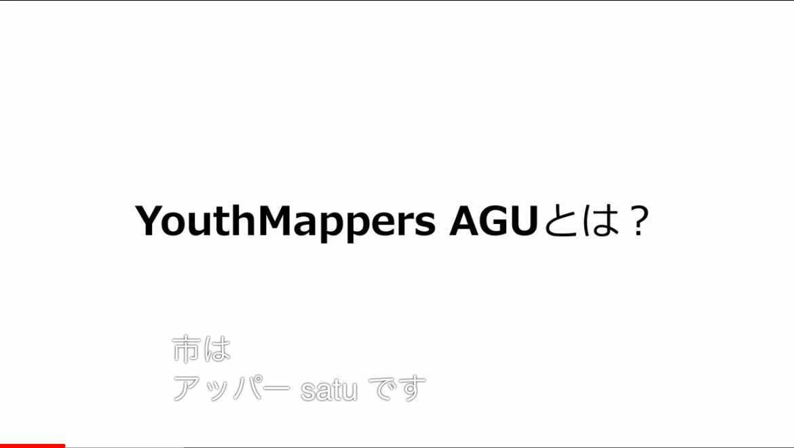
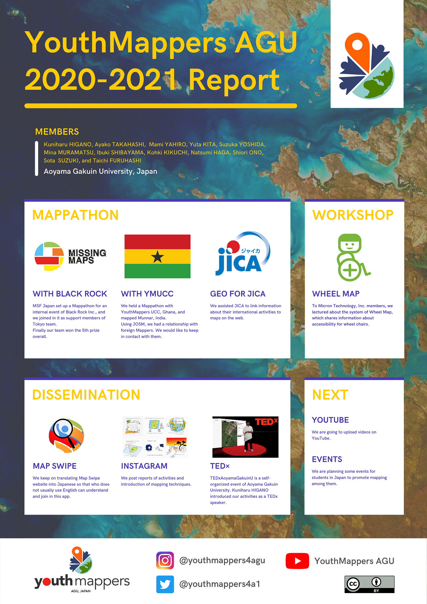
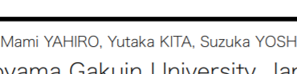
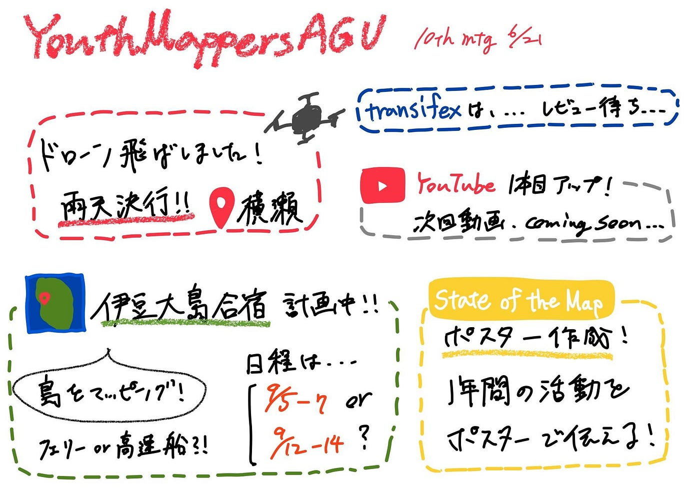

### 詰めの甘さに注意！―字幕崩壊、謎人物出現―

こんにちは。YouthMappers 3年の柴山です！

Youtubeチャンネルや合宿計画などのプロジェクトが加わる中、割とタスクが多いことに気付かされました…。YouthMappersの原点たるマッピングを放置しないように気を付けます！

各プロジェクトの進捗は以下の通りです。

【**YouTube**】

動画は毎週配信予定でしたが、次週から始まるハッカソンの負担や反省会の必要性も踏まえ、一時お休みとなりました。動画#1の反省としては、OPの音量とメインの音量バランスが悪いこと、スライドショー感が出すぎていることに加え、字幕についても問題が浮上しました。

この動画をアップする際に柴山が中盤の数箇所のみ字幕をチェックしたため、上のように自動字幕に問題がある箇所を見落としていました…。手動で字幕を入れることも出来るので、英語翻訳も含めて再編集していきます！古橋先生に新しく納品して頂いたOSMO3も活用していきたいです！

【**State of the Map 2021 に向けて**】

State of the Map 2021 用のポスター制作と提出を行いました。6/27（標準時不明）締め切りのため、大急ぎで制作しました！

昨年の State of the Map Japan でのプレゼン資料も参考に、2020年から2021年にかけての活動を Canva を使用してまとめました。Slack上で修正点を募りながらやっと完成版が出来上がり、いざ送信しようとしたその直前、高橋がメンバー欄に“Yutaka KITA”という誤字を発見！

これは柴山が昨年のポスターから一部コピペし、チェックを怠っていたことによるミスでした…。昨年のポスターのせいにはできません！気を付けます！

【**伊豆大島合宿**】

日程が**9/12~14**に決定しました！観光協会にご協力を頂きながら島をマッピングしていく予定です！

【**グラレコ**】

