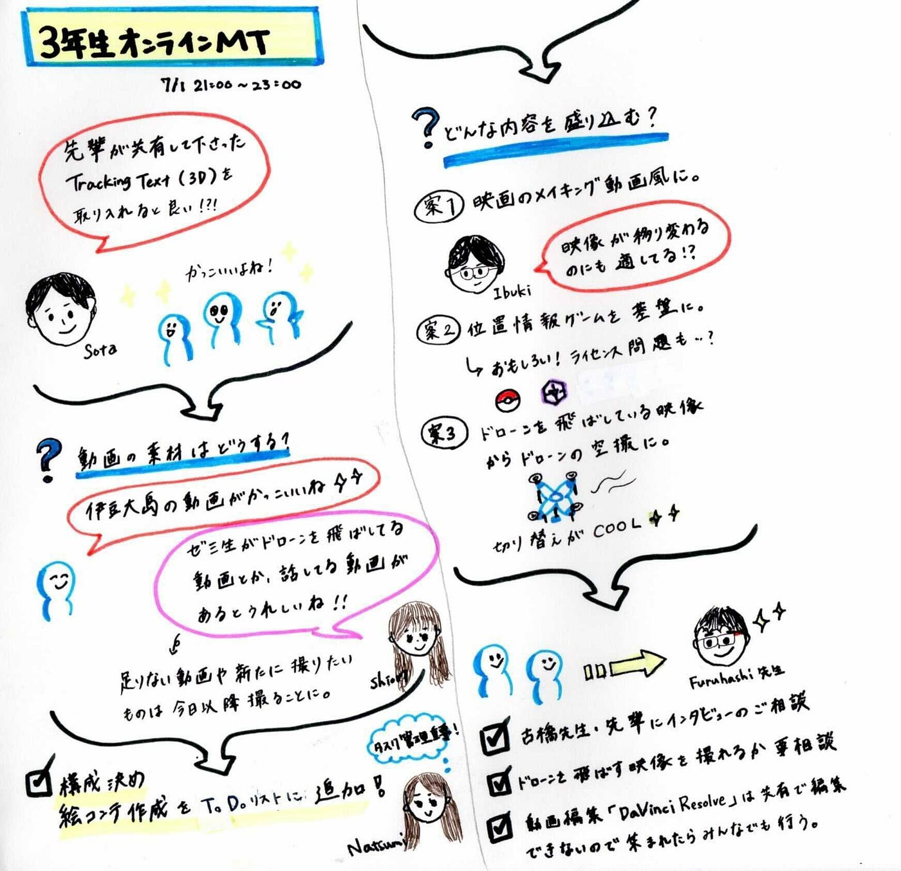
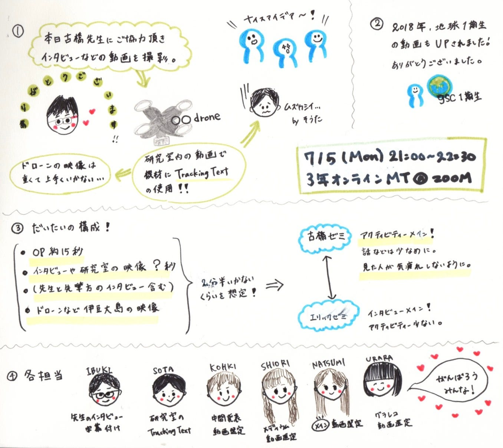

### 3年生オンラインハッカソン 中間発表

**〜オープンキャンパスまでに古橋研究室の紹介動画を作る〜**

２回のミーティングで話し合ったこと、実際に決まった構成についてまとめさせて頂きます。

> 第１回目ミーティング （７月１日木曜日）

**・素材をもとに構成を考える。**

**動画の構成は、あえてカオスに（研究室のキャラを表す）！**

コンセプトカラーは、基本白・撮影素材にマッチするものに変更も可。

※編集ツールはDavinci Resolve ※撮影機材はOSMO、GoPro

### ミーティングで出た案

＜動画のイメージ案＞

_・グローバルな活動をアピールする_

_・フィールドワークの様子を言葉だけでなくて実際の映像でイメージが湧くようにする_

_・ゼミ内サークルの紹介をいれる_

_・トラッキングテキストをいれる_

_・ガチャムクを入れる_

_・位置ゲーで遊ぶ風景を撮影_

_→その地図データのもとがOSMであることなどを伝え、Youthの紹介へ_

_（サークル紹介を途切れさすことなく、自然な流れが可能に）_

_・伊豆大島の空撮映像_

・研究室のごちゃごちゃ感・邪魔なものをよけて歩く

＜インタビューの具体案＞

・映画のメイキングで関係者が語るように映像に挿入(ランダムに・急に)する。

・サークルリーダーにサークルについて語ってもらう。

・撮ってる撮影風景をさらに撮る。（オフショットなど）

・インタビューを数秒に収める。→見ている人を飽きさせない工夫

**＜動画の構成案＞**

**OPはドライブの既存のOP映像 15秒**

**↓**

**古橋先生・先輩方のインタビュー**

**↓**

**EPは古橋研究室のロゴ ２秒**

動画の中身については、インタビューをした後に詰めていこうという形になりました。また、中間発表では大体のイメージを見てもらうために、絵コンテを作成することになりました。

**・必要な作業(撮影・編集)を決め、分担とスケジュールを決める。**

月曜に先生のインタビュー、ドローン撮影

撮影：月曜研究室に来られるメンバー

ED映像編集：芳賀

絵コンテ：柴山

メディウム：小野

グラレコ：長島

中間発表：菊池

[グラレコ]

> 第２回目ミーティング （７月５日月曜日）

撮影した動画をもとに実際どのような構成にするか再検討しました。

古橋先生、撮影にご協力頂きありがとうございました！！

前回のミーティングでは、エリックゼミの動画を基準に考えてしまったところがあったため、反省を生かして、エリックゼミの動画に欲しかった実際の活動内容について盛り込むことを決めました。

#### ＜固めた動画の構成案＞ 今のところ決定バージョン！

**OPはドライブの既存のOP映像 15秒**

**↓**

**古橋先生のインタビュー＜字幕あり＞**

**（インタビューの映像を単に流すのではなく、背景に他の動画を盛り込む）１分 ドライブにあるtake2を使用**

**↓**

**先生が研究室に入っていく動画（研究室内にあるドローンなどの機材にTracking Textの使用） →部屋一周のトラックングテキスト３０秒**

**↓**

**EPは古橋研究室のロゴ ２秒**

これを合わせると、計１分５０秒くらいになります。

そこで、研究室に入っていく動画の後に、先輩方のインタビュー、ドローンなど伊豆大島の映像を挿入しようということになりました。（40秒くらい）

計２分半くらいを想定して、アクティビティーメインの動画を作成することでまとまりました。

**・必要な作業(撮影・編集)を決め、分担とスケジュールを決める。**

火曜日に、先輩方にインタビューをする。

先生インタビューの字幕起こし：柴山

研究室のトラッキングテキスト：鈴木

ドローン離着陸の映像の選定し、短いカットを用意：芳賀をメインとし、小野、長島、菊池が行う

メディウム：小野

グラレコ：長島

発表：菊池

編集した動画は、随時チャンネルで共有して修正・改訂を繰り返していこうと考えています。

果たして間に合わせることができるのだろうかと不安もありますが、、、

限られた時間の中でより良いものを作れるように、3年生一同結束して頑張って行きます！！

[グラレコ]

