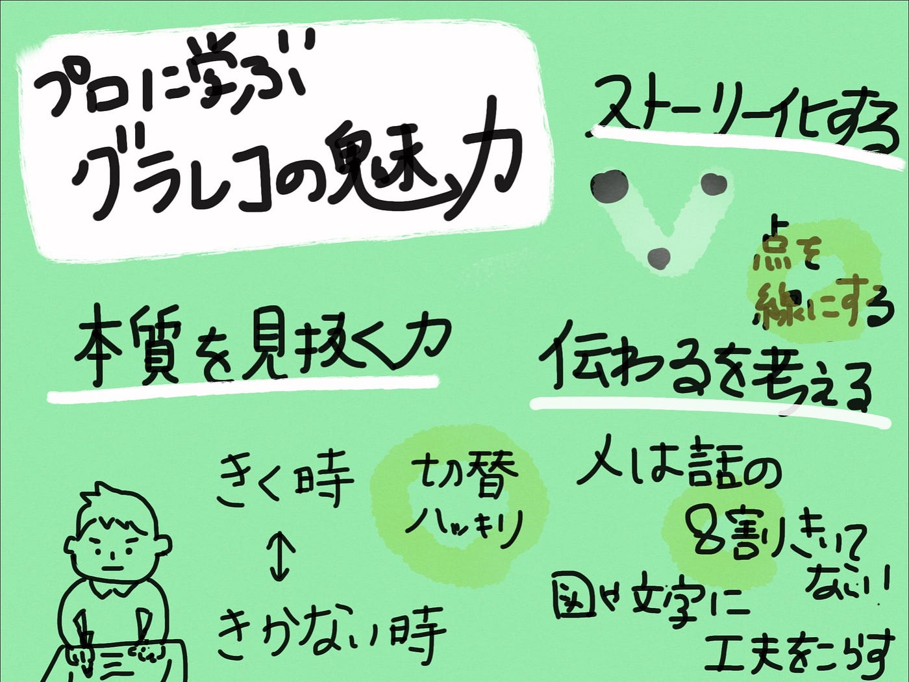

### プロから学ぶグラレコ の力

先週のデザイン部の週報ができなかったため、一週間遅れての週報になります！

今週はプロのグラフィッカーから学ぶ魅力や身に付けられる力を過去のnote記事をもとに私なりにまとめてみました。

### 魅力１ 本質を見抜く力を養える

**「聞く」と「描く」を同時になんて無理・・**

とプロの方も言ってます笑笑

グラレコ をする上で**大事なのは情報の取捨選択**だと思います。
私自身すごく苦手で、話したことをなるべくたくさん描こう！と思ってしまって、同時に描くというよりは話を終わってから描く二度手間タイプです。
でも、プロの方やグラレコ がうまい人って会議中なのにそのまま描き続けることができますよね？

**「聞いたことはすぐ書かない」**

それは集中的に聞く部分と聞き流す部分の見極めをしっかり行っているからだそうです！
・重要な話は集中的に聞く→情報の理解と整理
・そうでない話→重要部分をグラレコに描く

**意見の対立、話し手が感情的な時、間がある話し方**の際、特にしっかり聞いていると書いてありました！また、**「なぜこの話をしているのか」**という視点を持つことでより本質的な部分が見えてくるとのことでした！

同時に話がどこに着地するのか考えながら書いていくことも重要になりそうです！

### 魅力２ 議論の内容がストーリー化される

**点と点が繋がりストーリーになっていく**

自分が話していることや会議で話された内容って議論が白熱するほど何を話していたのか、なんでその話に至ったのか経緯を忘れがちな気がします。そんな時にグラレコ があることで話していることとの共通点やつながりを見つけやすくなります。

結論に至るまでの経緯の中に自分では気付けなかった解決の糸口が見つかったり、落とした小さなアイデアの種を開きやすくするという点もあると思います！

また[この記事](https://note.com/kuboasa/n/nc3a787ea4cb8?magazine_key=m1a133619a3a7)ではプロの方が使うレイアウトの「型」が紹介されています！

タイムライン型、吹き出し型、発散型など会議や話者の形によって型を変えていくことでよりわかりやすく、グラレコ の活用を考えていけるのではないでしょうか。

この記事本当に勉強になるので、ぜひ読んで欲しいです！！１

### 魅力３ 伝わるを考える

> **最低限必要なのは３色**

> **ちょっとしたコツで「読みやすい字」に見せる**

> **図とは、関係性の視覚化**

など見出しを見るだけでも伝わるために何ができるかを考えているものが非常に多いです。ただのき

「人は話の80％を聞いていない」とある本で読みました。

それが本当ならば、曖昧な記憶力のなかで話の20％、それ以上を理解していくのにグラレコは有効な手段であると感じました・
自分が描く側であっても、見る側であっても話を聞くだけよりも視覚からの情報もプラスして情報を整理しやすくなるのではないかと思います！

今まで言われてきたことの二番煎じかもしれませんが、改めてグラレコを本気でやるとかなり論理的に考える方法の一つであると感じました。
また人の話の聞き方などにおいては重要な話の聞き分けなどは実際の講義や社会に出てからも使えそうで、実際に描くことはしなくても頭の中でグラレコを描いてみるのも面白そうだと感じました。

#### 【おすすめ記事４選】

・レイアウトに迷ったらこれ！！！
[https://note.com/kuboasa/n/nc3a787ea4cb8](https://note.com/kuboasa/n/nc3a787ea4cb8)

・伝わる図、イラストの描き方
[https://note.com/kuboasa/n/nd39500f768c2](https://note.com/kuboasa/n/nd39500f768c2)
[https://note.com/kuboasa/n/n5ff85e7e5f52](https://note.com/kuboasa/n/n5ff85e7e5f52)

・グラレコをさらに学びたい！！！おすすめの書籍
[https://note.com/kuboasa/n/n5f5e31185414](https://note.com/kuboasa/n/n5f5e31185414)

#### 【デジタルグラレコ 】

コロナ禍においては今まで以上にオンラインのデジタルグラレコ の需要が高まっているそうです。
デジタルグラレコ はアナロググラレコと異なり、画材が必要ないこと、色が何色も使えたり、座って描けること、データ化しやすいという面で重宝されているとのこと！

[こちらの記事](https://z-kaigi.com/graphic/onlinegrareco/)ではzoomのホワイトボード機能を利用してアナログとの比較をしたものです。

zoom上での会議は顔が並んで圧迫感を感じやすいこともありますが、オンライングラレコがあることで一緒に作業をしている一体感を感じられたり、意見の言いやすさが生まれるそうです！

> デジタルツールなので、イラストの修正や色変えがすごくスムーズなんですよね。まとめやすいというか、グラレコ自体の精度が上がっているように感じています。

また、デジタルならではの修正しやすさもありそうです！

古橋研究室でもゼミ内容はデジタルグレレコを利用していますが、今後ディスカッションなどの場面においても使っていけるのではないかと思います！

グラレコを書いている過程を動画にしたものも面白いのでぜひみてください〜〜！

グラレコ、まだまだたくさんの可能性を秘めているなと感じました！！！

#### **【参考文献】**

・くぼみさん

[くぼみ📙はじめてのグラフィックレコーディング｜note
伝わる絵の描き方や図解のコツをわかりやすく解説。グラフィックレコーディングやビジュアルシンキングを実践。本業はUI&amp;UXデザイナー。📙note書籍化！『はじめてのグラフィックレコーディング』https://amzn.to/39CH…note.com](https://note.com/kuboasa)

・グラグリッド編集部

[グラグリッド編集部｜note
共創型サービスデザイン会社 グラグリッドのnoteです。 サービスデザイン、創造的可視化ファシリテーション、日々の活動、に関するマガジンを発信中！ 今ないつながりを創り出す、考え方、生み出し方を日々トライしています。note.com](https://note.com/glagrid)

・夏川まりなさん

[夏川まりな｜note
Artist（表現）⇄ Researcher（研究）⇄Teacher（実践） 研究テーマは創造性や主体性教育。 株式会社MIMIGURI/Art Educator。http://cultibase.jp ←「創造のカケラ」連載中…note.com](https://note.com/9marina)

・オンライングラレコ

[https://z-kaigi.com/graphic/onlinegrareco/](https://z-kaigi.com/graphic/onlinegrareco/)

#### **【グラレコ】**

