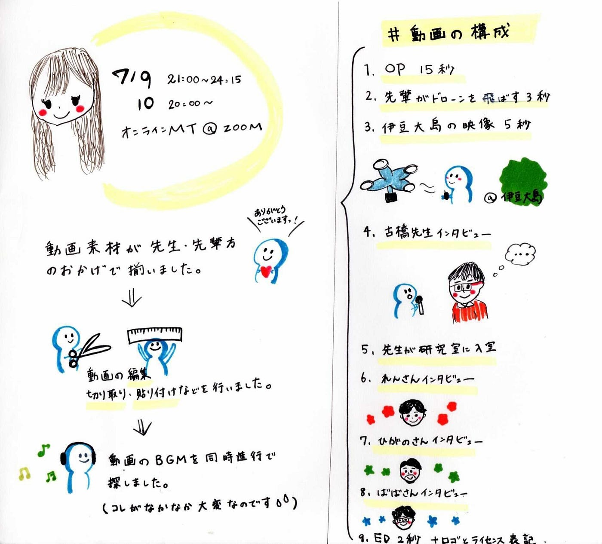

### 3年生オンラインハッカソン 最終発表

〜古橋研究室紹介動画 完成〜

オープンキャンパスまでに、無事に動画を完成させることが出来ました！！

動画の素材提供にご協力頂いた、古橋先生、先輩方、本当にありがとうございました。

> **古橋研究室紹介動画 完成版**

> **「動画の構成」の最終版**

**OP 15秒**

↓

**1.先生ドローンの飛ばしている映像 ５秒**

↓

**2.先輩がドローンを飛ばしている映像 ３秒**

↓

**3.伊豆大島の映像１カット ５秒**

↓

**4.先生インタビュー ５６秒**

↓

**5.先生が研究室に入っていく動画 ３３秒**

↓

**6.先輩インタビュー１ １０ 秒**

青木さん（総合的なゼミなので、地図を研究しながら動画を作れる→社会貢献）

↓

**7.先輩インタビュー２ １０ 秒**

日向野さん（カメラ見る、海外の会議に登壇→国際貢献）

↓

**8.先輩インタビュー３ １０ 秒**

馬場さん（機材多い、ゼミのテーマに沿って好きなことができる）

↓

**EP ２秒 ロゴとライセンスを表記**

**計２分３６秒**

> **工夫したこと・・・**

先生のインタビューの途中で**360°パノラマ動画素材**や**Mapillary点群データ**などを用いる→分かりやすく、かつ、飽きさせない

動画に**オチ**をつける→機材がありすぎて研究室が狭い

流れに違和感を感じさせない→繋げる動画の順番で、**自然さ**を心がける

視聴者に疲れを感じさせない→テンポ感を大事に

> **苦労したこと・・・**

**素材決定**

・ドローン空撮など良い素材ばかりであったためにどれを入れるか非常に悩んだ。

・動画は短めに設定しているためあまり長い尺の動画を入れることができない。

（そのためインタビューも特に良い部分を抜粋させていただきました。）

**動画編集**

**・**リモートでひとつの動画を分担して編集していく中で、フォントやコンセプトカラーがばらばらにならないように事前に入念にすり合わせをする必要があった。

・ゼミのロゴやライセンスを正しく記載すること

**トラッキングテキスト**

・初めはDaVinci Resolveでやってみたが、tracker機能が30秒ほどの動画に対応していないのか、画面を横切っていく対象物を最後まで追ってくれず断念した。

→AbobeのAfter Efecctを使ったところうまく作ることができた。

・Aeでは、8個目のトラッキングを追加したところ、それ以降のトラッキングにおいて対象物が画面上に表示されていないのにもかかわらず、動画の始まりからテキストが映ってしまうという現象が起きた。

→テキストが表示される時間を設定した。

**ＢＧＭ選曲とライセンス**

CCBYの曲をSoundCloudなどで探したが紹介動画に合うようなかっこいい曲が思うように見つからない。

SoundCloudでは全ての曲がCCライセンスでUpされているわけではないので、＃CCBY ＃criative commons など自分でタグをつけて探さ

なければいけなかった。

→全ての曲にcreative commonsライセンスを使用しているサイトを多く事前に知っていれば選曲に時間をかけずに済んだかもない。

また、第一回に提出した動画に使用した曲はCCBY3.0で、動画内に使用する素材が（Mapillary(CC BY-SA 4.0)とOSM(CC BY-SA 3.0)

異なるバージョンであったため、CC BY-SAのコンテンツ同士を併用する場合は、制作するコンテンツはバージョンの新しい方に合わせる

必要性があったができていなかった。その後新たに曲を探したが、その選曲も手こずってしまった。

・その上で動画に合った音楽を見つけること

秒数、動画のイメージに合うか、歌詞が動画を邪魔しないか、テンポが遅いと動画がだらだらした印象に見える、

など様々な問題があり、かなりの時間悩みました。

[修正前に使用した音楽]

[修正後に使用する音楽]

> **改善案・・・**

・OP後とドローン離陸の映像の間が変に間延びしているので、2秒程度に短縮する。
・カットの切り替えを滑らかにするために各所にクロスディゾルブを追加する。
・bgmをCC BY、CC BY-NC、CC BY-SAのものに変更する。

・ゼミ生の仲の良さを伝える動画をメイキングとして入れる。

> **最後に**

最初はエリックゼミの動画を基準に考えてしまったこともあって、オリジナリティをどう出していくのかに悩みました。

また、自分たちの作りたいとイメージする動画が実現可能であるかどうか、動画は期日までに間に合うのか、不安でいっぱいでした。

しかし、案を出し合い、撮影をしていくうちに、また新しい案が浮かぶなど実際に作業をしていく中でより良いものに出来上がったと考えます。

今回の動画制作での失敗や反省を生かして、今後に繋げていきたいです。

以上が２０２１年７月３年生オンラインハッカソン最終発表になります。

### 目指せ１０００回再生超え！

**[グラレコ]**

