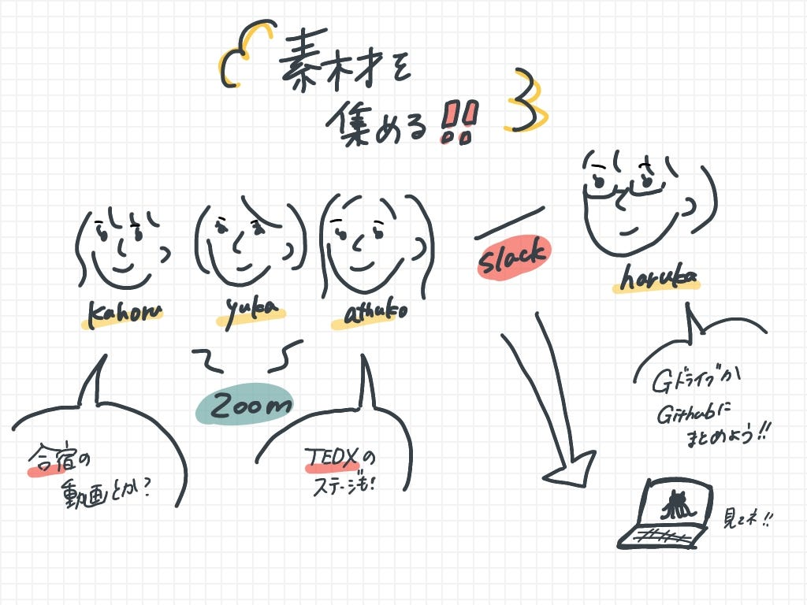

### design部素材集めてみた。

4年サトウです！

今回は3年生の補助（になるかは不明）のため、過去のデザイン、データなどを集めました😄

Slackに載せてましたが、わかりやすいようにGithubにまとめました！

→詳細は[こちら](https://github.com/furuhashilab/fc_Design/issues/13)

短くてすみませんが、ぜひ思い出とともに見てみてください！

