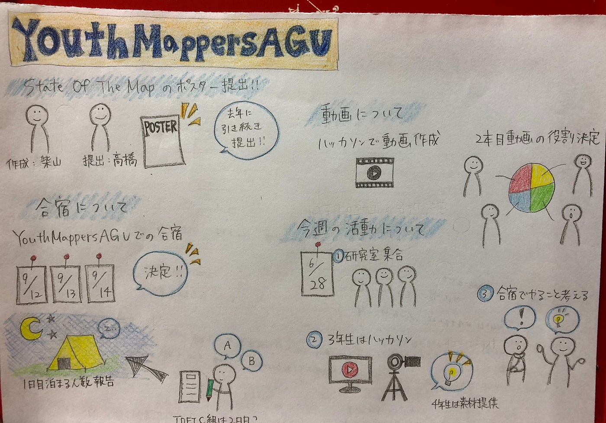

### Youth Mappers 週報

〜６月２８日ミーティング〜

> **1、ミーティングで話し合ったこと**

・先週の活動について・合宿の日程・動画について・今週の活動について

> **2、先週の活動について**

・State Of The Mapのポスター完成

作成：柴山 提出：高橋

> **3、合宿の日程**

・9月12日〜14日で決定しました！

1日目に泊まる人の数を古橋先生に報告

（TOEIC組はおそらく2日目から。もし飛行機で1日目に到着する場合はその旨を国治さんに伝えてください）

・合宿内容を決める（来週以降）→やりたいことを考えておく

> **4、動画について**

・３年生はハッカソンで研究室紹介動画を作成する

・Youth MappersのYouTube２本目

動画の分担をして、前回の反省点を今後に活かす。

> **5、今週の活動について**

・6月28日火曜日４限 研究室に集まる（髙橋オンライン）

IDエディターでマッピング→親睦を深める。

・3年生はハッカソンメインで、四年は素材提供。

> **次回のミーティングまでに考えておくこと**

・合宿でやりたいこと

・マッピング方法のワークショップの企画案

