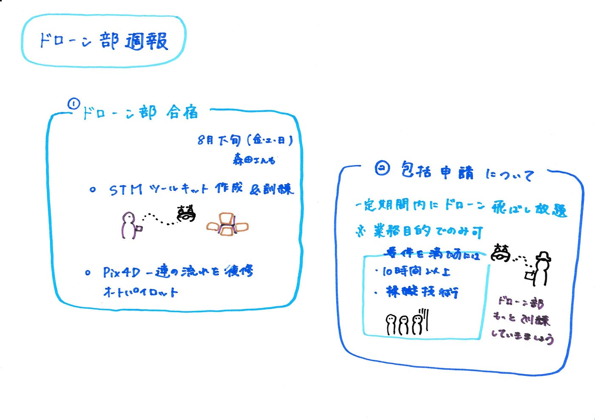

ドローン部週報

今週は合宿の日程と活動内容について話し合いました。

＃日程

8月の下旬（金・土・日）

＃活動内容

＃＃STMツールキットの作成と訓練

バケツ５×３セットで作る予定です。

＃＃[Pix4Dcapture](https://www.pix4d.com/jp/product/pix4dcapture)を用いてオートパイロットで空撮⇒[Pix4Dreact](https://www.pix4d.com/jp/download/pix4dreact)で空撮データを解析＆オルソモザイク生成⇒[OpenAerialMap](https://openaerialmap.org/)に投稿

昨年の合宿で一度練習したっきりで終わってしまっていたので一連の流れをもう一度確認しようと思います！

また、以前先生から聞いた包括申請について気になったので調べてみました。

包括申請とは、一定期間内に反復してドローンを飛行させる場合に、許可申請を1度にまとめて行える仕組みのことです。※業務目的でのみ可能

①個別申請
・ドローンを飛行させるスケジュールや飛行経路が確定した状態で申請を行う。

・ドローンを飛行させる度に許可申請を行う必要がある。

②包括申請
・一定の期間内に繰り返し飛行できる。（最長１年間）

・複数の場所で飛行できる。（飛行想定範囲を報告する必要あり）ただし、広範囲を設定するとそれ相応の飛行実績が必要。

どちらも申請者と操縦者は同一です。

ただし、操縦者要件を満たすために以下の飛行経歴が必要です。

・基本要件⇒10時間以上の飛行経歴を有すること。

・夜間飛行の要件⇒十分な飛行経験

・目視外飛行の要件⇒十分な飛行経験

・物件投下の要件⇒５回以上の投下経験

※風速・風向等の気象確認能力や上昇、一定位置・高度を維持したホバリング、ホバリング状態から機首の方向を90°回転、前後移動、水平方向の飛行、下降などの操縦技術も必要となり、１０時間以上の飛行経歴を有していてもこれらの技術がないと操縦者要件は満たされません。

また、2021年４月から、3 ヶ月毎及び許可・承認期間終了までの飛行実績の報告は不要となりました。

ただし、飛行実績の作成・管理については今後も継続して実施し、飛行実績の報告を航空局から求められた場合は、速やかに報告をする必要があります。

ドローン部の飛行経歴はまだまだです。。知識だけではなく、スキルを上げるためにも少なくとも10時間以上の飛行経歴、また操縦技術は卒業までに身に着けましょう。

横瀬合宿、B棟9階でのドローンの練習、高田橋のDroneBirdの練習参加しっかり行っていきましょう！

グラレコ

