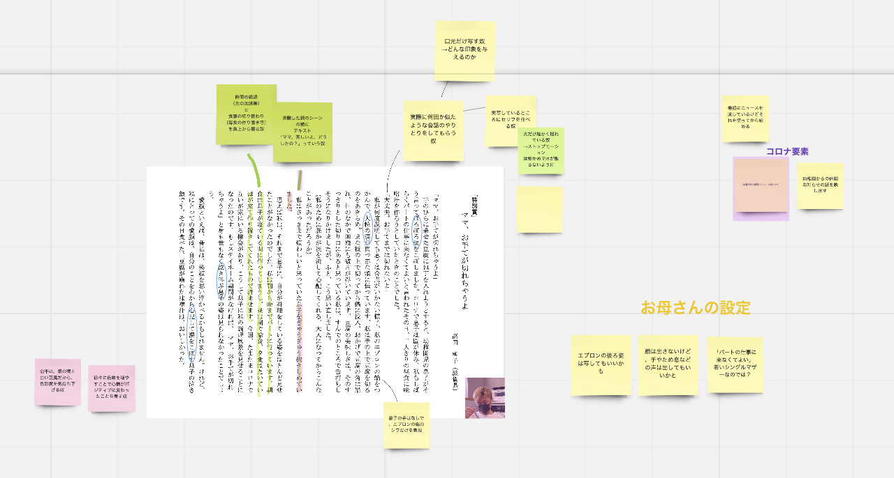

### いざ、ストップモーション。

前期最後のゼミ活動ですが、しばらくの方向性が決まりつつあるので発表します。

おしながき

> ・固定MTG変更
・ストップモーションをやる
・TikTokも順調

### 固定MTG変更

日曜に設定していたMTGはなんだかんだでメンバーが集まらなかったので曜日を変更して水曜日になりました。皆、忙しいみたいです。

そして今週のMTGで話したことは盛り沢山です。

### ストップモーションをやる

「愛顔感動ものがたり映像化コンテスト」に参加しますが、その脚本作りを皆で考えました。脚本作りなんてうまくできるのか？と心の底ではメンバー全員思っていますが、なんとなく設定が出来上がってきました。

MTGで使ったのはMiroというホワイトボードのサービスです。

[Sign up | Miro | Online Whiteboard for Visual Collaboration
Sign up using your Office 365, Slack, Google or Facebook accounts.miro.com](https://miro.com/app/board/o9J_l6Ii35E=/)

こんな感じで台本をボードに貼ってからそれぞれコメントを書いていきました。リンクを貼っておきますのでぜひご覧ください。

[Sign up | Miro | Online Whiteboard for Visual Collaboration
Sign up using your Office 365, Slack, Google or Facebook accounts.miro.com](https://miro.com/app/board/o9J_l6Ii35E=/)

### TikTokも順調

[TikTok
Edit descriptionvt.tiktok.com](https://vt.tiktok.com/ZSJp4CryG/)

TikTokは現状8動画アップしています。その中でスマホで編集した動画があります。

#### CapCut

[‎CapCut - 動画編集アプリ
‎想像を超える動画づくりを。必要なのは[CapCut]だけ 「カンタン編集」 誰もが操作できるようやさしい操作性を実現。カット、逆再生、速度変更もお手の物 「圧倒的な加工モード」…apps.apple.com](https://apps.apple.com/jp/app/capcut-%E5%8B%95%E7%94%BB%E7%B7%A8%E9%9B%86%E3%82%A2%E3%83%97%E3%83%AA/id1500855883)

CapCutというアプリで作った動画がこちら。

[TikTok
Edit descriptionvt.tiktok.com](https://vt.tiktok.com/ZSJp4H1Ww/)

#### Kine Master

[‎キネマスター - 動画編集 動画作成
‎「キネマスター - 動画編集 動画作成」のレビューをチェック、カスタマー評価を比較、スクリーンショットと詳細情報を確認することができます。「キネマスター - 動画編集 動画作成」をダウンロードしてiPhone、iPad、iPod…apps.apple.com](https://apps.apple.com/jp/app/%E3%82%AD%E3%83%8D%E3%83%9E%E3%82%B9%E3%82%BF%E3%83%BC-%E5%8B%95%E7%94%BB%E7%B7%A8%E9%9B%86-%E5%8B%95%E7%94%BB%E4%BD%9C%E6%88%90/id1223932558)

Kine Masterで作った動画がこちら。

[TikTok
Edit descriptionvt.tiktok.com](https://vt.tiktok.com/ZSJp4aFUF/)

[TikTok
Edit descriptionvt.tiktok.com](https://vt.tiktok.com/ZSJp4uGsn/)

思っていたよりもクオリティーの高い動画が作れるので短い動画ならスマホでも作れちゃう時代になりました。おそらく5~10分以上の動画になるとメモリの問題で難しくなりますが編集アプリの性能はいいと思います。

### グラレコ

