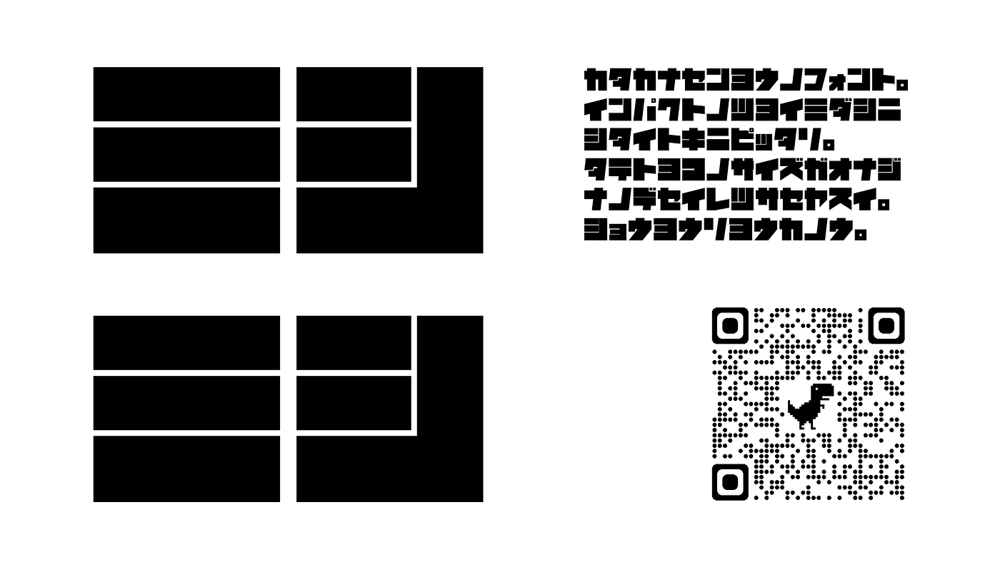
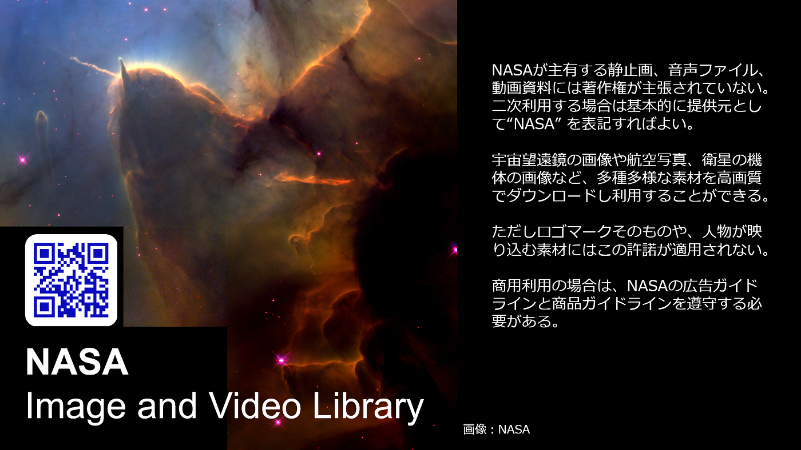
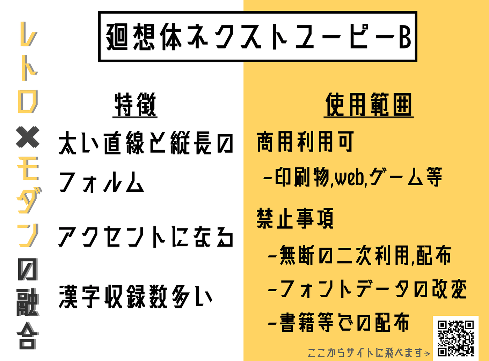
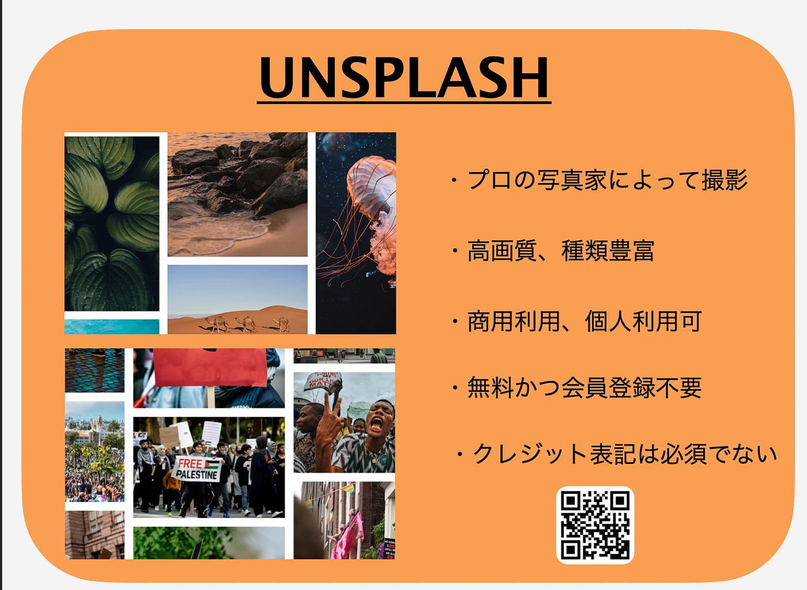
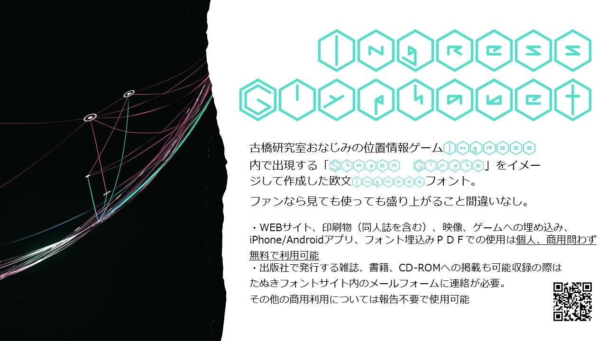
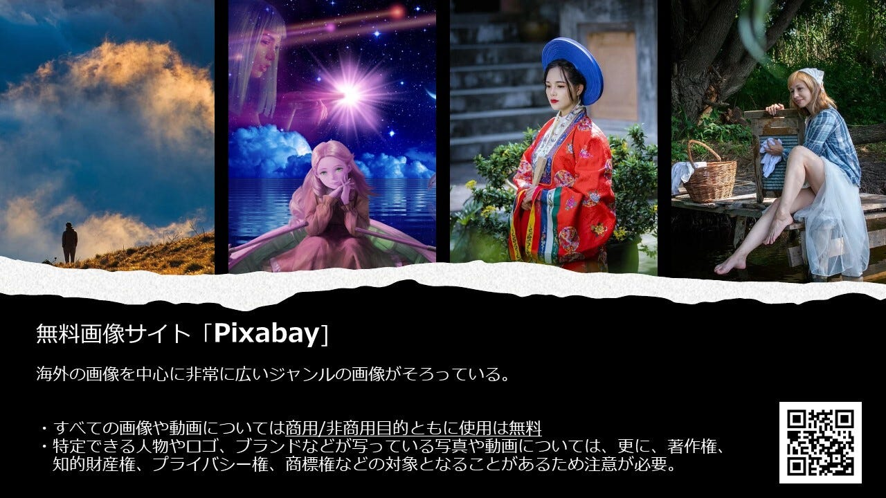
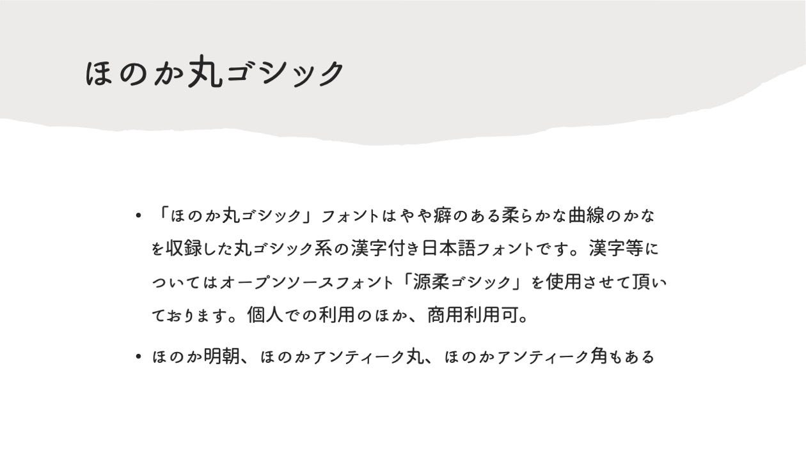
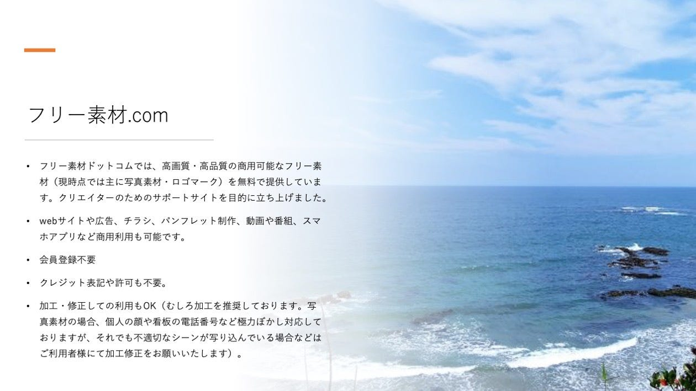
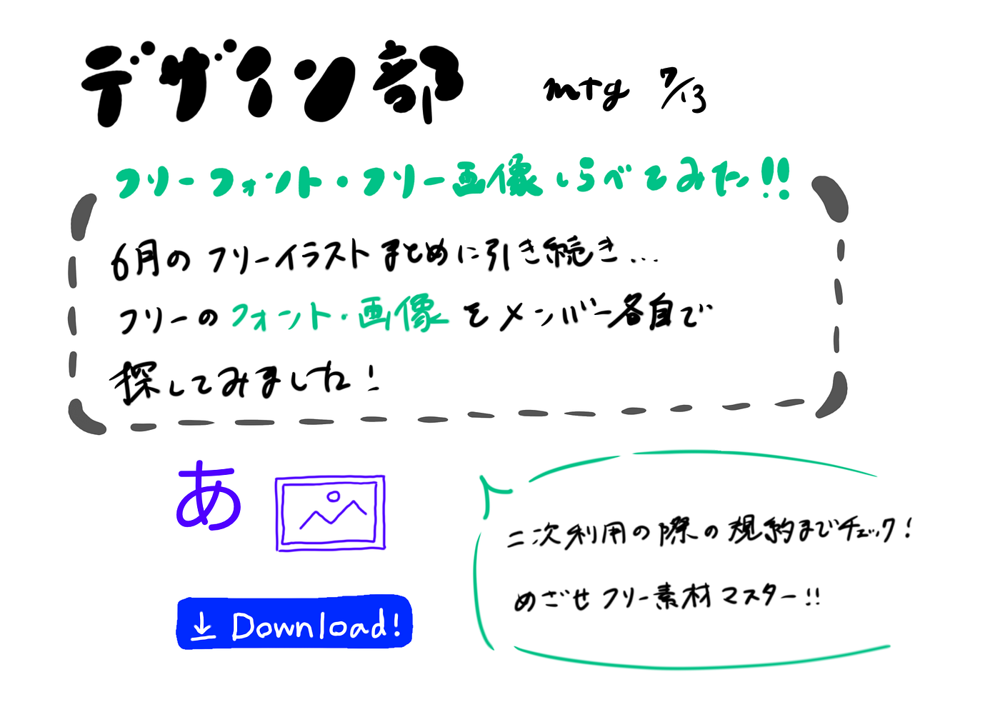

### めざせフリー素材マスター！！｜デザイン部

こんにちは。デザイン部3年の柴山です！

7月ハッカソンも終わったということで、今週のミーティングでは6月に引き続きフリー素材についてリサーチして共有するということを行いました。

今回のテーマはフリーフォントとフリー画像。各メンバーでそれぞれ一つずつ、使ってみる＆スライドにまとめてみる、ということをしてみました。

<シバヤマ>

<ワカマツ>

<ナガシマ>

<ヤスダ>

スライドの中に実際に使ってみるということを通して、それぞれのライセンスでどこまでのことができるのかということを経験することができました。

二次利用したいコンテンツに遭遇したときに積極的に活用法を見出す力をつけられるように目指していきたいです。

また、各自のGithubでフリー素材のお気に入りをまとめて共有してみるということにも取り組んでいきたいです。

今週のグラレコです。

