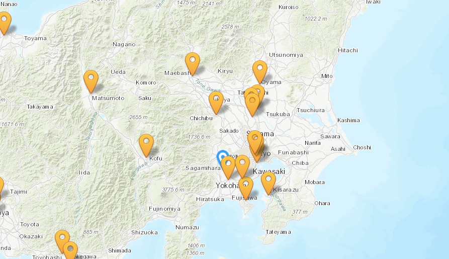
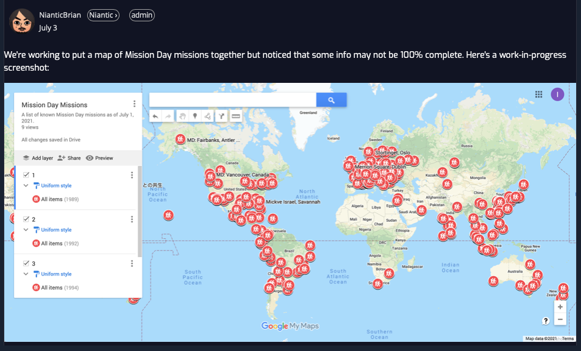

### セカンドサンデーとは！

お疲れ様です。位置情報ゲームです。みなさんイン活していますでしょうか？私は若干飽きてきてサボり気味であります。しかし、飽きてきた人に朗報のファーストサタデーとは異なる、イベントが開催されたのです！！それがセカンドサタデーです。

開催期間は、７月から９月までの3ヶ月間です。７月はもう終わってしまったので、８月８日 ９月１２日となっております。

> 内容の説明

実のところ、この３ヶ月におよぶ、セカンドサタデーはベータテストの要素が多く含まれており、この結果次第で内容がこれからコロコロ変わるみたいです。では、内容です。

#### ７月

終わりましたが、この時はミッションを6つクリアすれば良いといことでした。

#### ８月９月

この二つは各日に公式ミッションデーミッションを6つクリアすれば良いです。言い忘れてましたが、クリアするとMission dayメダルが1カウント増えます。

> ミッションデーミッションと何か

初めに、イングレスのイベントごとは二種類に分かれます。一つは、もちろんniantic様、そして二つ目は自治体です！いわば、地元の自治体の方達とエリートエージェントが組んで主体としたイベントです。その、自治体の方達が運営してたのがミッションデーです。

内容としては、オンラインスタンプラリーのように、複数のポータルを訪問してクイズに答えミッションをクリアしていく。

その時に用いられたミッションがミッションデーミッションと呼ばれます。まあ、私も参加したことないので、どこに行けばいいのかわかりません。

**[mission viewer**](https://mission.mogeringo.com/?pref=49)

このサイトは過去のミッションを見れる便利サイトで絞り込み機能を用いて探すことができます。

一応 ブライアンさんもマップを製作中？だそうです

