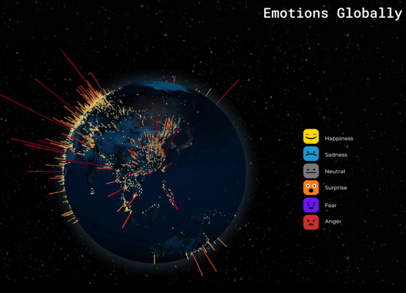
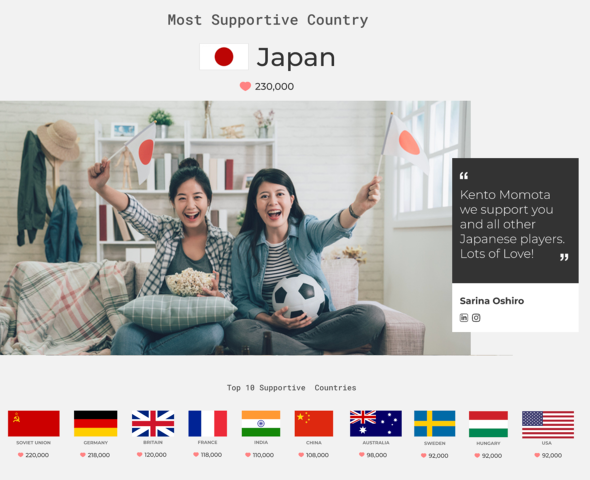

### ドローン部週報

#### 合宿日程決定

横瀬合宿とツリーハウス合宿の日程は既に決まっていましたが、ドローン部の合宿日程が決定しました。 現時点での日程は9/3,4,5 でメンバーの都合がついたのでこの予定で集まりたいと思います。

#### 今週のドローンニュース

今週のドローンニュースはSlackの#卒業生雑談チャンネルに平澤さんがあげていたニュースを引用させていただきます。

AIベンチャーのI’mbesideyouは7月19日、**オリンピックの声援がマップ上に可視化されるサービス**を発表しました。

> 東京五輪に出場する選手への応援メッセージをユーザーから集め、AIで感情を分析し、地球儀型マップに表示する無料のサービス「UNITE BY EMOTION」を発表した。現在メッセージを募集中で、正式サービスは23日に開始予定。（[https://www.itmedia.co.jp/news/articles/2107/19/news092.html](https://www.itmedia.co.jp/news/articles/2107/19/news092.html)より引用）

#### AIで感情分析

ユーザーは専用サイトに画像か動画をアップロード、名前を記入して応援したい国や競技を選択して任意でコメントを付けて応援メッセージを投稿します。

その投稿内容を独自の感情分析AIで「Happiness」（幸せ）、「Sadness」（悲しい）、「Anger」（怒り）などに色分けし、マップ上にランダムで表示することができ、応援メッセージを国別に表示することも可能とのことです。

公開済みのティーザーサイトではまだ可視化は始まっていませんが、すでに応援メッセージの投稿は可能です。

[ティーザーサイトトップ](https://world-emotions.imbesideyou.com/index.html)

無観客での開催が決定したオリンピックで観戦を楽しみにしていた人々がいる中で、盛り上がりや喜怒哀楽などのリアクションを世界中で共有できる非常にワクワクするサービスだと思いました。
