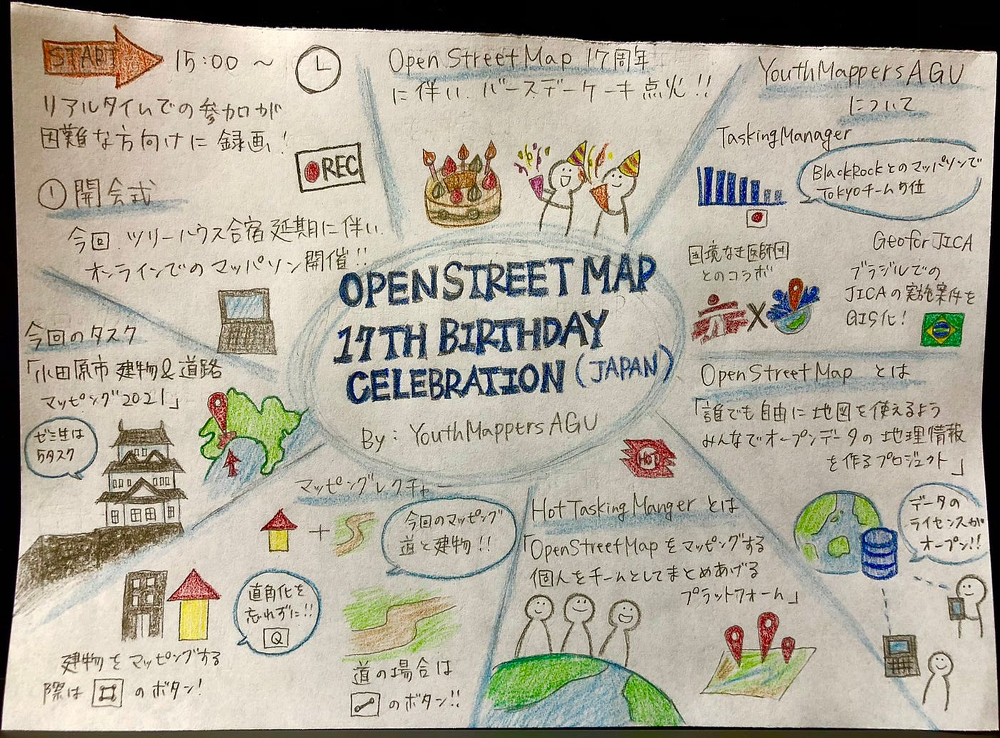

### OSM 17th Birthday Celebration Mapathon

〜Asia-Pacific Mapathon〜

Open Mapping Hub for Asia and the Pacific チームの一員として、インドネシア、フィジー、スリランカ、フィリピン、トルコ、ネパールとの合同オンライン Mapathon を 8/6–9 に開催することになりました！

そこで、キックオフイベントのトップバッターを私たち[ YouthMappers AGU](https://www.facebook.com/youthmappers4agu/?__cft__[0]=AZXUg5r9-XHFbkT_YjYuWApdfNBGA-xs9-xQ9ch2o9zGpeSupkUgh5AgdO4bsksYgI0t2z3LQctEKoXptQCxZ9Vp9mxbn-41UkBTIQ2E8OX9m8JPsmTUby3q6pYvJgaf8Z-_FrfG79hUeAvkZTX9d47iWx139lNjaSvPptqRUk2QyFJUgY4VbPoyrznLFpgmNZ4&__tn__=kK-R) チームが務めさせて頂きました。開催されるに伴い、8/2 のミーティングで担当決めを行いました。

> 〜 8/6 Mapathonの流れ 〜

> **1.開会宣言 バースデーケーキ点火**

ツリーハウスに居合わせたメンバーがケーキを作ってくれました。

> **2.YouthMappers AGUの紹介**

これまで活動してきたこと（Tasking Manager・Geo for Jica・国境なき医師団とのコラボ）を実績を交えながら、私たちの紹介をしました。

> **3.OpenStreetMapとは**

**「誰でも自由に地図を使えるよう、みんなでオープンデーの地理情報を作るプロジェクト」**

・誰でも自由に地図を「参加」「編集」「利用」することが可能。

・一般的な地図と異なり、データのライセンスがオープン。

・更新されるスピードが速い。→ 災害支援、人道支援に貢献

> **4.Hot Tasking Managerとは**

**「OpenStreetMapをマッピングする個人をチームとしてまとめあげるプラットフォーム」**

・世界中から多くの人がコミュニティに参加しマッピング

・検証作業を行い、データの品質を確認・保持

・プロジェクトの立ち上げ・宣言が可能

> **5.マッピングのレクチャー**

OSMの登録の方法から、TaskingManagerとの繋げ方、マッピングの方法までレクチャーを行いました。

> **6.実際にマッピングをしてみよう！！！**

画面共有でマッピングしている様子を映しながら、参加者が実際にマッピングを行いました。

> **7.締めの言葉**

期間内にゼミ生は1人５タスク達成できるよう、頑張っていきましょう！

### 今日のハッシュタグ

#OpenStreetMap17 #OSMAsiaPacific #OSMjp with #YouthMappersAGU #FuruhashiLab #DRONEBIRD

**[OSM Wiki サイト]**

[https://wiki.openstreetmap.org/w/index.php?title=OSM_17th_Birthday_Celebration_-_Asia_Pacific&fbclid=IwAR3eqpEuZ0PLi05azPjGAUIBwQXG8QDXNn5i4USno0h6E2BG4zXwltkW-Ak](https://wiki.openstreetmap.org/w/index.php?title=OSM_17th_Birthday_Celebration_-_Asia_Pacific&fbclid=IwAR3eqpEuZ0PLi05azPjGAUIBwQXG8QDXNn5i4USno0h6E2BG4zXwltkW-Ak)

**[GitHub]**

​​[Asia-Pacific Mapathon](https://github.com/furuhashilab/youthmappers4agu/projects/5)

**[グラレコ]**

