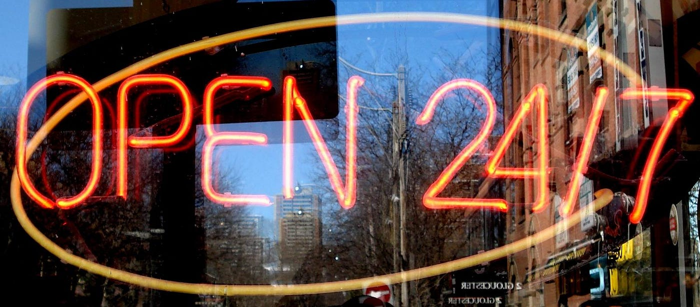
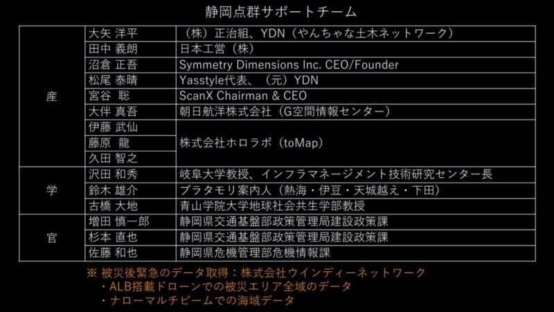
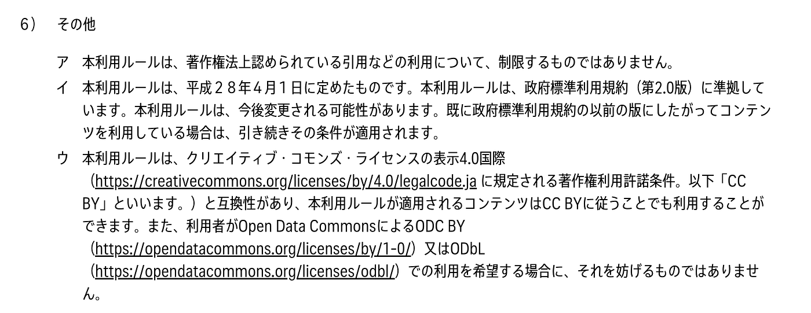

### デジタル庁が立ち上がる今だからこそ、政府標準利用規約（第3.0版）を作るべきだ

2021年9月1日に、デジタル庁がスタートとのことで、関係者へのエールも込めて、今の気持ちを記します。（2022/05/09 、2025/01/30追記あり → **政府標準利用規約**から**[公共データ利用規約**](https://www.digital.go.jp/resources/open_data/public_data_license_v1.0)に名称変更になりました。）

**いよいよ「[オープン](https://digitalprinciples.org/principle/use-open-standards-open-data-open-source-and-open-innovation/)」という考え方が当たり前になってきたと信じたい**。

いわゆる、ただ閲覧できるだけの「なんちゃってオープン」ではなく、許諾不要で、商用利用可能な本当の意味での「オープン」として。

2021年7月3日に**[静岡県熱海市で発生した土砂災害**](https://ja.wikipedia.org/wiki/%E4%BB%A4%E5%92%8C3%E5%B9%B47%E6%9C%88%E4%BC%8A%E8%B1%86%E5%B1%B1%E5%9C%9F%E7%A0%82%E7%81%BD%E5%AE%B3)において、クライシスマッピング活動の一環で、静岡県庁と民間企業そして学術メンバーがオンライン上でその力を結集し、迅速に被災地の地理空間情報を取得、解析、公開しました。古橋はこのチームに合流し、ドローンによる[空撮データのオルソモザイク](https://www.geospatial.jp/ckan/dataset/atami20210703izusan0000shizuokapref01)や[地形・地物の高さデータ](https://www.geospatial.jp/ckan/dataset/atami20210703izusan0000shizuokapref02)、そして[点群データ](https://github.com/crisismappersjapan/atami20210706izusan0000vshizuoka01uav_lidar)を迅速に公開する支援を実施。チーム名は「**[静岡点群サポートチーム**](https://www.google.com/search?q=%E9%9D%99%E5%B2%A1%E7%82%B9%E7%BE%A4%E3%82%B5%E3%83%9D%E3%83%BC%E3%83%88%E3%83%81%E3%83%BC%E3%83%A0)」と呼ばれました。

この静岡点群サポートチームの分析結果は、即座に静岡県の難波副知事に共有され、その後の判断に大きく活用されました。

更に、難波副知事の最後の会見での言葉が、この活動に関わった一人として感慨深く身体に染み渡りました。

> オープンデータの重要性。私自身、時代が変わったなということを痛感した。発災から14時間で出てくる。ヘリが飛べないからドローンで空撮してデータ解析を1時間ちょっとで見られる。それを県庁組織でなく、外の方々がサポートして下さる。データをオープンにしておいて、こんな事が出来るのではないかということをやって下さる方々がいっぱいいる。 − 難波副知事（静岡県）

思えば、[2011年に起きた**東日本大震災**](https://ja.wikipedia.org/wiki/%E6%9D%B1%E6%97%A5%E6%9C%AC%E5%A4%A7%E9%9C%87%E7%81%BD)で、被災地で起きている**事実**と**[地図(OpenStreetMap)**](https://www.openstreetmap.org/)を組み合わせて被災・支援情報集約プラットフォーム **[sinsai.info**](https://www.google.com/search?q=%22sinsai.info%22) を立ち上げた10年前の当時は、自治体に片っ端から電話をして自治体ウェブサイトに公開されていた情報をオープンデータとして利用してよいか確認をとりつつも、ほとんどのケースが「オープンデータ？よくわかりませんので持ち帰り検討します or 許諾できません」という対応で、結局はほとんどのデータは行政を頼らずに収集せざるを得ない。これが我が国のリアルな状況でした。

それが、10年後に都道府県の副知事から「オープンデータの重要性」を語られる、そんな時代になったことは素直に喜びたいと思います。

一方で、まだまだ本当の意味でのオープンに対する理解は足りていないのも現状です。

日本政府は様々な議論を踏まえて2014年に**[政府標準利用規約**](https://ja.wikipedia.org/wiki/%E6%94%BF%E5%BA%9C%E6%A8%99%E6%BA%96%E5%88%A9%E7%94%A8%E8%A6%8F%E7%B4%84)を策定し、2016年には、国際的なオープンライセンスとして認知されているクリエイティブ・コモンズの **[CC BY 4.0 ライセンス**](https://creativecommons.org/licenses/by/4.0/deed.ja)との互換性を加えた**[政府標準利用規約第2.0版**](https://www.kantei.go.jp/jp/singi/it2/densi/kettei/gl2_betten_1_gaiyou.pdf)と改定され、2021年現在の行政が選択するオープンデータライセンスのデファクトスタンダードとなっています。

国土地理院の**[地理院地図**](https://www.gsi.go.jp/kikakuchousei/kikakuchousei40182.html)も、国土交通省の **[Project PLATEAU**](https://www.mlit.go.jp/plateau/site-policy/) も、**[東京都オープンデータカタログサイト**](https://portal.data.metro.tokyo.lg.jp/terms/)も、経済産業省の**[地域経済分析システム RESAS**](https://resas.go.jp/policy/#/13/13101) も、**[総務省消防庁**](https://www.fdma.go.jp/about/others/post3.html)も、**[気象庁ウェブサイト**](https://www.jma.go.jp/jma/kishou/info/coment.html)も、**[静岡県点群データ VIRTUAL SHIZUOKA**](https://www.g-mark.org/award/describe/51263) も、そしてもちろん**[デジタル庁**](https://www.digital.go.jp/copyright-policy)も政府標準利用規約第2.0版もしくは CC BY 4.0 のオープンデータライセンスを採用することで公文書の情報公開と国民の税金によって得られたデータとして情報公開をすすめていく姿勢は打ち出せていると理解できます。

しかし、多くの組織が、盲目的に政府標準利用規約や CC BY 4.0 を選べばオープンデータとして十分であると思われている節が随所で見られるのが現状です。

例えば、CC BY 4.0 とは厳密な意味で互換性のないオープンデータライセンスは存在します。OpenStreetMap が採用している **[ODbL ライセンス**](https://opendatacommons.org/licenses/odbl/)がその一例で、2012年に著作性が認められにくい事実データとしての地物情報をデータベースとしてライセンス管理するために OpenStreetMap が CC BY-SA ライセンスから ODbL ライセンスへ変更された後、何度か[クリエイティブ・コモンズライセンスと ODbL ライセンスの互換性について議論](https://blog.openstreetmap.org/2017/03/21/openstreetmap%E3%81%AB%E3%81%8A%E3%81%91%E3%82%8Bcc-by-4-0%E3%83%A9%E3%82%A4%E3%82%BB%E3%83%B3%E3%82%B9%E9%81%A9%E7%94%A8%E3%83%87%E3%83%BC%E3%82%BF%E3%81%AE%E5%88%A9%E7%94%A8%E3%81%AB%E3%81%A4/?lang=ja)されてきましたが、残念ながら**互換性なし**というのが結論です。

特にクリエイティブ・コモンズ・ライセンスが持つ DRM (Digital Rights Management、デジタル著作権管理)に対する非常に厳しい制限や、ライセンス保持者の帰属表示に関する差異などを埋めることができず CC BY 4.0 でオープン化されたデータを OpenStreetMap にそのまますぐに再利用することはできないのです。

そうは言っても OpenStreetMap 以外に ODbL の採用事例はあるのか？という疑問も湧いてくると思います。特に古橋自身が OpenStreetMap 普及に関わっているためフェアではないと言われるかもしれません。例えばフランスの**[パリ市オープンデータ**](https://opendata.paris.fr/page/lalicence/)は ODbL ライセンスを採用しています。衛星画像の機械学習によって抽出された **[Google Open Buildings**](https://sites.research.google/open-buildings/) や **[Microsoft Building Footprints**](https://www.microsoft.com/en-us/maps/building-footprints)もODbLライセンスとして利用できます。また東京大学生産技術研究所が公開している**[地球全域をカバーする標高データ「MERIT DEM」**](https://www.iis.u-tokyo.ac.jp/ja/news/3412/)は **[CC BY-NC 4.0**](https://creativecommons.org/licenses/by-nc/4.0/deed.ja) と **ODbL **のデュアルライセンスで定義されています。CC BY ほどではないものの、ODbL は確かに世の中に浸透してきています。

CC BY でも ODbL でも、もともとはオープンに自由に使ってほしいという担当者の願いが、具体的にライセンスを明記することで、ライセンスの厳密な互換性問題が足かせとなって自由に使えない。これが2021年現在のオープンデータの課題です。

そこで、**[Project PLATEAU](https://www.mlit.go.jp/plateau/site-policy/) や [静岡点群サポートチーム](https://www.google.com/search?q=%E9%9D%99%E5%B2%A1%E7%82%B9%E7%BE%A4%E3%82%B5%E3%83%9D%E3%83%BC%E3%83%88%E3%83%81%E3%83%BC%E3%83%A0) **で公開したデータはデュアル(もしくはマルチ)ライセンスとして CC BY 4.0 だけでなく ODbL や ODC BY での利用も可能となるように、複数のライセンスを列挙する形で、その自由度を担保するとともに、OpenStreetMap での利用も考慮の上で公開いただいています。

しかし、本来はこのような利用規約はできるだけシンプルにわかりやすく運用していくのが本筋であり、このようなデュアルライセンスのように互換性のあるライセンスをひたすら併記していく運用は過渡期とすべきです。それよりも、行政の担当者が安心して「このコンテンツのライセンスは政府標準利用規約(第3.0版)に準拠しています。」と書くだけで、より広い互換性が担保されたオープンデータになる世の中のほうが今よりずっと良い。

当事者の方々も、同じ課題はきっと共有されていると思いますが、ここは声を大にしてはっきりと言います。

> **“デジタル庁は政府標準利用規約を改定し、政府標準利用規約第3.0版として CC BY 4.0 だけでなく ODbL そして ODC BY といった、志を同じくしているオープンデータライセンスとの互換性をより拡張した、汎用的なオープンデータライセンスとしてアップデートし、省庁の垣根を超えて、広く行政組織が当たり前に活用する世の中を作ることを強く望みます。”**

より透明性が高く、きちんと公文書が保存、アーカイブされ、国民一人ひとりが当たり前に情報にアクセスし、再利用し、二次利用できるオープンな世の中をつくる一歩として、そして9月1日開始というデジタル庁の門出をお祝いする意味でも、ここに意思表明を記録します。

_追記(2021/09/05) [Code for Fukui の福野さんと具体案の検討](https://github.com/code4fukui/copyright-policy-jp)が始まりました。_

[GitHub - code4fukui/copyright-policy-jp: 政府標準利用規約
政府標準利用規約. Contribute to code4fukui/copyright-policy-jp development by creating an account on GitHub.github.com](https://github.com/code4fukui/copyright-policy-jp)

青山学院大学 地球社会共生学部 教授
古橋 大地
