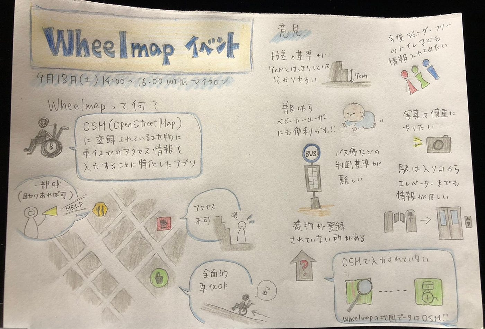

### オンラインで頑張り抜いたYouthMappersAGUの夏

約１ヶ月半の夏休みが終了しました。

YouthMappersAGUの夏休みの活動について報告します。

### Micron, LIVESチームとの 合同Wheelmap オンラインマッパソン

9月18日土曜日に、オンラインでMicronのLIVESチームとWheelmapの合同マッパソンを開催しました。

YouthMappers AGU 側から動画を交えて使い方の説明を行い、その後ブレイクアウトセッションで5、6人ずつに分かれ、作業を行いました。

分からないことや質問があればこちらからの参加者がその都度説明する、ということだったのですが、質問だけではなくWheelmap アプリに関する意見や改善点などについても議論することができ充実した2時間となりました。

各チームから出た意見の一部を紹介します。

・アプリの日本語訳に改善の余地がありそう

・ガゾリンスタンドやバス停などの車椅子でのアクセシビリティは何を基準にするべきか（そこまでの道のりなのか、利用のしやすさなのか）

・今までと違った視点で街を歩けそう

・ジェンダーフリーの情報も入れたい

・駅は入り口からエレベーターまでの情報も欲しい

・もっと普及すればベビーカーユーザーにも便利そうだ

他にも様々な意見が交わされ、私たちにとってもWheelmapについてより深く考えるきっかけとなりました。

日本ではまだ入力されたデータが少なく、認知もされていないのでこのようなマッパソンを今後も開催していきたいと思います。

### その他の活動

合同マッパソン以外にも、いくつかの活動をしました。

まず、**Open Street Map 17th Birthday celebration**と銘打って各国で開催されたマッパソンでは、私たちYouthMappersAGUが先頭を切って日本開催を主催しました。

オンラインで行い、OSMの17周年を記念するバースデーケーキも作りました。

一方で、残念なことに参加者は一人を除いて全員YouthMappers メンバーでした。うまく情報を発信できていないという課題を再確認する良い機会だったと捉え、SNSの投稿内容・頻度を見直していきたいです。

合同マッパソンで説明時に利用した**Wheelmapの説明動画作成**も、夏休み中に行ったことの一つです。

見やすくわかりやすい動画が完成し、デザインもかっこいいのでぜひ多くの方に見て欲しいです。

こちらからご覧いただけます。[https://youtu.be/QVI5Fa_oTm0](https://youtu.be/QVI5Fa_oTm0)

### 中止になった予定

新型コロナウイルスの影響で、中止になった予定もあります。

YouthMappersAGUとして行う予定だった合宿二つです。

本来なら同じ場所に集まって一緒にドローンで空撮したり、そのデータを使ってマッピングをする予定でしたが、夏休み中にはできませんでした。

コロナが1日も早く収束に向かい、対面でのイベントや合宿ができることを祈ります。

### まとめ

コロナによってできないこともありましたが、できることをオンラインで行い、課題も洗い出せたので全力を尽くせたと思います。

後期に控えているイベントも、メンバーで工夫しながら取り組んでいきたいとおもいます。

髙橋彩子
