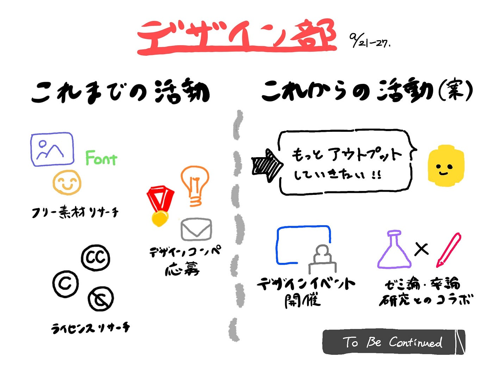

### 2021年後期のデザイン部

これまでのデザイン部は、主に3つの活動をしました。まず、「登竜門」から複数のデザインコンペに応募しました。その中でフォントなどの素材の使用に関して疑問が上がったので、数週にわたってフリー素材をまとめてみました。さらに素材のライセンスに関して深掘り、スライドにまとめる活動へと発展しました。

後期からの活動は、これまでの活動のアウトプットとして、デザイン系のイベントの開催を目指したいと思います。さらにメンバーのゼミ論の中でデザイン部と関連性のあるテーマがあれば、そういった研究とのコラボも目指していこうと思います！

