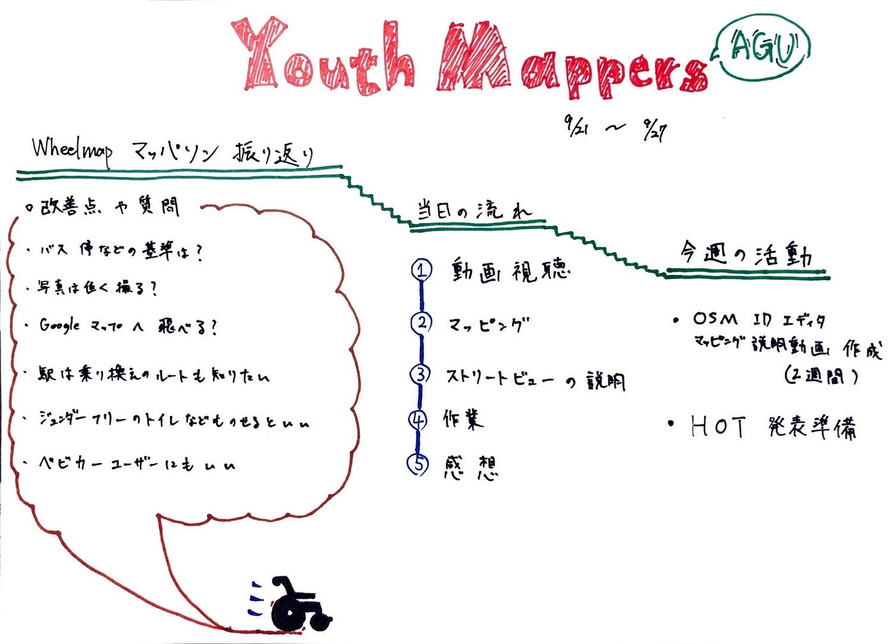

### Wheelmapマッパソンの振り返り

こんにちは。YouthMappers 4年の木多です。

### **今週の主な活動**

9月18日土曜日にオンラインで開催されたMicronのLIVESチームとWheelmapの合同マッパソンの振り返りをしました。

その時に話し合った質問や意見は先週の[Medium](https://medium.com/furuhashilab/%E3%82%AA%E3%83%B3%E3%83%A9%E3%82%A4%E3%83%B3%E3%81%A7%E9%A0%91%E5%BC%B5%E3%82%8A%E6%8A%9C%E3%81%84%E3%81%9Fyouthmappersagu%E3%81%AE%E5%A4%8F-1d2f85f9df53)にも記載されているため、そちらも目を通していただければと思います。

今週の振り返りで出た意見としては

・車椅子利用者向けの駅から目的地への最適な道提示などもしてくれたら嬉しい

・備考欄のような細かい状況を自分たちで記載できるところがあるとさらに良くなるのでは

・日常的にGoogle Mapを利用している方からは、Google Mapに飛べると便利と言った声があった

一部ではありますが、こういった意見が出てきました。

### **その他の活動**

その他の活動としては、 [HOT Tasking Manager](http://tasks.hotosm.org/)の発表に向けた準備（日向野、髙橋、柴山、鈴木）と、OSM idEditorを使ったマッピング説明動画の作成（[HOT Tasking Manager](http://tasks.hotosm.org/)の担当以外）の両軸で進めています。

### **今週のグラレコ**

