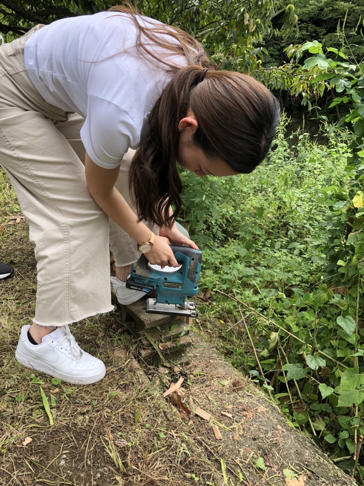
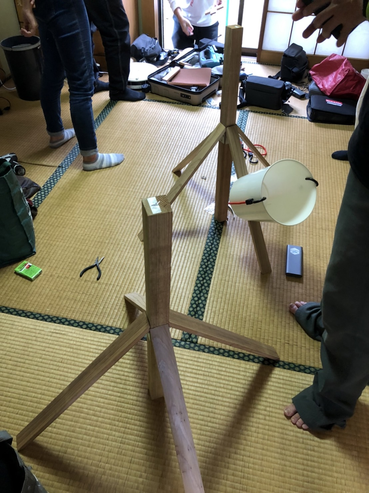
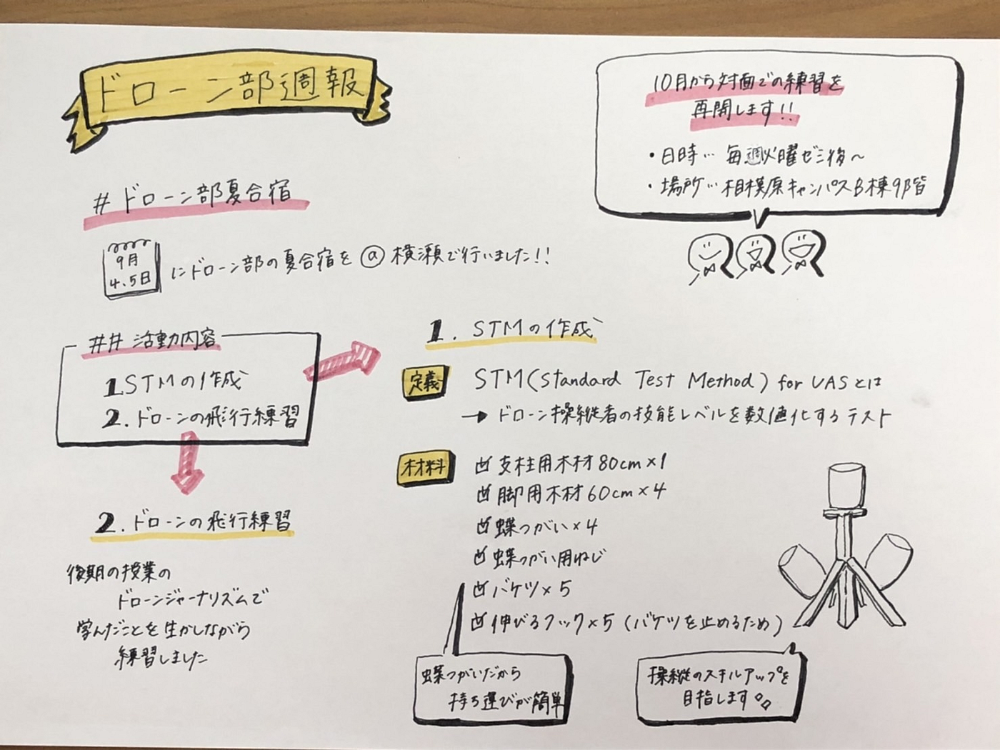

### ドローン部夏合宿

先週から後期のゼミが始まりました！

今後もドローン部としての活動をお伝えしていきたいと思っていますので、残り半年間もどうぞよろしくお願いします。

#10月から対面での練習を再開します

緊急事態宣言が9月30日で終了することもあり、10月からドローンの練習を再開します。練習では合宿で作成したSTMを使用し、ドローンの操作の技術を向上させていきたいと考えています。

日時は毎週火曜2限のゼミ後で、場所は相模原キャンパスB棟の9階で行う予定です。

#ドローン部夏合宿

9月4、5日にドローン部の合宿を行いました。

##活動内容

・STMの作成

・ドローンの飛行練習

###STMの作成

STM(Standard Test Method) for UASとはドローン操縦者の技能レベルを数値化し、可視化できるものです。

今回の合宿ではSTMで使用されているキットを、電動のこぎりや電動ドリルドライバーを使いながら作成しました。

材料は下記のとおりです。

・支柱用木材80cm×１

・脚用木材60cm×４

・蝶つがい×４

・蝶つがい用ねじ

・バケツ×５

・伸びるフック×５（バケツを止めるため）

完成したキットがこちらです。

蝶つがいで、持ち運びがしやすい形状となっているので、大学構内以外でも練習することが出来ます。

操縦のスキルアップを目指してSTMの練習に取り組んでいきたいです。

今週のグラレコ

