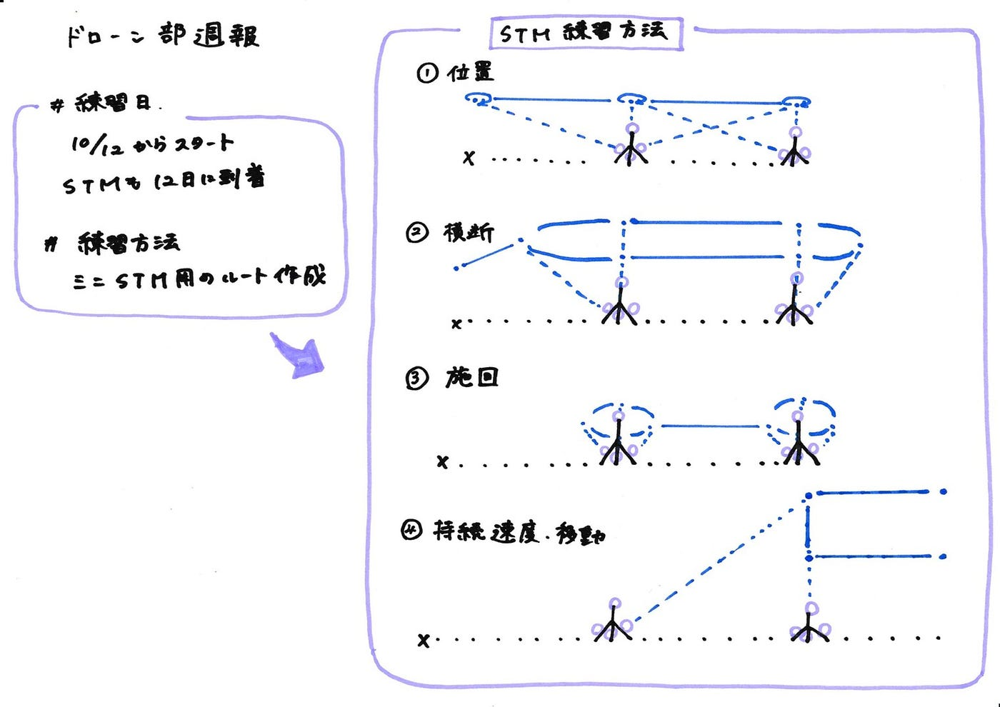

### ドローン部週報

今週のドローン部では飛行訓練の日程決めとSTMの練習方法について話し合いました。

＃ドローン部飛行訓練の日程決め

１０月１２日から本格的に練習を始めていく予定です。

（１０月１２日にSTMのキットが研究室にとどきます）

＃STMの練習方法

今回ドローン部で作ったものはトイドローン用のミニサイズのものです。

そこでミニサイズのSTMでの訓練方法をまとめました。

STMの訓練の構造は

①位置

②横断

③旋回

④螺旋

⑤持続速度/移動

の五つの方式から成り立っています。

そこで、ミニサイズではそのうち①、②、③、⑤の練習をし、それぞれタイムを出します。

一般的なSTMのルートを参考にミニサイズ用のルートを作成しました。

毎回タイムを計測し記録していくため、初めはSTM同士の距離、スタート地点からの距離は２メートルずつと設定します。

また、まだバケツの中の文字がないためそこに文字を書いた紙を貼り付け完成させるところから始めます。

グラレコ

