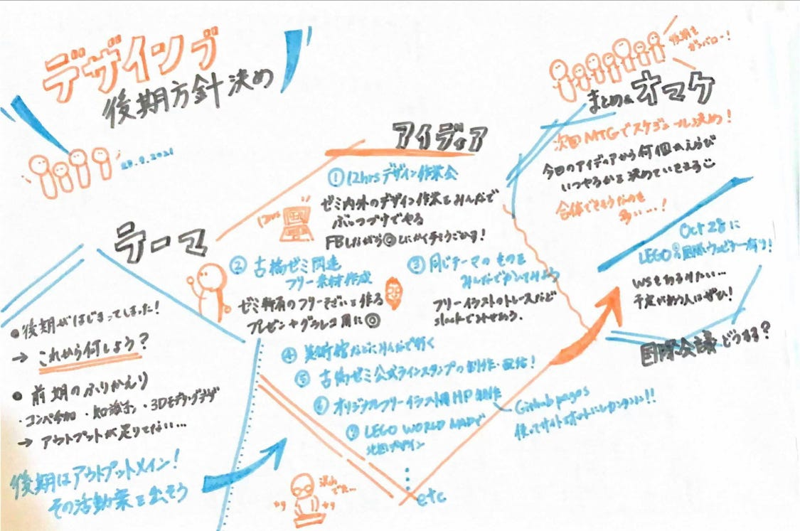

### 後期何しよう！~design部~

こんにちは！デザイン部です！
後期が始まり、新しい活動を何しようか、国際会議まだ参加してない！という焦りを中心に先週はMTGしました。

デザイン部としては前期はインプット系が多かったので、後期は積極的にアウトプットしていきたいと考えております！！！
また、古橋研究室は年に一度国際会議に参加必須となっているので今からでも間に合う！国際会議を調べてみました！
（正直、あまり見つからなかった笑）

#### ▶︎後期デザイン部活動案

メンバーに意見を求めたところかなり多くの案が出ました！

①**12時間デザイン作業しぬほどしちゃおうの会**

各々ゼミ論のデザイン作業を一緒にやることでチャットチャとゼミ論すすめちゃおうよ狙い
みんなからFBもらえるし一石二鳥！
ゼミに関わらない外部のものでも可

②**古橋ゼミ関連フリー素材を作る**

古橋ゼミ特有のイラストや写真等のフリー素材を作る。今後のプレゼンやグラレコで活用してもらうことを目指す！

③**みんなで同じものを真似て描いてみる！テーマは同じ**
以前古橋先生が実践していた(先生はいらすとやでしたが)何か自分の目標とするフリーイラストなどをトレースしてみる！
→それをみんなでslackなどで見せ合う。個性が出て面白そう。

④**みんなで同じテーマを決めて何かを作る。**

例えば、今日は本の表紙をデザインする…
飲食店のメニュー表をデザインする…
飲料のパッケージをデザインする…など！！！
→見せ合う。

⑤**美術館などの展覧会にみんなで行く**

緊急事態宣言も解除されたので実際に足を運んでデザインを学ぶのもあり！みんなで生かせそうなデザインについて話し合うのも楽しそう！

⑥**いいと思ったデザインを定期的にslackで送る**

個人的にこれめちゃくちゃやりたいんですが、町でみかけた良いデザインの広告など写真を撮りslackで共有する！コメントを言い合う！他の人の思う良いデザインが知れて面白そう。

⑦**古橋研究室公式LINEスタンプの制作・配信**

**②**と似ていますが、古橋ゼミに関係する用語やイラスト、地図マニアにうけそうなものをスタンプ化し、コミュニケーションツールで使えるところまで挑戦してみるというものです。うまくいけば収益化できるかもしれません。

⑧**オリジナルのフリーイラスト用ホームページの制作**

前期に調べてみたフリー素材のサイトを参考に、自分でフリー素材を作り、ライセンスを自分で考えて決め、Webページを作ってみんながダウンロードできるようにするという一連の活動になります。Webページに関してはGithub pagesを使ってサイトをホストとし、フレームワークを利用して構築すれば割と簡単に作れます！

⑨**LEGO WORLD MAPを用いた地図デザインの実践**

Lego製品の[LEGO WORLD MAP](https://www.lego.com/ja-jp/themes/art/world-map)をみんなで組み立てながら地図デザインをしてみるというものです。3万円ほどするので古橋先生に買っていただけるか交渉した方がいいかも？組み立てているところを上から撮影し、タイムラプス動画にして公式Youtubeチャンネルにあげてみたいです。

次回MTGでこれらの中から選んで活動していきたいと考えてます！
個人的にめちゃめちゃ面白そうなのが多いので、楽しみです〜〜☺︎

#### ▶︎まだ間に合う！国際会議！

６月のstate of the mapに参加し忘れて、[国際会議](https://github.com/furuhashilab/README/issues/21)参加しないとやばい、、、となっている方に必見です。

すでに候補として上がってる国際会議一覧→_[こちら_](https://github.com/furuhashilab/README/issues/21#issuecomment-924530352)

正直あまり見つからなかったのとこれは国際会議なのか？？と悩んでしまうものが多かったので先生の意見を頂きたいです！

①[LEGO® SERIOUS PLAY® ONLINE WEBINAR (FREE)](https://inthrface.com/en/webinar/)

10/28(木 )
lego製品のLEGO SERIOUS PLAYをクリエイティブツールとしてデザインしながら問題解決へ応用させていく体験ができるWebinarです。
どちらかというとカンファレンスよりかはワークショップである点と、外国人スピーカーが2名以上参加するかどうかが不明であるという点があるので国際会議扱いされるかどうか微妙かもしれません。。。

②Humanitarian OpenStreetMap Summit 2021
11/22(月)
「地域の人道的オープンマッピングエコシステムの進化：コミュニティ、コラボレーション、貢献を理解する**。**」をテーマに行われるそうです。
スピーカーなど詳細がまだあまり公開されていない？ようなので参加したい方は確認する必要があります！

国際会議扱いではないけれどデザインを学ぶのに面白そうなwebinar
③Design Makeover

canvaのエキスパートデザイナーから直接デザインの基礎となる部分や改善するための方法を学ぶことができます！
[10/11](https://www.eventbrite.com/e/design-makeover-with-jacob-tickets-179579686677?aff=ebdssbonlinesearch&keep_tld=1)(月)、[10/28](https://www.eventbrite.com/e/design-makeover-with-jo-tickets-181456520337?aff=ebdssbonlinesearch&keep_tld=1)(木)

古橋先生に確認は必要ですが、個人用としても無料で参加できるwebinarなどが多かったので機会がある方はこのサイトを見ると面白いかもです！
→[リンク](https://www.eventbrite.com/)

