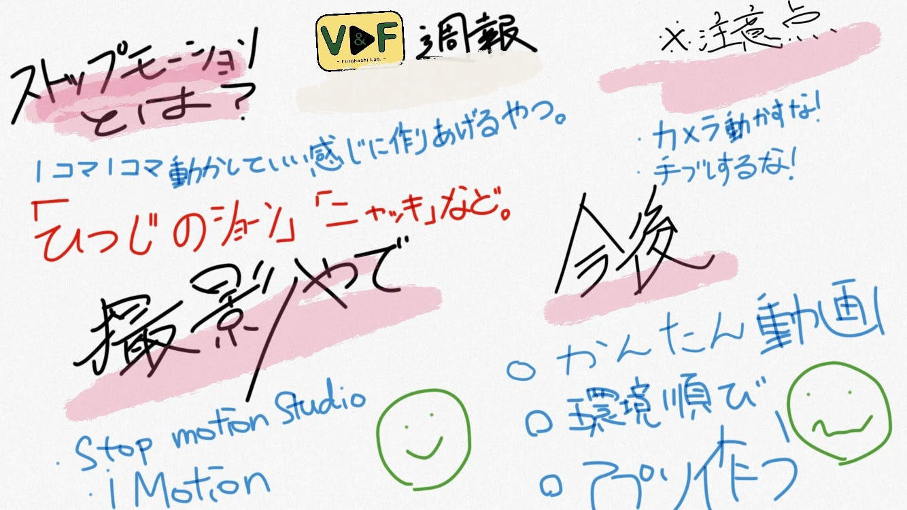

### ”ストップモーション”を撮るには、

V＆Fの活動としてTikTokも進めつつ、今回ストップモーションでの撮影・編集に挑戦してみようと考えている。現段階では、料理に因んだものを制作したいと思っている。

その上でまずストップモーションとは何か。何が必要でどのように撮影すれば良いのか等の抽象的な事を調査し、ここに記していきたいと思う。

#### ストップモーション技法とは：

被写体を1コマ1コマずらして撮影し動きを出していく撮影技法。

現在では、_**[「ひつじのショーン」_**](https://youtu.be/3oyaQfxK2W4)や**「ニャッキ」**などのクレイアニメでこの技法が使われている他、この手法を使った映画が注目を集めいている。

- _**[PUI PUI モルカー_**](https://youtu.be/7Dr14FJvYmw)

- _**[ミッシング・リンク 英国紳士と秘密の相棒_**](https://youtu.be/jT3WNH76Aqw)

- _**[ごん_**](https://youtu.be/DV0_eWY1qoM)

- _**[ちえりとチェリー_**](https://youtu.be/ffPkdd2PHz8)

- _**[リラックマとカオルさん_**](https://youtu.be/iJLRAO6dRtE)

LEGOとストップモーション手法を使用し、サカナクションの新宝島のMVを忠実に再現した動画も話題になっていた。

#### ストップモーションを撮影するには：

では、具体的にどのように撮影すれば良いのだろうか。

- **iPhone・iPadを使用する場合**

アプリ：

**/ Stop Motion Studio**

パソコンで編集する必要なし。写真を撮りながらすぐにその場でHD（高解像度）のアニメを作成可能。
有料の拡張機能＝サウンドエフェクトやペイントなどで編集できる。

**/ iMotion**

タイムラプスとストップモーション動画を直感的に作成できる。

- **デジタルカメラを使用する場合**

注意点：

カメラが動かないように三脚を用意し、しっかりと固定。

シャッターを切るときも、手ブレがないようにする。(リモコン付きのデジカメを使うなど)

#### 今後の活動予定：

- 簡易的に出来る撮影内容を決める

- 環境準備をする

- アプリを使用してみる

#### ＜グラレコ＞

