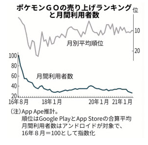
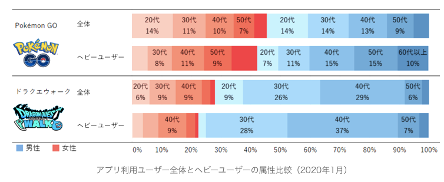
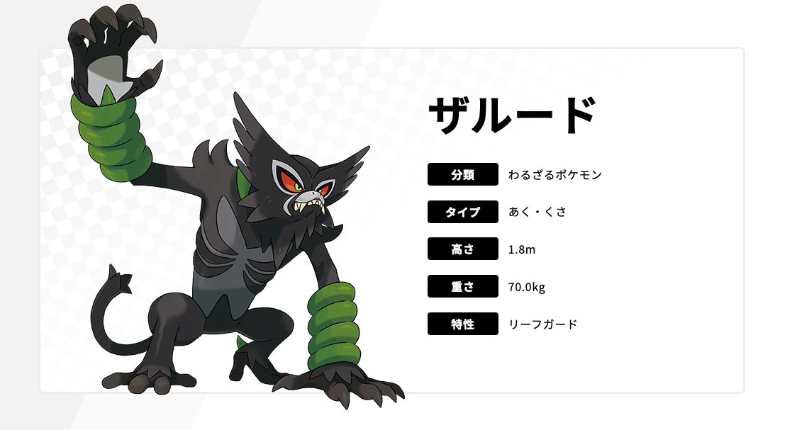
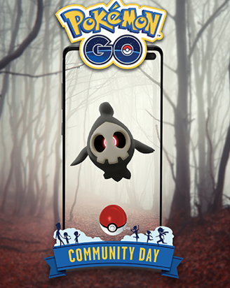
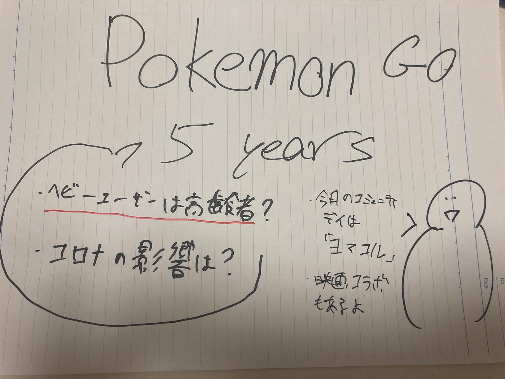

### 位置ゲー週報

お久しぶりです。突然ですがこの動画はご覧いただきましたか？

ポケモンgo五周年の映像ですね。世界中で愛されるゲームの一つであることがわかります。リリース前でも、多くのメディアから紹介されていましたね。自分自身リリース日に友達と自転車を走らせポケモンを取りに行った記憶が蘇ります。

しかしながら、変動の激しいアプリ市場でポケモンgoの利用者はどのように推移しているのか気になったので調べてみました。(国内のみ）

2016年8月から2017年10月らへんまで減少しています。その後30%付近で停滞しており今日まで続いております。

コロナの影響が日本国内で始まったのが2020年4月、一見コロナの影響を多大に受けそうなアプリだがこのグラフからは見受けられない。

いち早くリモートレイドパスを導入したのが良かったのだろうか。しかし、2021年6月(各地で緊急事態宣言、マンボウ開始）は約25.5%で前月から約15%落ちている。やはり、外出を禁止されると影響はあるようだ。

実際、年代別の月別利用者数を見ると、21年6月は10代～40代が前年度同月比13.3%減であるのに対し、50代以上のシニアは28.4%減と顕著に落ち込む。（日経新聞）

次に、全体利用者とへービーユーザー（月に200回起動）の年代男女別グラフを見ていく、ドラクエも含む

＊ねとらぼ調査隊（株式会社ヴァリューズより）

全体として最も利用しているのは、20、30の男性、20の女性だが、広く分布されている。ヘビーユーザーになると、20代の男女はどちらも半数以下に落ち込みとりあえず入れただけの人が一定数いることがわかる。ヘビーユーザーで最も多いのは40,50の男性。比べると、ヘビーユーザーは年齢層が高くなっていることがわかる。

しかし、ここでは触れていないドラクエとは比較しては、あれですが、ポケモンgoは男女関係なく愛されていますね。実際、自分自身レイドしに公園を歩いていると高齢者の夫婦だったり、子供連れの主婦さん、猛者のサラリーマンがいます。良いゲームですね！

とまあ、ここまで私が気になってデータを見てみました。次に皆さん用に10月のポケモンgoのイベントを見ていきましょう。何より、明日10月６日（水）はnianticが設立した日です！記念日を祝して無料のボックスが貰えますよ！

> 映画コラボイベント

10月1日（金）から10月10日（日）まで、「劇場版ポケットモンスター ココ」_とコラボしたイベントが開催されます。幻のポケモン「ザルード」が初登場します！↓公式画像

> ハロウィン

10月15日（金）から10月31日（日）まで、毎年恒例の「Pokémon GO ハロウィン」に衣装を身にまとったポケモンがやってきます！野生で出現する衣装を身にまとったポケモンたちや、ハロウィンがテーマの新しいスペシャルリサーチにご注目ください。詳しい情報はまだのようです。

> コミュニティ デイ

日本時間2021年10月9日（土）11時から17時まで

毎月ポケモンgoが強くなるチャンスのコミュニティデイ、今月はヨマワルです！進化でヨナワールにするとシャドボールが貰えるようです！評価はまだ分かりませんが、自分はゴーストタイプを持っていないのでここでゲットしたいです！↓ヨナワル公式

グラレコ

