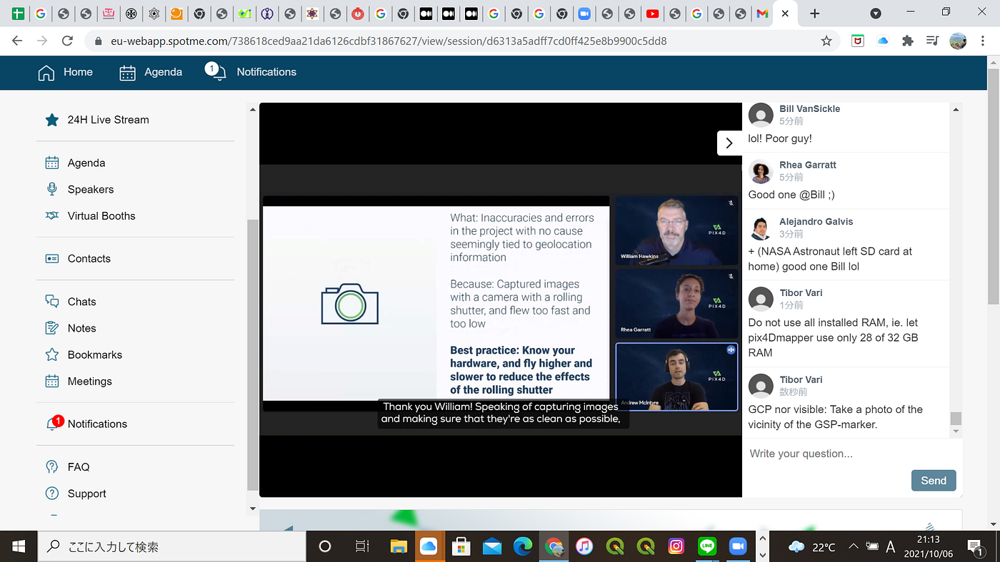
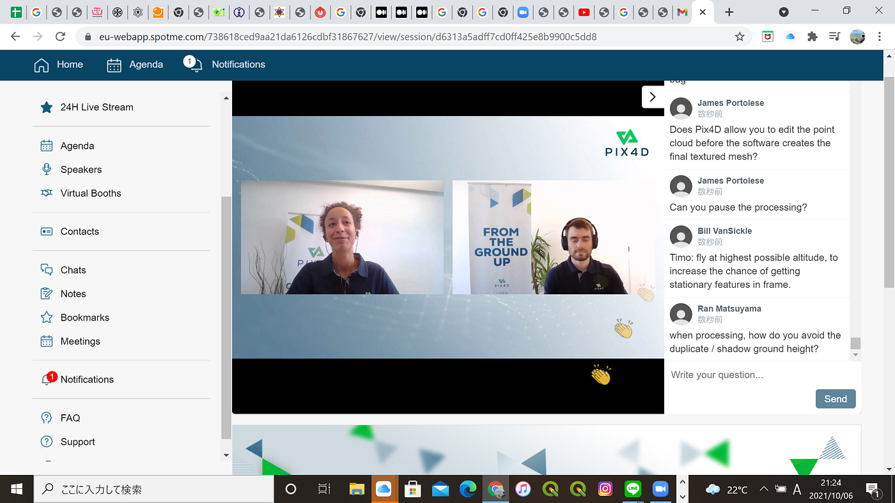
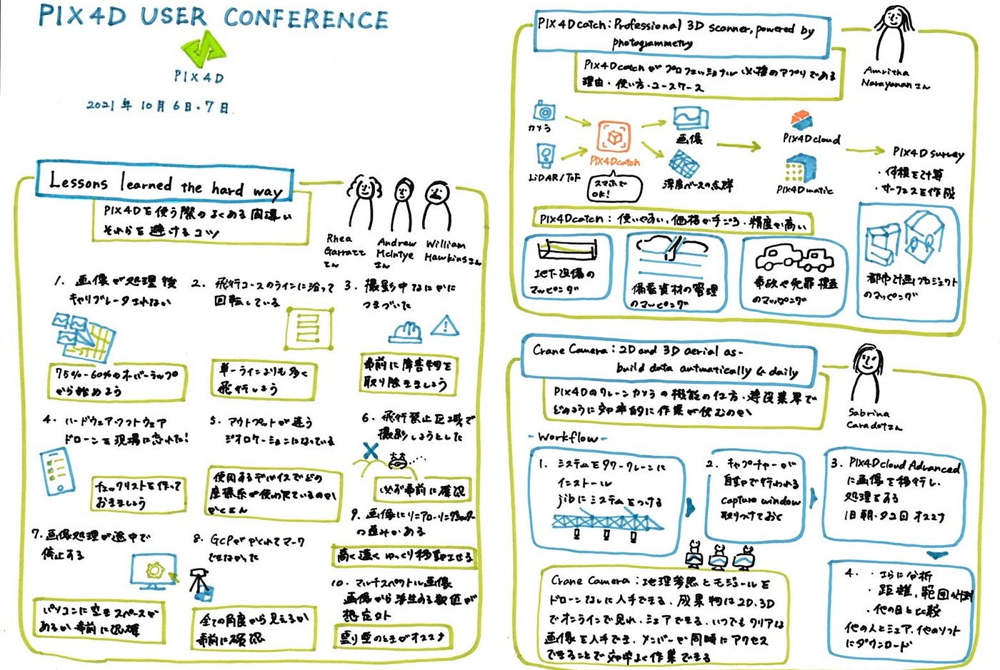

### PIX4D user conference

今回PIX4Dの国際会議に参加したので、その記事を書きたいと思います。

登壇者は古橋先生も含め計57名おり、10月６日～７日、２４時間にわたって行われました。

その中でも、私は３名のゲストのスピーチをまとめたいと思います。

まず初めに、Amritha Narayananさんによる「PIX4Dcatch: Professional 3D scanner, powered by photogrammetry」です。

内容は、PIX4Dcatchがプロフェッショナル必携のアプリである理由、時間とコストの節約につながる使い方とユースケースを語られています。

まずPIX4Dcatchが必携である理由について

PIX4Dは、皆が持っているスマートフォンカメラで使うことが出来、LiderやToFセンサーと組み合わせることで高画質な画像や深度ベースの点群を作成することが出来ます。そして、アウトプットをPIX4D製フォトグラメトリーソリューションスイートに読み込めば３Dモデルを作成できます。また、精度について、PIX4Dは昨年からviDoc RTK roverのグローバルリセラーとなり、このRTK roverを接続しPIX4Dcatchで撮影をすると誤差５センチ以内の精度を実現できます。

以上をまとめると、PIX4Dcatchは使いやすく、価格が手ごろであり、精度が高いということです。

次に、使い方についてです。アプリを開いて、測定したい場所の近くに移動し撮影を開始します。現場の周りを歩いてくまなく撮影します。LiDARやToF搭載のデバイスでは、ライブプレビューパネルで撮影範囲を確認できます。作成した点群データをPIX4Dcloudにアップロードします。

また、PIX4Dcloudでの作業が完了した後は、PIX4Dmaticにインポートするとデータを完全に管理することが出来ます。さらに、PIX4Dmaticでの作業が完了した後（3Dモデルやオルソマップを作成）、その点群をPIX4Dsurveyにエクスポートすることでデータのベクトル化とデジタル化をすることが出来、点群データを基に体積を計算したりサーフェスを作成したりできます。

そして最後にユースケースの紹介をしています。特に使われているのは、建築、エンジニアリング、建設業界（AEC）です。事例としては、地下設備（配管、ケーブル、水道）のマッピング、建設現場の備蓄資材の管理のマッピング、事故の検証や犯罪捜査の現場のマッピング、都市計画プロジェクトのマッピングなどがあります。

次に、Rhea Garrattさん、Andrew Mclntyreさん、William Hawkinsさんの合同発表による「Lessons learned the hard way」についてです。

内容は、PIX４Dを使う際のよくある間違い、そしてそれらを避けるためのコツについてでした。これらを一つずつまとめていきます。

１，画像が処理後にキャリブレータされない

適切なオーバーラップを確保する必要があり、どの程度のオーバーラップをとるかわからない場合は７５％-６０％オーバーラップから始めるのが良い。また、地形の標高差が大きい場合は高度が一番高いところを考慮して撮影をする。

２，corridor projectで生成された再構築モデルが飛行コースのラインに沿って回転している

この原因は、単一の飛行ラインで画像を取得していることにあり、十分な量のオーバーラップを確保する必要性がある。そのため、単一の飛行ラインよりも多く飛行したほうが良い。

３，PIX4Dcatchで画像撮影中に何らかの機材につまずいた

この原因は、撮影者が動くエリアを確認し障害物を事前に取り除いていなかったこと。ドローンを飛行させているときでもドローンがどこにあるかなど確認するために動き回ることがあるため気を付ける。

４，現場にハードウェアやソフトウェアを持ち込むのを忘れた、SDカードやケーブルを忘れてしまった、現場に到着したらリュックにドローンが入っていなかった、、笑

このように、大切なものを忘れないようにするためにはチェックリストを作ることが必要。また、全ての機材を整えるボックスとラベルで管理すること。

５，アウトプットが間違ったジオロケーションになっている

ドローンのGPSでどの座標系が使われているのか、現場でGCPを観測する際に使用するデバイスではどの座標系が使われているのかを確認し、設定をすることが必要。

６，飛行禁止区域で画像を撮影しようとし、プロジェクトのエリアを全く撮影することが出来なかった

撮影をする前に、国の制限、地域の制限、さらにローカルの制限を事前に確認することが大切

７，画像処理が途中で停止する

原因として、コンピューターに画像を処理、処理後生成してエクスポートするためのスペースがないことが考えられるため、処理を始める前に十分な空きスペースがあるか確認することが大切。

８，グランドコントロールポイントが撮影した画像で見えなかったため、マークすることが出来なかった

フライトを開始する前に全てのハードウェアを回収しておくことでGCPが見えなくなることを防ぐ。また、何かしらの構造物に隣接している場合や植物など上空のドローンからの視界を遮るものもあるため、全ての角度から見えるかを事前に確認しておくことが大切。

９，画像にかなりの量のリニアローリングシャッターの歪みがある

画像の歪みを減らすには、地上からより高く飛行しより遠くから撮影すること、またより遅い飛行スピードでカメラをゆっくり移動させることが大切。

１０，マルチスペクトル画像を撮影した時、画像から派生する指数値を計算する際に、数値が想定外になっている

原因として、飛行する際の環境状況をよく確認していなかった可能性がある。マルチスペクトル画像を撮影する場合には光源が一定である必要があるため、おすすめは曇り空のとき。

最後に、Sabrina Caradotさんによる「CraneCamera: 2D and 3D aerial as-built data automatically and daily」です。

内容は、PIX4Dのクレーンカメラがどのように機能するのか、また建設業界がどのようにコストを削減でき、より効率的に作業が進むのかということについてでした。

建設業界の抱える問題として、コミュニケーションの不足、データが利用できない・正確でない、ビルドエラーによるコストのかかるやり直し、スケジュールの遅れ、未解決の論争などがあります。

この問題に対し、クレーンカメラは地理参照とモジュール（部品）をドローンを飛ばさずに入手することができます。そのため、パイロットも必要なく、天候にも左右されません。また、イメージキャプチャ、データの移行、PIX4Dcloud Advancedでのデータ処理が全て自動で行われます。

そしてその成果物を２D,３Dでオンラインで見ること、シェアすることが可能です。これにより、いつでもクリアな画像をいつでも入手することが出来ることで計画運用に役立ち、またプロジェクトのメンバーが同時に同じページにアクセスすることが出来るのでコミュニケーションも向上し、効率よく作業が進みます。

次にワークフローを説明します。まず初めにシステムをタワークレーンにインストールし、jibsにシステムを取り付けます。キャプチャーは完全に自動で行われるためcapture windowを取り付けておきましょう。キャプチャは午前と午後一日に二回行うと活動の比較が出来良いでしょう。次に処理をします。画像をPIX4Dcloud Advancedに移行すると自動的に処理されます。生成物は、さらなる分析、距離や範囲の計測が可能になり、また他の生成物（他の日の画像）と比較することも可能です。さらに、CAD drawingをかぶせることで仮にビルトエラーが起きた時に識別を可能にします。また、データセットはプロジェクトチームでシェアすることが出来、他のソフトにもダウンロードすることも可能です。

最後に新しいクレーンカメラの紹介です。新しいタイプのクレーンカメラは接続性の向上、インストールの簡素化、生成物の精度と整合性の向上があります。

今回PIX4Dの国際会議に参加し、新たなPIX4Dの知識を得ることが出来ました。他の講演者の内容も興味深かったのでアーカイブでもう一度見て学んでいこうと思います。私は今までドローン空撮でPIX4DreactとPIX4Dcaptureしか使ったことがなかったのですが、スマホだけで使えるPIX4Dcatchもつかってみてみたいと思いました。

＜会議スクショ＞

＜グラレコ＞

