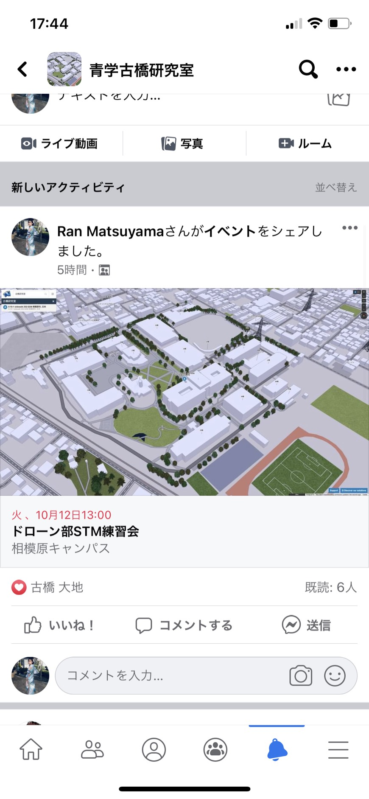
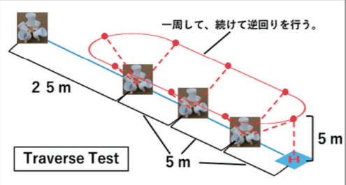
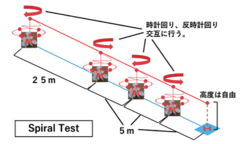
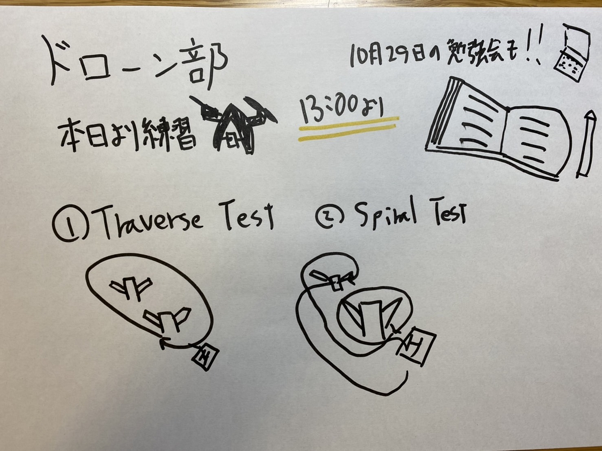

ドローン部週報

本日より相模原キャンパスでドローンの飛行練習を行います。

先週ゼミの後松山がFacebookでアドグルの人たちに向けて予定を立ててくれました。

本日13時より練習を開始したいと思います。

今日の練習ではSTMを用いて、ドローンの技術が備わっているか確認を行い、反省点や改善点を次に生かしていきたいと思います。

具体的な飛行法については２つの飛行法を行いたいと思います。

1つ目は一周時計回りをして、一周したら逆回りを行います。

離陸、着陸にも点数を定め、枠が正確に映っているかで点数を加算方式で図っていきたいと思います。

一回の練習約5分を想定しています。

2つ目はこのように1つの木を一周して、逆回りしたいと思います。

ルールは1つ目と同様に行いたいと思います。

また前回ゼミでお話しされていた10月29日のDRONE BIRDの自治体向けのイベントについても話し合いました。

本日練習した後に、ドローン部員とアドグルの人たちで４つのテーマについて勉強会を行い、分からない点がないようにして代表者を2,3名決めたいと思います。

グラレコはこちら

